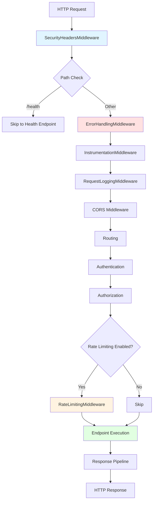

# Architecture Specification: Middleware Pipeline

> **Spec ID:** SPEC-ARCH-007  
> **Feature:** ASP.NET Core Middleware Pipeline Architecture  
> **Module:** Architecture  
> **Version:** 1.0  
> **Last Updated:** February 23, 2026  
> **Status:** 🚧 Draft  
> **Priority:** P2 (Documentation)  
> **Author:** Architecture Team  
> **Cross-References:** [SPEC-ARCH-002](SPEC-ARCH-002-ErrorHandlingStrategy.md) (Error Handling), [SPEC-ARCH-003](SPEC-ARCH-003-DependencyInjectionPatterns.md) (DI), [SPEC-SYS-002](SPEC-SYS-002-Authentication.md) (Authentication)

---

## Executive Summary

The CRM solution implements a **comprehensive middleware pipeline** that processes all HTTP requests through a series of cross-cutting concerns before reaching controllers. This specification documents the middleware architecture, execution order, custom implementations, and best practices for extending the pipeline.

**Key Components:**
- 8+ custom middleware components
- Feature flag-driven rate limiting
- Global error handling with exception mapping
- Security headers enforcement
- Request/response logging and instrumentation
- Conditional middleware execution based on endpoints

**Why This Matters:**
- Centralizes cross-cutting concerns (authentication, logging, error handling)
- Ensures consistent request processing across all endpoints
- Enables separation of concerns from business logic
- Provides standardized extension points for new features
- Improves observability and debugging

---

## 1. Business Context

### 1.1 Feature Description

The middleware pipeline is the **first line of defense and processing** for all HTTP requests in the CRM. It provides:
- **Security:** Authentication, authorization, rate limiting, security headers
- **Observability:** Request logging, instrumentation, performance tracking
- **Reliability:** Error handling, exception mapping, graceful degradation
- **Quality:** Request validation, response standardization

### 1.2 Middleware Components

| Component | Purpose | Order | Status |
|-----------|---------|-------|--------|
| **SecurityHeadersMiddleware** | Adds security headers (CSP, HSTS, etc.) | 1 | ✅ Implemented |
| **ErrorHandlingMiddleware** | Global exception handling | 2 | ✅ Implemented |
| **InstrumentationMiddleware** | Request/response timing and tracing | 3 | ✅ Implemented |
| **RequestLoggingMiddleware** | Structured request/response logging | 4 | ⚠️ Serilog-based |
| **CORS Middleware** | Cross-origin resource sharing | 5 | ✅ Built-in |
| **Authentication Middleware** | JWT token validation | 6 | ✅ Built-in |
| **Authorization Middleware** | Role/permission checking | 7 | ✅ Built-in |
| **RateLimitingMiddleware** | API throttling and abuse prevention | 8 | ✅ Implemented (custom) |
| **Static Files Middleware** | Serves frontend assets | 9 | ✅ Built-in |

### 1.3 Use Cases

| UC-ID | Use Case | Actor | Expected Flow | Status |
|-------|----------|-------|---------------|--------|
| UC-001 | Process authenticated request | API Client | Request → Security → Auth → Rate Limit → Controller | ✅ |
| UC-002 | Handle unhandled exception | API Client | Exception → ErrorHandling → JSON error response | ✅ |
| UC-003 | Rate limit API calls | API Client | Request → Rate Limiter → 429 if exceeded | ✅ |
| UC-004 | Track request performance | Ops | Request → Instrumentation → Metrics logged | ✅ |
| UC-005 | Skip middleware for health checks | K8s | /health → Bypass rate limiting/auth | ✅ |

---

## 2. Architecture & Design

### 2.1 Middleware Pipeline Flow



### 2.2 Design Principles

| Principle | Description | Implementation |
|-----------|-------------|----------------|
| **Order Matters** | Middleware executes in registration order | Carefully ordered in `Program.cs` |
| **Single Responsibility** | Each middleware handles one concern | Separate classes for error handling, logging, etc. |
| **Fail Fast** | Authentication/authorization before business logic | Auth middleware before controllers |
| **Bypass for Health** | Health checks shouldn't trigger auth/rate limits | Conditional middleware execution |
| **Dependency Injection** | Middleware uses DI for services | Constructor injection pattern |
| **Async/Await** | All middleware is async | `Task InvokeAsync(HttpContext)` |

### 2.3 Configuration Pattern

All custom middleware supports configuration-driven behavior:

```csharp
// appsettings.json
{
  "RateLimiting": {
    "EnableEndpointRateLimiting": true,
    "HttpStatusCode": 429,
    "QuotaExceededMessage": "API calls quota exceeded!",
    "GeneralRules": [
      { "Endpoint": "*", "Period": "1m", "Limit": 1000 }
    ],
    "EndpointRules": {
      "/api/auth/login": { "Period": "1m", "Limit": 5 }
    }
  },
  "SecurityHeaders": {
    "EnableHSTS": true,
    "EnableCSP": true,
    "FrameOptions": "DENY"
  }
}
```

---

## 3. Implementation Details

### 3.1 ErrorHandlingMiddleware

**Purpose:** Catches all unhandled exceptions and converts them to standardized JSON error responses.

**Key Features:**
- Maps `CrmException` to appropriate HTTP status codes
- Handles `DbUpdateConcurrencyException` specially (409 Conflict)
- Logs all exceptions with structured data
- Returns consistent error response format

**Code Example:**

```csharp
// CRM.Api/Middleware/ErrorHandlingMiddleware.cs
public class ErrorHandlingMiddleware
{
    private readonly RequestDelegate _next;
    private readonly ILogger<ErrorHandlingMiddleware> _logger;
    private static readonly JsonSerializerOptions JsonOptions = new()
    {
        PropertyNamingPolicy = JsonNamingPolicy.CamelCase
    };

    public ErrorHandlingMiddleware(RequestDelegate next, ILogger<ErrorHandlingMiddleware> logger)
    {
        _next = next;
        _logger = logger;
    }

    public async Task InvokeAsync(HttpContext context)
    {
        try
        {
            await _next(context);
        }
        catch (CrmException ex)
        {
            // Handle custom CRM exceptions with appropriate status codes
            _logger.LogWarning(ex, "CRM exception {ErrorCode}: {Message} for request {Method} {Path}",
                ex.ErrorCode, ex.Message, context.Request.Method, context.Request.Path);

            context.Response.StatusCode = (int)ex.StatusCode;
            context.Response.ContentType = "application/json";

            var errorResponse = CreateErrorResponse(ex, context);
            await context.Response.WriteAsync(JsonSerializer.Serialize(errorResponse, JsonOptions));
        }
        catch (DbUpdateConcurrencyException ex)
        {
            // Handle optimistic concurrency conflicts
            _logger.LogWarning(ex, "Concurrency conflict detected for request {Method} {Path}",
                context.Request.Method, context.Request.Path);

            context.Response.StatusCode = StatusCodes.Status409Conflict;
            context.Response.ContentType = "application/json";

            var conflictResponse = new ConcurrencyConflictResponse
            {
                Message = "The record was modified by another user. Please refresh and try again.",
                ConflictType = "ConcurrencyConflict",
                Timestamp = DateTime.UtcNow,
                RequestPath = context.Request.Path,
                EntityInfo = ex.Entries.Select(e => new EntityConflictInfo
                {
                    EntityType = e.Entity.GetType().Name,
                    State = e.State.ToString()
                }).ToList()
            };

            await context.Response.WriteAsJsonAsync(conflictResponse);
        }
        catch (Exception ex)
        {
            _logger.LogError(ex, "Unhandled exception occurred");
            context.Response.StatusCode = 500;
            context.Response.ContentType = "application/json";
            await context.Response.WriteAsJsonAsync(new
            {
                message = "Internal server error",
                traceId = context.TraceIdentifier
            });
        }
    }

    private ErrorResponse CreateErrorResponse(CrmException ex, HttpContext context)
    {
        return new ErrorResponse
        {
            StatusCode = (int)ex.StatusCode,
            Message = ex.Message,
            ErrorCode = ex.ErrorCode,
            Timestamp = DateTime.UtcNow,
            Path = context.Request.Path,
            TraceId = context.TraceIdentifier,
            Details = ex.Details
        };
    }
}
```

**Error Response Format:**

```json
{
  "statusCode": 400,
  "message": "Account name is required",
  "errorCode": "VALIDATION_ERROR",
  "timestamp": "2026-02-23T10:30:00Z",
  "path": "/api/accounts",
  "traceId": "0HMVFE42K7QVO:00000001",
  "details": {
    "field": "accountName",
    "constraint": "required"
  }
}
```

### 3.2 RateLimitingMiddleware

**Purpose:** Protects the API from abuse by limiting requests per client per time window.

**Algorithm:** Sliding window with configurable limits per endpoint.

**Key Features:**
- Per-client tracking (by IP or authenticated user)
- Endpoint-specific limits
- Configurable bypass for internal endpoints
- Environment-based enable/disable (off in Development)
- Returns 429 with `Retry-After` header

**Code Example:**

```csharp
// CRM.Api/Middleware/RateLimitingMiddleware.cs
public class RateLimitingMiddleware
{
    private readonly RequestDelegate _next;
    private readonly ILogger<RateLimitingMiddleware> _logger;
    private readonly RateLimitOptions _options;
    private readonly ConcurrentDictionary<string, ClientRateInfo> _clients = new();

    public RateLimitingMiddleware(
        RequestDelegate next,
        ILogger<RateLimitingMiddleware> logger,
        RateLimitOptions? options = null)
    {
        _next = next;
        _logger = logger;
        _options = options ?? new RateLimitOptions();
    }

    public async Task InvokeAsync(HttpContext context)
    {
        // Skip rate limiting for health checks and internal endpoints
        if (ShouldSkipRateLimiting(context.Request.Path))
        {
            await _next(context);
            return;
        }

        var clientId = GetClientIdentifier(context);
        var now = DateTime.UtcNow;

        var clientInfo = _clients.AddOrUpdate(
            clientId,
            key => new ClientRateInfo
            {
                RequestTimestamps = new Queue<DateTime>(new[] { now }),
                WindowStart = now
            },
            (key, existing) =>
            {
                CleanExpiredTimestamps(existing, now, _options.WindowSize);
                existing.RequestTimestamps.Enqueue(now);
                return existing;
            });

        // Check if limit exceeded
        if (clientInfo.RequestTimestamps.Count > _options.MaxRequests)
        {
            var oldestRequest = clientInfo.RequestTimestamps.Peek();
            var retryAfter = (int)(_options.WindowSize - (now - oldestRequest)).TotalSeconds + 1;

            _logger.LogWarning("Rate limit exceeded for client {ClientId} on {Path}",
                clientId, context.Request.Path);

            context.Response.StatusCode = 429;
            context.Response.Headers["Retry-After"] = retryAfter.ToString();
            await context.Response.WriteAsJsonAsync(new
            {
                message = _options.QuotaExceededMessage,
                retryAfter = retryAfter
            });
            return;
        }

        await _next(context);
    }

    private bool ShouldSkipRateLimiting(PathString path)
    {
        return path.StartsWithSegments("/health") ||
               path.StartsWithSegments("/metrics") ||
               path.StartsWithSegments("/swagger");
    }

    private string GetClientIdentifier(HttpContext context)
    {
        // Prefer authenticated user ID
        var userId = context.User?.FindFirst("userId")?.Value;
        if (!string.IsNullOrEmpty(userId))
        {
            return $"user_{userId}";
        }

        // Fallback to IP address
        return $"ip_{context.Connection.RemoteIpAddress}";
    }

    private void CleanExpiredTimestamps(ClientRateInfo info, DateTime now, TimeSpan windowSize)
    {
        while (info.RequestTimestamps.Count > 0 &&
               now - info.RequestTimestamps.Peek() > windowSize)
        {
            info.RequestTimestamps.Dequeue();
        }
    }
}

public class ClientRateInfo
{
    public Queue<DateTime> RequestTimestamps { get; set; } = new();
    public DateTime WindowStart { get; set; }
}

public class RateLimitOptions
{
    public int MaxRequests { get; set; } = 100;
    public TimeSpan WindowSize { get; set; } = TimeSpan.FromMinutes(1);
    public string QuotaExceededMessage { get; set; } = "API calls quota exceeded!";
}
```

**Configuration-Driven Behavior:**

```csharp
// Program.cs - Rate limiting registration
var rateLimitingConfig = builder.Configuration.GetSection("RateLimiting");
var rateLimitingEnabled = rateLimitingConfig.GetValue("EnableEndpointRateLimiting", !isDevelopment);

if (rateLimitingEnabled)
{
    builder.Services.AddRateLimiter(options =>
    {
        options.RejectionStatusCode = rejectionStatusCode;
        
        // Apply endpoint-specific rules from configuration
        var endpointRules = rateLimitingConfig.GetSection("EndpointRules").Get<Dictionary<string, RateLimitRule>>();
        foreach (var rule in endpointRules)
        {
            options.AddPolicy(rule.Key, context =>
            {
                var period = ParseRateLimitPeriod(rule.Value.Period);
                return RateLimitPartition.GetSlidingWindowLimiter(
                    GetClientIdentifier(context),
                    _ => new SlidingWindowRateLimiterOptions
                    {
                        PermitLimit = rule.Value.Limit,
                        Window = period
                    });
            });
        }
    });
}

// Middleware usage
app.UseRateLimiter();
```

### 3.3 SecurityHeadersMiddleware

**Purpose:** Adds security headers to all responses to protect against common attacks.

**Headers Added:**
- `X-Content-Type-Options: nosniff`
- `X-Frame-Options: DENY`
- `X-XSS-Protection: 1; mode=block`
- `Strict-Transport-Security: max-age=31536000; includeSubDomains`
- `Content-Security-Policy: default-src 'self'`
- `Referrer-Policy: no-referrer`

**Code Example:**

```csharp
// CRM.Api/Middleware/SecurityHeadersMiddleware.cs
public class SecurityHeadersMiddleware
{
    private readonly RequestDelegate _next;
    private readonly ILogger<SecurityHeadersMiddleware> _logger;

    public SecurityHeadersMiddleware(RequestDelegate next, ILogger<SecurityHeadersMiddleware> logger)
    {
        _next = next;
        _logger = logger;
    }

    public async Task InvokeAsync(HttpContext context)
    {
        // Add security headers
        context.Response.OnStarting(() =>
        {
            var headers = context.Response.Headers;

            // Prevent MIME type sniffing
            headers["X-Content-Type-Options"] = "nosniff";

            // Prevent clickjacking
            headers["X-Frame-Options"] = "DENY";

            // Enable XSS filter
            headers["X-XSS-Protection"] = "1; mode=block";

            // Enforce HTTPS (only in production)
            if (!context.Request.IsLocal())
            {
                headers["Strict-Transport-Security"] = "max-age=31536000; includeSubDomains";
            }

            // Content Security Policy
            headers["Content-Security-Policy"] = "default-src 'self'; " +
                "script-src 'self' 'unsafe-inline' 'unsafe-eval'; " +
                "style-src 'self' 'unsafe-inline'; " +
                "img-src 'self' data: https:; " +
                "font-src 'self'; " +
                "connect-src 'self'";

            // Referrer policy
            headers["Referrer-Policy"] = "no-referrer";

            return Task.CompletedTask;
        });

        await _next(context);
    }
}
```

### 3.4 InstrumentationMiddleware

**Purpose:** Tracks request/response timing and adds distributed tracing context.

**Metrics Tracked:**
- Request duration (ms)
- Response status code
- Endpoint path
- HTTP method
- Exception occurrences

**Code Example:**

```csharp
// CRM.Api/Middleware/InstrumentationMiddleware.cs
public class InstrumentationMiddleware
{
    private readonly RequestDelegate _next;
    private readonly ILogger<InstrumentationMiddleware> _logger;
    private readonly IMetricsService _metrics;

    public InstrumentationMiddleware(
        RequestDelegate next,
        ILogger<InstrumentationMiddleware> logger,
        IMetricsService metrics)
    {
        _next = next;
        _logger = logger;
        _metrics = metrics;
    }

    public async Task InvokeAsync(HttpContext context)
    {
        var sw = System.Diagnostics.Stopwatch.StartNew();
        var method = context.Request.Method;
        var path = context.Request.Path.Value ?? "/";

        try
        {
            await _next(context);
        }
        finally
        {
            sw.Stop();
            var duration = sw.ElapsedMilliseconds;
            var statusCode = context.Response.StatusCode;

            // Record metrics
            _metrics.RecordRequestDuration(method, path, statusCode, duration);

            // Structured logging
            _logger.LogInformation(
                "HTTP {Method} {Path} responded {StatusCode} in {Duration}ms",
                method, path, statusCode, duration);
        }
    }
}
```

### 3.5 Pipeline Registration

**Location:** `CRM.Api/Program.cs` (lines 1165-1215)

```csharp
// Program.cs - Middleware pipeline configuration

// 1. Security headers (first to apply to all responses)
app.UseSecurityHeaders();

// 2. Swagger UI (only in non-production)
if (app.Environment.IsDevelopment() || app.Environment.IsStaging())
{
    app.UseSwagger();
    app.UseSwaggerUI(c =>
    {
        c.SwaggerEndpoint("/swagger/v1/swagger.json", "CRM API v1");
        c.RoutePrefix = "swagger";
    });

    // Request logging (only apply to non-health endpoints)
    app.UseWhen(context => !context.Request.Path.StartsWithSegments("/health"), appBuilder =>
    {
        appBuilder.UseSerilogRequestLogging();
    });
}

// 3. Static files for frontend
app.UseStaticFiles(); // Serve from wwwroot

var frontendBuildPath = "CRM.Frontend/build";
if (Directory.Exists(frontendBuildPath))
{
    app.UseDefaultFiles(new DefaultFilesOptions { FileProvider = new PhysicalFileProvider(Path.GetFullPath(frontendBuildPath)) });
    app.UseStaticFiles(new StaticFileOptions { FileProvider = new PhysicalFileProvider(Path.GetFullPath(frontendBuildPath)) });
}

// 4. Routing (must come before CORS, Auth, Rate Limiting)
app.UseRouting();

// 5. CORS
app.UseCors();

// 6. Rate limiting (after routing, before auth)
if (rateLimitingEnabled)
{
    app.UseRateLimiter();
}

// 7. Authentication & Authorization
app.UseAuthentication();
app.UseAuthorization();

// 8. Map endpoints
app.MapControllers();
app.MapHub<NotificationHub>("/hubs/notifications");
app.MapHealthChecks("/health");
app.MapHealthChecks("/health/ready");
app.MapHealthChecks("/health/live");

// 9. Fallback to frontend for SPA routing
app.MapFallbackToFile("index.html");
```

### 3.6 Conditional Middleware Execution

**Pattern:** Use `app.UseWhen()` to conditionally apply middleware based on request path or other criteria.

```csharp
// Apply request logging only to non-health endpoints
app.UseWhen(
    context => !context.Request.Path.StartsWithSegments("/health"),
    appBuilder =>
    {
        appBuilder.UseSerilogRequestLogging();
    });

// Apply authentication only to non-public endpoints
app.UseWhen(
    context => !context.Request.Path.StartsWithSegments("/swagger"),
    appBuilder =>
    {
        appBuilder.UseAuthentication();
        appBuilder.UseAuthorization();
    });
```

---

## 4. Best Practices

### 4.1 Middleware Development Guidelines

| Best Practice | Rationale | Example |
|---------------|-----------|---------|
| **Use async/await** | Prevents thread pool starvation | `public async Task InvokeAsync(HttpContext context)` |
| **Call `_next(context)`** | Ensures pipeline continues | `await _next(context);` |
| **Inject services via constructor** | Follows DI pattern | `public ErrorHandlingMiddleware(RequestDelegate next, ILogger<T> logger)` |
| **Use `OnStarting` for headers** | Headers must be set before response starts | `context.Response.OnStarting(() => { ... })` |
| **Log with structured data** | Enables better observability | `_logger.LogInformation("Request {Method} {Path}", method, path)` |
| **Handle exceptions gracefully** | Prevent pipeline crashes | `try { await _next(context); } catch { ... }` |

### 4.2 Common Pitfalls to Avoid

| Pitfall | Why It's Bad | Solution |
|---------|--------------|----------|
| **Modifying response after started** | Response headers already sent | Use `context.Response.OnStarting()` |
| **Not calling `_next(context)`** | Pipeline terminates prematurely | Always call unless intentionally short-circuiting |
| **Synchronous I/O** | Blocks thread pool threads | Use async methods everywhere |
| **Capturing HttpContext in background tasks** | Context becomes invalid | Copy required data before spawning task |
| **Order mistakes** | Auth before routing won't work | Follow standard ordering: Routing → CORS → Auth → Rate Limit |
| **Using scoped services in singleton middleware** | Service lifetime mismatch | Resolve scoped services per request from `HttpContext.RequestServices` |

### 4.3 Performance Considerations

| Consideration | Impact | Mitigation |
|---------------|--------|------------|
| **Middleware overhead** | Each middleware adds latency | Keep middleware lean, measure with instrumentation |
| **Logging verbosity** | High volume in production | Use structured logging, filter by level |
| **Rate limit tracking** | Memory consumption for client tracking | Implement cleanup of expired entries |
| **Exception handling cost** | Try/catch has overhead | Only catch at middleware level, not in every method |
| **Conditional branching** | Path checks on every request | Use `UseWhen()` to bypass entire middleware |

### 4.4 Extension Pattern

**How to add new middleware:**

```csharp
// 1. Create middleware class
public class CustomMiddleware
{
    private readonly RequestDelegate _next;
    private readonly ILogger<CustomMiddleware> _logger;

    public CustomMiddleware(RequestDelegate next, ILogger<CustomMiddleware> logger)
    {
        _next = next;
        _logger = logger;
    }

    public async Task InvokeAsync(HttpContext context)
    {
        // Pre-processing
        _logger.LogDebug("Custom middleware executing");

        // Call next middleware
        await _next(context);

        // Post-processing (after response)
        _logger.LogDebug("Custom middleware completed");
    }
}

// 2. Create extension method
public static class CustomMiddlewareExtensions
{
    public static IApplicationBuilder UseCustomMiddleware(this IApplicationBuilder builder)
    {
        return builder.UseMiddleware<CustomMiddleware>();
    }
}

// 3. Register in Program.cs (at appropriate position)
app.UseCustomMiddleware();
```

---

## 5. Testing Strategy

### 5.1 Unit Testing Middleware

**Pattern:** Test middleware in isolation using mocked `HttpContext` and `RequestDelegate`.

```csharp
// CRM.Backend/tests/Middleware/ErrorHandlingMiddlewareTests.cs
public class ErrorHandlingMiddlewareTests
{
    [Fact]
    public async Task InvokeAsync_WhenCrmExceptionThrown_ReturnsAppropriateStatusCode()
    {
        // Arrange
        var context = new DefaultHttpContext();
        context.Response.Body = new MemoryStream();
        
        var logger = new Mock<ILogger<ErrorHandlingMiddleware>>();
        var middleware = new ErrorHandlingMiddleware(
            next: (innerContext) => throw new CrmNotFoundException("Account not found"),
            logger: logger.Object);

        // Act
        await middleware.InvokeAsync(context);

        // Assert
        Assert.Equal(404, context.Response.StatusCode);
        Assert.Equal("application/json", context.Response.ContentType);
        
        context.Response.Body.Seek(0, SeekOrigin.Begin);
        var responseBody = await new StreamReader(context.Response.Body).ReadToEndAsync();
        Assert.Contains("Account not found", responseBody);
    }

    [Fact]
    public async Task InvokeAsync_WhenConcurrencyException_Returns409()
    {
        // Arrange
        var context = new DefaultHttpContext();
        context.Response.Body = new MemoryStream();
        
        var logger = new Mock<ILogger<ErrorHandlingMiddleware>>();
        var middleware = new ErrorHandlingMiddleware(
            next: (innerContext) => throw new DbUpdateConcurrencyException(),
            logger: logger.Object);

        // Act
        await middleware.InvokeAsync(context);

        // Assert
        Assert.Equal(409, context.Response.StatusCode);
    }
}
```

### 5.2 Integration Testing

**Pattern:** Test entire pipeline with `WebApplicationFactory`.

```csharp
// CRM.Backend/tests/Integration/MiddlewarePipelineTests.cs
public class MiddlewarePipelineTests : IClassFixture<WebApplicationFactory<Program>>
{
    private readonly WebApplicationFactory<Program> _factory;

    public MiddlewarePipelineTests(WebApplicationFactory<Program> factory)
    {
        _factory = factory;
    }

    [Fact]
    public async Task Request_WithoutAuth_Returns401()
    {
        // Arrange
        var client = _factory.CreateClient();

        // Act
        var response = await client.GetAsync("/api/accounts");

        // Assert
        Assert.Equal(HttpStatusCode.Unauthorized, response.StatusCode);
    }

    [Fact]
    public async Task Request_ExceedingRateLimit_Returns429()
    {
        // Arrange
        var client = _factory.CreateClient();
        var endpoint = "/api/auth/login";

        // Act - Exceed rate limit (5 requests per minute)
        var responses = await Task.WhenAll(Enumerable.Range(0, 10)
            .Select(_ => client.PostAsJsonAsync(endpoint, new { email = "test@test.com", password = "pass" })));

        // Assert
        Assert.Contains(responses, r => r.StatusCode == (HttpStatusCode)429);
    }

    [Fact]
    public async Task Request_ToHealthEndpoint_BypassesAuth()
    {
        // Arrange
        var client = _factory.CreateClient();

        // Act
        var response = await client.GetAsync("/health");

        // Assert
        Assert.Equal(HttpStatusCode.OK, response.StatusCode);
    }
}
```

### 5.3 Test Coverage Requirements

| Component | Target Coverage | Priority |
|-----------|-----------------|----------|
| **ErrorHandlingMiddleware** | 90%+ | P0 - Critical |
| **RateLimitingMiddleware** | 85%+ | P1 - High |
| **SecurityHeadersMiddleware** | 80%+ | P2 - Medium |
| **InstrumentationMiddleware** | 75%+ | P2 - Medium |
| **Pipeline Integration** | 70%+ | P1 - High |

---

## 6. References

### 6.1 Internal Documentation

- [SPEC-ARCH-002: Error Handling Strategy](SPEC-ARCH-002-ErrorHandlingStrategy.md)
- [SPEC-ARCH-003: Dependency Injection Patterns](SPEC-ARCH-003-DependencyInjectionPatterns.md)
- [SPEC-SYS-002: Authentication](SPEC-SYS-002-Authentication.md)
- [SPEC-SYS-011: Non-Functional Requirements](SPEC-SYS-011-NonFunctionalRequirements.md)

### 6.2 Source Code References

| File | Purpose |
|------|---------|
| `CRM.Api/Middleware/ErrorHandlingMiddleware.cs` | Global exception handling |
| `CRM.Api/Middleware/RateLimitingMiddleware.cs` | API throttling |
| `CRM.Api/Middleware/SecurityHeadersMiddleware.cs` | Security headers |
| `CRM.Api/Middleware/InstrumentationMiddleware.cs` | Request tracing |
| `CRM.Api/Program.cs` | Pipeline registration |
| `CRM.Backend/tests/Middleware/` | Middleware unit tests |

### 6.3 External Resources

- [ASP.NET Core Middleware](https://learn.microsoft.com/en-us/aspnet/core/fundamentals/middleware/)
- [ASP.NET Core Rate Limiting](https://learn.microsoft.com/en-us/aspnet/core/performance/rate-limit)
- [Security Headers Best Practices](https://owasp.org/www-project-secure-headers/)
- [Distributed Tracing with OpenTelemetry](https://opentelemetry.io/)

---

## 7. Change Log

| Version | Date | Author | Changes |
|---------|------|--------|---------|
| 1.0 | 2026-02-23 | Architecture Team | Initial specification documenting existing middleware pipeline |

---

## 8. Appendix

### 8.1 Middleware Execution Order Table

| Order | Middleware | Required | Purpose | Skip Conditions |
|-------|-----------|----------|---------|-----------------|
| 1 | SecurityHeadersMiddleware | Yes | Adds security headers | None |
| 2 | ErrorHandlingMiddleware | Yes | Global exception handling | None |
| 3 | InstrumentationMiddleware | Optional | Performance tracking | Production only |
| 4 | RequestLoggingMiddleware | Optional | Structured logging | `/health` endpoints |
| 5 | StaticFilesMiddleware | Yes | Serve frontend assets | None |
| 6 | RoutingMiddleware | Yes | Endpoint routing | None |
| 7 | CorsMiddleware | Yes | CORS policy enforcement | None |
| 8 | RateLimiterMiddleware | Optional | API throttling | Development, `/health` |
| 9 | AuthenticationMiddleware | Yes | JWT validation | `/health`, `/swagger` |
| 10 | AuthorizationMiddleware | Yes | Permission checking | `/health`, `/swagger` |

### 8.2 HTTP Status Code Mapping

| Exception Type | HTTP Status | Error Code | Example |
|----------------|-------------|------------|---------|
| `CrmNotFoundException` | 404 | NOT_FOUND | "Account with ID 123 not found" |
| `CrmValidationException` | 400 | VALIDATION_ERROR | "Account name is required" |
| `CrmUnauthorizedException` | 401 | UNAUTHORIZED | "Invalid credentials" |
| `CrmForbiddenException` | 403 | FORBIDDEN | "Insufficient permissions" |
| `CrmConflictException` | 409 | CONFLICT | "Account already exists" |
| `DbUpdateConcurrencyException` | 409 | CONCURRENCY_CONFLICT | "Record modified by another user" |
| `RateLimitExceededException` | 429 | RATE_LIMIT_EXCEEDED | "API calls quota exceeded" |
| `Exception` (unhandled) | 500 | INTERNAL_ERROR | "Internal server error" |

---

**END OF SPECIFICATION**
