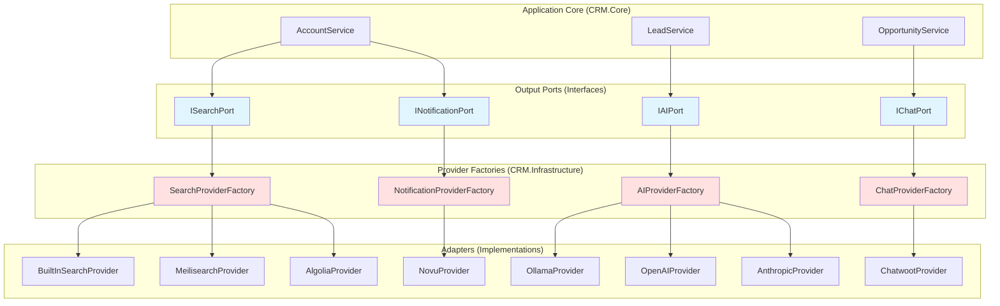
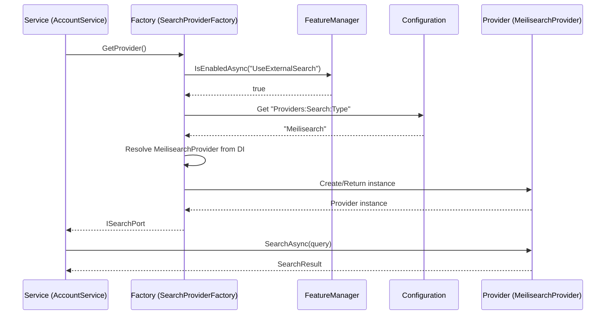

# Architecture Specification: Provider Plugin Architecture

> **Spec ID:** SPEC-ARCH-008  
> **Feature:** Pluggable Provider System (Hexagonal Architecture)  
> **Module:** Architecture  
> **Version:** 1.0  
> **Last Updated:** February 23, 2026  
> **Status:** 🚧 Draft  
> **Priority:** P2 (Documentation)  
> **Author:** Architecture Team  
> **Cross-References:** [SPEC-ARCH-004](SPEC-ARCH-004-CachingStrategy.md) (Caching), [SPEC-INT-002](SPEC-INT-002-ProviderIntegration.md) (Integration), [SPEC-SYS-004](SPEC-SYS-004-FeatureFlagManagement.md) (Feature Flags)

---

## Executive Summary

The CRM solution implements a **Hexagonal Architecture (Ports & Adapters)** pattern that enables **runtime provider switching** for critical infrastructure concerns. This architecture allows the system to swap implementations of search, AI, chat, notifications, analytics, signatures, and integrations without code changes—using only configuration and feature flags.

**Key Benefits:**
- **Vendor Independence:** Switch from Meilisearch to Algolia without code changes
- **Cost Optimization:** Use local Ollama for development, OpenAI for production
- **Progressive Enhancement:** Start with built-in providers, upgrade to enterprise solutions
- **Testing Flexibility:** Mock providers in tests, use real providers in staging/production
- **Multi-Tenancy Ready:** Different tenants can use different providers

**Provider Categories:**
- **Search:** BuiltIn, Meilisearch, Algolia, Typesense, Elasticsearch, Azure Cognitive Search
- **AI:** Ollama, OpenAI, Azure OpenAI, Anthropic, AWS Bedrock, OpenRouter, Google Gemini
- **Chat:** BuiltIn, Chatwoot, Intercom, Zendesk, Freshchat, Rocket.Chat
- **Notifications:** BuiltIn, Novu, Twilio, SendGrid, OneSignal, Courier, AWS SES
- **Analytics:** BuiltIn, Apache Superset, Metabase, Power BI, Looker, AWS QuickSight
- **Signatures:** BuiltIn, DocuSeal, DocuSign, Adobe Sign, HelloSign
- **Integrations:** BuiltIn, n8n, Zapier, Make (Integromat), Workato

---

## 1. Business Context

### 1.1 Feature Description

The Pluggable Provider Architecture solves a fundamental challenge: **how to integrate with multiple third-party services without creating tight coupling or vendor lock-in.**

**Traditional Problem:**
```csharp
// Tightly coupled to specific provider
public class AccountService
{
    private readonly MeilisearchClient _searchClient;
    
    public async Task<List<Account>> SearchAccounts(string query)
    {
        return await _searchClient.Search<Account>(query); // Locked to Meilisearch
    }
}
```

**Pluggable Solution:**
```csharp
// Abstracted through port interface
public class AccountService
{
    private readonly ISearchPort _searchPort;
    
    public async Task<List<Account>> SearchAccounts(string query)
    {
        return await _searchPort.SearchAsync<Account>(query); // Provider-agnostic
    }
}
```

### 1.2 Architecture Pattern: Ports & Adapters



### 1.3 Provider Categories

| Category | Port Interface | Implementations Count | Status |
|----------|----------------|----------------------|--------|
| **Search** | `ISearchPort` | 6 (BuiltIn, Meilisearch, Algolia, Typesense, Elasticsearch, AzureSearch) | ✅ Implemented |
| **AI** | `IAIPort` | 7 (Ollama, OpenAI, Azure, Anthropic, Bedrock, OpenRouter, Gemini) | ✅ Implemented |
| **Chat** | `IChatPort` | 6 (BuiltIn, Chatwoot, Intercom, Zendesk, Freshchat, RocketChat) | ⚠️ Partial |
| **Notifications** | `INotificationPort` | 7 (BuiltIn, Novu, Twilio, SendGrid, OneSignal, Courier, SES) | ⚠️ Partial |
| **Analytics** | `IAnalyticsPort` | 6 (BuiltIn, Superset, Metabase, PowerBI, Looker, QuickSight) | ⚠️ Partial |
| **Signatures** | `ISignaturePort` | 5 (BuiltIn, DocuSeal, DocuSign, AdobeSign, HelloSign) | ⚠️ Partial |
| **Integrations** | `IIntegrationPort` | 5 (BuiltIn, N8n, Zapier, Make, Workato) | ⚠️ Partial |

### 1.4 Use Cases

| UC-ID | Use Case | Actor | Configuration | Expected Behavior | Status |
|-------|----------|-------|---------------|-------------------|--------|
| UC-001 | Switch from built-in to Meilisearch | DevOps | Set `UseExternalSearch=true` + config | All searches use Meilisearch | ✅ |
| UC-002 | Use Ollama in dev, OpenAI in prod | Developer | Environment-specific config | Dev uses local LLM, prod uses API | ✅ |
| UC-003 | Fallback on provider failure | System | Auto-fallback enabled | Uses BuiltIn if external fails | ✅ |
| UC-004 | Add new provider type | Developer | Implement port interface | New provider available via factory | ✅ |
| UC-005 | Multi-tenant provider selection | System | Tenant-specific config | Different tenants use different providers | ⚠️ Future |

---

## 2. Architecture & Design

### 2.1 Core Design Principles

| Principle | Description | Implementation |
|-----------|-------------|----------------|
| **Dependency Inversion** | Core depends on abstractions, not implementations | Ports define contracts in `CRM.Core`, adapters in `CRM.Infrastructure` |
| **Open/Closed** | Open for extension (new providers), closed for modification | Add provider by implementing interface, no core changes |
| **Single Responsibility** | Each provider handles ONE external service | `MeilisearchProvider` only does search, nothing else |
| **Interface Segregation** | Port interfaces are focused and minimal | `ISearchPort` has only search methods |
| **Factory Pattern** | Factories create appropriate provider at runtime | `SearchProviderFactory` selects based on config |
| **Feature Flag Driven** | Providers enabled/disabled via feature flags | `UseExternalSearch` controls provider selection |

### 2.2 Component Structure

```
CRM.Backend/
├── src/
│   ├── CRM.Core/                              # Application Core
│   │   ├── Ports/
│   │   │   └── Output/
│   │   │       └── Providers/
│   │   │           ├── ISearchPort.cs         # Search abstraction
│   │   │           ├── IAIPort.cs             # AI/LLM abstraction
│   │   │           ├── IChatPort.cs           # Chat abstraction
│   │   │           ├── INotificationPort.cs   # Notification abstraction
│   │   │           ├── IAnalyticsPort.cs      # Analytics abstraction
│   │   │           ├── ISignaturePort.cs      # E-signature abstraction
│   │   │           └── IIntegrationPort.cs    # Integration abstraction
│   │   └── Features/
│   │       ├── FeatureFlags.cs                # Feature flag names
│   │       └── ProviderTypes.cs               # Provider type constants
│   │
│   └── CRM.Infrastructure/                    # Adapters Layer
│       ├── Factories/                         # Provider factories
│       │   ├── SearchProviderFactory.cs
│       │   ├── AIProviderFactory.cs
│       │   ├── ChatProviderFactory.cs
│       │   └── ...
│       ├── Providers/                         # Provider implementations
│       │   ├── BuiltIn/                       # Default implementations
│       │   │   ├── BuiltInSearchProvider.cs
│       │   │   ├── BuiltInChatProvider.cs
│       │   │   └── ...
│       │   ├── Meilisearch/
│       │   │   └── MeilisearchProvider.cs
│       │   ├── Algolia/
│       │   │   └── AlgoliaProvider.cs
│       │   ├── Ollama/
│       │   │   └── OllamaProvider.cs
│       │   ├── OpenAI/
│       │   │   └── OpenAIProvider.cs
│       │   └── ...
│       └── DependencyInjection/
│           └── ProviderServiceExtensions.cs   # DI registration
```

### 2.3 Provider Selection Flow



---

## 3. Implementation Details

### 3.1 Port Interface Example: ISearchPort

**Purpose:** Defines the contract for all search providers.

```csharp
// CRM.Core/Ports/Output/Providers/ISearchPort.cs
namespace CRM.Core.Ports.Output.Providers;

/// <summary>
/// Output port for search operations supporting pluggable search providers.
/// Implementations: BuiltIn (SQL), Meilisearch, Algolia, Typesense, Elasticsearch, Azure Cognitive Search.
/// </summary>
public interface ISearchPort
{
    /// <summary>
    /// Gets the unique identifier for this search provider.
    /// </summary>
    string ProviderName { get; }

    /// <summary>
    /// Checks if the search provider is properly configured and available.
    /// </summary>
    Task<bool> IsAvailableAsync(CancellationToken cancellationToken = default);

    /// <summary>
    /// Performs a unified search across all indexed entity types.
    /// </summary>
    Task<SearchResult> SearchAsync(SearchRequest request, CancellationToken cancellationToken = default);

    /// <summary>
    /// Searches within a specific entity type.
    /// </summary>
    Task<SearchResult<T>> SearchAsync<T>(string query, SearchOptions? options = null, CancellationToken cancellationToken = default) where T : class;

    /// <summary>
    /// Indexes a single document for searching.
    /// </summary>
    Task IndexAsync<T>(T document, string id, CancellationToken cancellationToken = default) where T : class;

    /// <summary>
    /// Indexes multiple documents in a batch operation.
    /// </summary>
    Task IndexBatchAsync<T>(IEnumerable<T> documents, Func<T, string> idSelector, CancellationToken cancellationToken = default) where T : class;

    /// <summary>
    /// Removes a document from the search index.
    /// </summary>
    Task DeleteAsync<T>(string id, CancellationToken cancellationToken = default) where T : class;

    /// <summary>
    /// Gets autocomplete suggestions based on a prefix.
    /// </summary>
    Task<IEnumerable<string>> GetSuggestionsAsync(string prefix, string? indexName = null, int maxResults = 10, CancellationToken cancellationToken = default);
}

#region Supporting Types

public class SearchRequest
{
    public string Query { get; set; } = string.Empty;
    public int Page { get; set; } = 1;
    public int PageSize { get; set; } = 20;
    public Dictionary<string, object>? Filters { get; set; }
    public string? SortBy { get; set; }
    public bool SortDescending { get; set; }
}

public class SearchResult
{
    public List<SearchHit> Hits { get; set; } = new();
    public int TotalHits { get; set; }
    public long ProcessingTimeMs { get; set; }
}

public class SearchResult<T> where T : class
{
    public List<T> Results { get; set; } = new();
    public int TotalCount { get; set; }
    public long ProcessingTimeMs { get; set; }
}

public class SearchHit
{
    public string EntityType { get; set; } = string.Empty;
    public string EntityId { get; set; } = string.Empty;
    public string Title { get; set; } = string.Empty;
    public string? Description { get; set; }
    public double Score { get; set; }
    public Dictionary<string, object> Metadata { get; set; } = new();
}

public class SearchOptions
{
    public int MaxResults { get; set; } = 20;
    public int Offset { get; set; } = 0;
    public Dictionary<string, object>? Filters { get; set; }
}

#endregion
```

**Key Design Decisions:**
- **Generic methods:** Support any entity type
- **Async by default:** All operations are async
- **Cancellation token:** Support for operation cancellation
- **Provider name:** Enables health checks and logging
- **IsAvailable:** Allows health monitoring

### 3.2 Provider Factory Pattern

**Purpose:** Creates the appropriate provider implementation based on configuration and feature flags.

```csharp
// CRM.Infrastructure/Factories/SearchProviderFactory.cs
using CRM.Core.Features;
using CRM.Core.Interfaces;
using CRM.Core.Ports.Output.Providers;
using Microsoft.Extensions.Configuration;
using Microsoft.Extensions.DependencyInjection;
using Microsoft.Extensions.Logging;
using Microsoft.FeatureManagement;

namespace CRM.Infrastructure.Factories;

/// <summary>
/// Factory for resolving search provider implementations.
/// Supports runtime switching between BuiltIn, Meilisearch, Algolia, Typesense, and Elasticsearch.
/// </summary>
public class SearchProviderFactory : IProviderFactory<ISearchPort>
{
    private readonly IServiceProvider _serviceProvider;
    private readonly IFeatureManager _featureManager;
    private readonly IConfiguration _configuration;
    private readonly ILogger<SearchProviderFactory> _logger;

    public SearchProviderFactory(
        IServiceProvider serviceProvider,
        IFeatureManager featureManager,
        IConfiguration configuration,
        ILogger<SearchProviderFactory> logger)
    {
        _serviceProvider = serviceProvider ?? throw new ArgumentNullException(nameof(serviceProvider));
        _featureManager = featureManager ?? throw new ArgumentNullException(nameof(featureManager));
        _configuration = configuration ?? throw new ArgumentNullException(nameof(configuration));
        _logger = logger ?? throw new ArgumentNullException(nameof(logger));
    }

    /// <inheritdoc />
    public ISearchPort GetProvider()
    {
        // Check feature flag
        var useExternal = _featureManager.IsEnabledAsync(FeatureFlags.UseExternalSearch)
            .GetAwaiter().GetResult();

        if (!useExternal)
        {
            _logger.LogDebug("Feature flag disabled. Using BuiltIn search provider");
            return GetBuiltInProvider();
        }

        // Read provider type from configuration
        var providerType = _configuration["Providers:Search:Type"] ?? ProviderTypes.Search.BuiltIn;
        _logger.LogDebug("Resolving search provider: {ProviderType}", providerType);

        try
        {
            return GetProvider(providerType);
        }
        catch (Exception ex)
        {
            _logger.LogWarning(ex, "Failed to resolve {ProviderType}. Falling back to BuiltIn", providerType);
            return GetBuiltInProvider();
        }
    }

    /// <inheritdoc />
    public ISearchPort GetProvider(string providerName)
    {
        if (string.IsNullOrWhiteSpace(providerName))
        {
            throw new ArgumentException("Provider name cannot be null or empty", nameof(providerName));
        }

        _logger.LogDebug("Resolving search provider by name: {ProviderName}", providerName);

        return providerName.ToLowerInvariant() switch
        {
            "builtin" => GetBuiltInProvider(),
            "meilisearch" => GetProviderOrFallback<ISearchPort>("MeilisearchProvider"),
            "algolia" => GetProviderOrFallback<ISearchPort>("AlgoliaProvider"),
            "typesense" => GetProviderOrFallback<ISearchPort>("TypesenseProvider"),
            "elasticsearch" => GetProviderOrFallback<ISearchPort>("ElasticsearchProvider"),
            "azuresearch" => GetProviderOrFallback<ISearchPort>("AzureSearchProvider"),
            _ => throw new InvalidOperationException($"Unknown search provider: {providerName}")
        };
    }

    /// <inheritdoc />
    public IEnumerable<string> GetAvailableProviders()
    {
        return new[]
        {
            ProviderTypes.Search.BuiltIn,
            ProviderTypes.Search.Meilisearch,
            ProviderTypes.Search.Algolia,
            ProviderTypes.Search.Typesense,
            ProviderTypes.Search.Elasticsearch,
            ProviderTypes.Search.AzureSearch
        };
    }

    /// <summary>
    /// Gets the BuiltIn search provider (fallback).
    /// </summary>
    private ISearchPort GetBuiltInProvider()
    {
        return _serviceProvider.GetRequiredService<BuiltInSearchProvider>();
    }

    /// <summary>
    /// Attempts to resolve a provider by type name, falls back to BuiltIn on failure.
    /// </summary>
    private T GetProviderOrFallback<T>(string typeName) where T : class
    {
        try
        {
            // Try to resolve by service type name
            var providerType = Type.GetType($"CRM.Infrastructure.Providers.{typeName}");
            if (providerType != null)
            {
                var provider = _serviceProvider.GetService(providerType) as T;
                if (provider != null)
                {
                    return provider;
                }
            }

            // Fallback: try to get from all registered ISearchPort implementations
            var allProviders = _serviceProvider.GetServices<ISearchPort>();
            var matchingProvider = allProviders.FirstOrDefault(p =>
                p.GetType().Name.Equals(typeName, StringComparison.OrdinalIgnoreCase)) as T;

            if (matchingProvider != null)
            {
                return matchingProvider;
            }

            throw new InvalidOperationException($"Provider {typeName} not registered");
        }
        catch (Exception ex)
        {
            _logger.LogWarning(ex, "Failed to resolve provider {TypeName}, using fallback", typeName);
            return GetBuiltInProvider() as T ?? throw new InvalidOperationException("Fallback provider not available");
        }
    }
}
```

**Key Features:**
- **Feature flag check:** Respects `UseExternalSearch` flag
- **Configuration-driven:** Reads provider type from config
- **Automatic fallback:** Falls back to BuiltIn on error
- **Type-safe:** Generic `IProviderFactory<T>` interface
- **Extensible:** Easy to add new providers

### 3.3 Provider Implementation Example: MeilisearchProvider

```csharp
// CRM.Infrastructure/Providers/Meilisearch/MeilisearchProvider.cs
using CRM.Core.Ports.Output.Providers;
using Meilisearch;
using Microsoft.Extensions.Configuration;
using Microsoft.Extensions.Logging;

namespace CRM.Infrastructure.Providers.Meilisearch;

/// <summary>
/// Meilisearch implementation of ISearchPort.
/// Provides fast, typo-tolerant search using the Meilisearch engine.
/// </summary>
public class MeilisearchProvider : ISearchPort
{
    private readonly MeilisearchClient _client;
    private readonly ILogger<MeilisearchProvider> _logger;
    private readonly string _indexPrefix;

    public string ProviderName => "Meilisearch";

    public MeilisearchProvider(IConfiguration configuration, ILogger<MeilisearchProvider> logger)
    {
        _logger = logger ?? throw new ArgumentNullException(nameof(logger));

        var url = configuration["Providers:Search:Meilisearch:Url"]
                  ?? throw new InvalidOperationException("Meilisearch URL not configured");
        var apiKey = configuration["Providers:Search:Meilisearch:ApiKey"] ?? string.Empty;
        _indexPrefix = configuration["Providers:Search:Meilisearch:IndexPrefix"] ?? "crm_";

        _client = new MeilisearchClient(url, apiKey);
        _logger.LogInformation("Meilisearch provider initialized with URL: {Url}", url);
    }

    public async Task<bool> IsAvailableAsync(CancellationToken cancellationToken = default)
    {
        try
        {
            await _client.HealthAsync();
            return true;
        }
        catch (Exception ex)
        {
            _logger.LogWarning(ex, "Meilisearch health check failed");
            return false;
        }
    }

    public async Task<SearchResult> SearchAsync(SearchRequest request, CancellationToken cancellationToken = default)
    {
        var sw = System.Diagnostics.Stopwatch.StartNew();

        try
        {
            // Search across all indexes
            var multiSearchResult = await _client.MultiSearchAsync(new MultiSearchQuery
            {
                Queries = new[]
                {
                    new SearchQuery
                    {
                        IndexUid = $"{_indexPrefix}accounts",
                        Q = request.Query,
                        Limit = request.PageSize,
                        Offset = (request.Page - 1) * request.PageSize
                    }
                }
            });

            sw.Stop();

            var hits = multiSearchResult.Results
                .SelectMany(r => r.Hits.Select(h => new SearchHit
                {
                    EntityType = r.IndexUid.Replace(_indexPrefix, ""),
                    EntityId = h.GetValueOrDefault("id")?.ToString() ?? string.Empty,
                    Title = h.GetValueOrDefault("name")?.ToString() ?? string.Empty,
                    Description = h.GetValueOrDefault("description")?.ToString(),
                    Score = 1.0, // Meilisearch doesn't expose scores in the same way
                    Metadata = h
                }))
                .ToList();

            return new SearchResult
            {
                Hits = hits,
                TotalHits = hits.Count,
                ProcessingTimeMs = sw.ElapsedMilliseconds
            };
        }
        catch (Exception ex)
        {
            _logger.LogError(ex, "Meilisearch search failed for query: {Query}", request.Query);
            throw;
        }
    }

    public async Task<SearchResult<T>> SearchAsync<T>(string query, SearchOptions? options = null, CancellationToken cancellationToken = default) where T : class
    {
        var indexName = $"{_indexPrefix}{typeof(T).Name.ToLowerInvariant()}s";
        var index = _client.Index(indexName);

        options ??= new SearchOptions();

        try
        {
            var searchResult = await index.SearchAsync<T>(query, new Meilisearch.SearchQuery
            {
                Limit = options.MaxResults,
                Offset = options.Offset
            });

            return new SearchResult<T>
            {
                Results = searchResult.Hits.ToList(),
                TotalCount = searchResult.EstimatedTotalHits ?? 0,
                ProcessingTimeMs = searchResult.ProcessingTimeMs
            };
        }
        catch (Exception ex)
        {
            _logger.LogError(ex, "Meilisearch typed search failed for type {Type}, query: {Query}",
                typeof(T).Name, query);
            throw;
        }
    }

    public async Task IndexAsync<T>(T document, string id, CancellationToken cancellationToken = default) where T : class
    {
        var indexName = $"{_indexPrefix}{typeof(T).Name.ToLowerInvariant()}s";
        var index = _client.Index(indexName);

        try
        {
            await index.AddDocumentsAsync(new[] { document }, primaryKey: "id");
            _logger.LogDebug("Indexed document {Id} in {Index}", id, indexName);
        }
        catch (Exception ex)
        {
            _logger.LogError(ex, "Failed to index document {Id} in {Index}", id, indexName);
            throw;
        }
    }

    public async Task IndexBatchAsync<T>(IEnumerable<T> documents, Func<T, string> idSelector, CancellationToken cancellationToken = default) where T : class
    {
        var indexName = $"{_indexPrefix}{typeof(T).Name.ToLowerInvariant()}s";
        var index = _client.Index(indexName);
        var docList = documents.ToList();

        try
        {
            await index.AddDocumentsAsync(docList, primaryKey: "id");
            _logger.LogInformation("Indexed {Count} documents in {Index}", docList.Count, indexName);
        }
        catch (Exception ex)
        {
            _logger.LogError(ex, "Failed to batch index {Count} documents in {Index}", docList.Count, indexName);
            throw;
        }
    }

    public async Task DeleteAsync<T>(string id, CancellationToken cancellationToken = default) where T : class
    {
        var indexName = $"{_indexPrefix}{typeof(T).Name.ToLowerInvariant()}s";
        var index = _client.Index(indexName);

        try
        {
            await index.DeleteOneDocumentAsync(id);
            _logger.LogDebug("Deleted document {Id} from {Index}", id, indexName);
        }
        catch (Exception ex)
        {
            _logger.LogError(ex, "Failed to delete document {Id} from {Index}", id, indexName);
            throw;
        }
    }

    public async Task<IEnumerable<string>> GetSuggestionsAsync(string prefix, string? indexName = null, int maxResults = 10, CancellationToken cancellationToken = default)
    {
        indexName ??= $"{_indexPrefix}accounts";
        var index = _client.Index(indexName);

        try
        {
            var searchResult = await index.SearchAsync<Dictionary<string, object>>(prefix, new Meilisearch.SearchQuery
            {
                Limit = maxResults,
                AttributesToRetrieve = new[] { "name" }
            });

            return searchResult.Hits
                .Select(h => h.GetValueOrDefault("name")?.ToString() ?? string.Empty)
                .Where(s => !string.IsNullOrEmpty(s))
                .ToList();
        }
        catch (Exception ex)
        {
            _logger.LogError(ex, "Failed to get suggestions for prefix: {Prefix}", prefix);
            return Enumerable.Empty<string>();
        }
    }
}
```

### 3.4 Configuration Schema

**Example Configuration:** `appsettings.json`

```json
{
  "FeatureManagement": {
    "UseExternalSearch": true,
    "UseExternalAI": true,
    "UseExternalChat": false,
    "UseExternalNotifications": false,
    "UseExternalAnalytics": false,
    "UseExternalSignatures": false,
    "UseExternalIntegrations": false
  },
  "Providers": {
    "Search": {
      "Type": "Meilisearch",
      "Meilisearch": {
        "Url": "http://crm-meilisearch:7700",
        "ApiKey": "masterKey",
        "IndexPrefix": "crm_"
      },
      "Algolia": {
        "ApplicationId": "YOUR_APP_ID",
        "ApiKey": "YOUR_API_KEY",
        "IndexPrefix": "crm_"
      }
    },
    "AI": {
      "Type": "OpenAI",
      "Ollama": {
        "Url": "http://crm-ollama:11434",
        "Model": "llama3.1:8b",
        "EmbeddingModel": "nomic-embed-text"
      },
      "OpenAI": {
        "ApiKey": "sk-...",
        "Model": "gpt-4o",
        "MaxTokens": 2000
      },
      "AzureOpenAI": {
        "Endpoint": "https://xxx.openai.azure.com/",
        "ApiKey": "...",
        "DeploymentName": "gpt-4o"
      },
      "Anthropic": {
        "ApiKey": "sk-ant-...",
        "Model": "claude-3-5-sonnet-20241022"
      }
    },
    "Chat": {
      "Type": "Chatwoot",
      "Chatwoot": {
        "BaseUrl": "http://crm-chatwoot:3000",
        "ApiKey": "...",
        "AccountId": "1",
        "InboxId": "1"
      }
    },
    "Notifications": {
      "Type": "Novu",
      "Novu": {
        "ApiKey": "...",
        "ApplicationId": "...",
        "BaseUrl": "http://crm-novu:3000"
      },
      "Twilio": {
        "AccountSid": "...",
        "AuthToken": "...",
        "FromPhoneNumber": "+1234567890"
      }
    },
    "Analytics": {
      "Type": "Superset",
      "Superset": {
        "Url": "http://crm-superset:8088",
        "Username": "admin",
        "Password": "...",
        "DatabaseId": 1
      }
    },
    "Signatures": {
      "Type": "DocuSeal",
      "DocuSeal": {
        "Url": "http://crm-docuseal:3000",
        "ApiKey": "...",
        "WebhookSecret": "..."
      }
    },
    "Integrations": {
      "Type": "N8n",
      "N8n": {
        "BaseUrl": "http://crm-n8n:5678",
        "ApiKey": "...",
        "WebhookBaseUrl": "http://crm-n8n:5678/webhook"
      }
    }
  }
}
```

### 3.5 Dependency Injection Registration

**Location:** `CRM.Infrastructure/DependencyInjection/ProviderServiceExtensions.cs`

```csharp
// CRM.Infrastructure/DependencyInjection/ProviderServiceExtensions.cs
using CRM.Core.Ports.Output.Providers;
using CRM.Infrastructure.Factories;
using CRM.Infrastructure.Providers.BuiltIn;
using Microsoft.Extensions.Configuration;
using Microsoft.Extensions.DependencyInjection;

namespace CRM.Infrastructure.DependencyInjection;

public static class ProviderServiceExtensions
{
    /// <summary>
    /// Registers all pluggable provider factories and implementations.
    /// </summary>
    public static IServiceCollection AddPluggableProviders(
        this IServiceCollection services,
        IConfiguration configuration)
    {
        // Register provider factories
        services.AddScoped<IProviderFactory<ISearchPort>, SearchProviderFactory>();
        services.AddScoped<IProviderFactory<IChatPort>, ChatProviderFactory>();
        services.AddScoped<IProviderFactory<INotificationPort>, NotificationProviderFactory>();
        services.AddScoped<IProviderFactory<IAnalyticsPort>, AnalyticsProviderFactory>();
        services.AddScoped<IProviderFactory<ISignaturePort>, SignatureProviderFactory>();
        services.AddScoped<IProviderFactory<IAIPort>, AIProviderFactory>();
        services.AddScoped<IProviderFactory<IIntegrationPort>, IntegrationProviderFactory>();

        // Register port interfaces to resolve from factories
        // This allows consumers to inject ISearchPort, IChatPort, etc. directly
        services.AddScoped<ISearchPort>(sp =>
            sp.GetRequiredService<IProviderFactory<ISearchPort>>().GetProvider());
        services.AddScoped<IChatPort>(sp =>
            sp.GetRequiredService<IProviderFactory<IChatPort>>().GetProvider());
        services.AddScoped<INotificationPort>(sp =>
            sp.GetRequiredService<IProviderFactory<INotificationPort>>().GetProvider());
        services.AddScoped<IAnalyticsPort>(sp =>
            sp.GetRequiredService<IProviderFactory<IAnalyticsPort>>().GetProvider());
        services.AddScoped<ISignaturePort>(sp =>
            sp.GetRequiredService<IProviderFactory<ISignaturePort>>().GetProvider());
        services.AddScoped<IAIPort>(sp =>
            sp.GetRequiredService<IProviderFactory<IAIPort>>().GetProvider());
        services.AddScoped<IIntegrationPort>(sp =>
            sp.GetRequiredService<IProviderFactory<IIntegrationPort>>().GetProvider());

        // Register built-in providers (always available as fallback)
        RegisterBuiltInProviders(services);

        // Register external providers if configured
        RegisterExternalProviders(services, configuration);

        return services;
    }

    private static void RegisterBuiltInProviders(IServiceCollection services)
    {
        // Registers as ISearchPort for factory resolution via GetServices<ISearchPort>()
        services.AddScoped<ISearchPort, BuiltInSearchProvider>();
        services.AddScoped<BuiltInSearchProvider>();

        services.AddScoped<IChatPort, BuiltInChatProvider>();
        services.AddScoped<BuiltInChatProvider>();

        services.AddScoped<INotificationPort, BuiltInNotificationProvider>();
        services.AddScoped<BuiltInNotificationProvider>();

        services.AddScoped<IAnalyticsPort, BuiltInAnalyticsProvider>();
        services.AddScoped<BuiltInAnalyticsProvider>();

        services.AddScoped<ISignaturePort, BuiltInSignatureProvider>();
        services.AddScoped<BuiltInSignatureProvider>();

        services.AddScoped<IIntegrationPort, BuiltInIntegrationProvider>();
        services.AddScoped<BuiltInIntegrationProvider>();
    }

    private static void RegisterExternalProviders(IServiceCollection services, IConfiguration configuration)
    {
        // Meilisearch
        if (configuration.GetValue<bool>("Providers:Search:Meilisearch:Enabled"))
        {
            // Register as ISearchPort for factory resolution
            services.AddScoped<ISearchPort, MeilisearchProvider>();
            services.AddScoped<MeilisearchProvider>();
        }

        // Algolia
        if (configuration.GetValue<bool>("Providers:Search:Algolia:Enabled"))
        {
            // Register as ISearchPort for factory resolution
            services.AddScoped<ISearchPort, AlgoliaProvider>();
            services.AddScoped<AlgoliaProvider>();
        }

        // Chatwoot
        if (configuration.GetValue<bool>("Providers:Chat:Chatwoot:Enabled"))
        {
            // Register as IChatPort for factory resolution
            services.AddScoped<IChatPort, ChatwootProvider>();
            services.AddScoped<ChatwootProvider>();
        }

        // Add more external provider registrations as needed...
    }
}
```

---

## 4. Best Practices

### 4.1 Provider Development Guidelines

| Best Practice | Rationale | Example |
|---------------|-----------|---------|
| **Implement all interface methods** | Ensures complete provider functionality | Every `ISearchPort` must implement `SearchAsync`, `IndexAsync`, etc. |
| **Use dependency injection** | Enables testability and configuration | Inject `IConfiguration`, `ILogger` in constructor |
| **Log provider actions** | Aids debugging and monitoring | Log searches, indexing, errors with structured data |
| **Handle errors gracefully** | Prevent provider failures from crashing app | Catch exceptions, log, return empty results or throw custom exception |
| **Implement IsAvailable()** | Enables health checks | Ping external service, return false on failure |
| **Use configuration for credentials** | Security and flexibility | Read API keys from `appsettings.json` or environment variables |
| **Support cancellation tokens** | Enable request cancellation | Pass `CancellationToken` to all async operations |

### 4.2 Factory Pattern Best Practices

| Best Practice | Rationale | Example |
|---------------|-----------|---------|
| **Check feature flags first** | Respect global enable/disable settings | `if (!await _featureManager.IsEnabledAsync(flag)) return BuiltIn;` |
| **Auto-fallback on errors** | Ensure system doesn't crash | `catch (Exception) { return GetBuiltInProvider(); }` |
| **Log provider selection** | Debugging and auditing | `_logger.LogDebug("Using provider: {Provider}", providerName)` |
| **Support provider enumeration** | Admin UI can list available providers | `GetAvailableProviders()` returns all registered types |
| **Use named providers** | Multi-provider support | `GetProvider(string providerName)` allows explicit selection |

### 4.3 Configuration Best Practices

| Best Practice | Rationale | Example |
|---------------|-----------|---------|
| **Environment-specific configs** | Dev uses local, prod uses cloud | `appsettings.Development.json` vs `appsettings.Production.json` |
| **Use feature flags** | Easy enable/disable without code changes | `UseExternalSearch: false` in development |
| **Store secrets securely** | Prevent credential leaks | Use Azure Key Vault, AWS Secrets Manager, or environment variables |
| **Validate configuration on startup** | Fail fast if misconfigured | Check required settings in `Program.cs` |
| **Document all settings** | Developers know what to configure | Inline comments in `appsettings.json` |

### 4.4 Common Pitfalls to Avoid

| Pitfall | Why It's Bad | Solution |
|---------|--------------|----------|
| **Tight coupling to provider SDK** | Hard to switch providers | Abstract SDK types behind your own DTOs |
| **No fallback strategy** | System breaks if provider unavailable | Always implement BuiltIn provider as fallback |
| **Inconsistent error handling** | Some providers throw, others return null | Standardize error responses across all providers |
| **Missing health checks** | Ops can't monitor provider status | Implement `IsAvailableAsync()` properly |
| **Configuration in code** | Redeployment needed to change provider | Use `appsettings.json` and feature flags |
| **Ignoring cancellation tokens** | Long-running operations can't be canceled | Pass token to all async calls |

---

## 5. Testing Strategy

### 5.1 Unit Testing Providers

**Pattern:** Test providers in isolation with mocked dependencies.

```csharp
// CRM.Backend/tests/Providers/MeilisearchProviderTests.cs
public class MeilisearchProviderTests
{
    [Fact]
    public async Task SearchAsync_WithValidQuery_ReturnsResults()
    {
        // Arrange
        var config = new ConfigurationBuilder()
            .AddInMemoryCollection(new Dictionary<string, string>
            {
                ["Providers:Search:Meilisearch:Url"] = "http://localhost:7700",
                ["Providers:Search:Meilisearch:ApiKey"] = "masterKey",
                ["Providers:Search:Meilisearch:IndexPrefix"] = "test_"
            })
            .Build();

        var logger = new Mock<ILogger<MeilisearchProvider>>();
        var provider = new MeilisearchProvider(config, logger.Object);

        var request = new SearchRequest
        {
            Query = "test",
            Page = 1,
            PageSize = 10
        };

        // Act
        var result = await provider.SearchAsync(request);

        // Assert
        Assert.NotNull(result);
        Assert.NotNull(result.Hits);
    }

    [Fact]
    public async Task IsAvailableAsync_WhenServiceDown_ReturnsFalse()
    {
        // Arrange (point to non-existent service)
        var config = new ConfigurationBuilder()
            .AddInMemoryCollection(new Dictionary<string, string>
            {
                ["Providers:Search:Meilisearch:Url"] = "http://localhost:9999",
                ["Providers:Search:Meilisearch:ApiKey"] = "invalid"
            })
            .Build();

        var logger = new Mock<ILogger<MeilisearchProvider>>();
        var provider = new MeilisearchProvider(config, logger.Object);

        // Act
        var isAvailable = await provider.IsAvailableAsync();

        // Assert
        Assert.False(isAvailable);
    }
}
```

### 5.2 Testing Factories

```csharp
// CRM.Backend/tests/Factories/SearchProviderFactoryTests.cs
public class SearchProviderFactoryTests
{
    [Fact]
    public void GetProvider_WhenFeatureFlagDisabled_ReturnsBuiltIn()
    {
        // Arrange
        var featureManager = new Mock<IFeatureManager>();
        featureManager.Setup(fm => fm.IsEnabledAsync(FeatureFlags.UseExternalSearch))
            .ReturnsAsync(false);

        var config = new ConfigurationBuilder().Build();
        var services = new ServiceCollection();
        services.AddScoped<BuiltInSearchProvider>();
        var serviceProvider = services.BuildServiceProvider();

        var logger = new Mock<ILogger<SearchProviderFactory>>();
        var factory = new SearchProviderFactory(serviceProvider, featureManager.Object, config, logger.Object);

        // Act
        var provider = factory.GetProvider();

        // Assert
        Assert.IsType<BuiltInSearchProvider>(provider);
    }

    [Fact]
    public void GetProvider_WhenMeilisearchConfigured_ReturnsMeilisearch()
    {
        // Arrange
        var featureManager = new Mock<IFeatureManager>();
        featureManager.Setup(fm => fm.IsEnabledAsync(FeatureFlags.UseExternalSearch))
            .ReturnsAsync(true);

        var config = new ConfigurationBuilder()
            .AddInMemoryCollection(new Dictionary<string, string>
            {
                ["Providers:Search:Type"] = "Meilisearch",
                ["Providers:Search:Meilisearch:Url"] = "http://localhost:7700"
            })
            .Build();

        var services = new ServiceCollection();
        services.AddScoped<BuiltInSearchProvider>();
        services.AddScoped<MeilisearchProvider>();
        var serviceProvider = services.BuildServiceProvider();

        var logger = new Mock<ILogger<SearchProviderFactory>>();
        var factory = new SearchProviderFactory(serviceProvider, featureManager.Object, config, logger.Object);

        // Act
        var provider = factory.GetProvider();

        // Assert
        Assert.IsType<MeilisearchProvider>(provider);
    }
}
```

### 5.3 Integration Testing

**Pattern:** Test entire provider pipeline with real external services (or test containers).

```csharp
// CRM.Backend/tests/Integration/SearchProviderIntegrationTests.cs
public class SearchProviderIntegrationTests : IClassFixture<WebApplicationFactory<Program>>
{
    private readonly WebApplicationFactory<Program> _factory;

    public SearchProviderIntegrationTests(WebApplicationFactory<Program> factory)
    {
        _factory = factory.WithWebHostBuilder(builder =>
        {
            builder.ConfigureAppConfiguration((context, config) =>
            {
                config.AddInMemoryCollection(new Dictionary<string, string>
                {
                    ["FeatureManagement:UseExternalSearch"] = "true",
                    ["Providers:Search:Type"] = "BuiltIn" // Use BuiltIn for tests
                });
            });
        });
    }

    [Fact]
    public async Task SearchAccounts_WithMockProvider_ReturnsResults()
    {
        // Arrange
        var client = _factory.CreateClient();
        await AuthenticateClient(client);

        // Act
        var response = await client.GetAsync("/api/accounts/search?query=test");

        // Assert
        response.EnsureSuccessStatusCode();
        var content = await response.Content.ReadAsStringAsync();
        Assert.Contains("\"results\":", content);
    }
}
```

---

## 6. References

### 6.1 Internal Documentation

- [SPEC-INT-002: Provider Integration](SPEC-INT-002-ProviderIntegration.md)
- [SPEC-SYS-004: Feature Flag Management](SPEC-SYS-004-FeatureFlagManagement.md)
- [SPEC-ARCH-003: Dependency Injection Patterns](SPEC-ARCH-003-DependencyInjectionPatterns.md)
- [ADR-001: Pluggable Architecture Strategy](../../docs/architecture/ADR-001-Pluggable-Architecture-Strategy.md)

### 6.2 Source Code References

| File/Directory | Purpose |
|----------------|---------|
| `CRM.Core/Ports/Output/Providers/` | Port interface definitions |
| `CRM.Core/Features/FeatureFlags.cs` | Feature flag constants |
| `CRM.Core/Features/ProviderTypes.cs` | Provider type constants |
| `CRM.Infrastructure/Factories/` | Provider factory implementations |
| `CRM.Infrastructure/Providers/` | Provider implementations |
| `CRM.Infrastructure/DependencyInjection/ProviderServiceExtensions.cs` | DI registration |
| `CRM.Backend/tests/Factories/` | Factory unit tests |
| `CRM.Backend/tests/Providers/` | Provider unit tests |

### 6.3 External Resources

- [Hexagonal Architecture (Ports & Adapters)](https://alistair.cockburn.us/hexagonal-architecture/)
- [Microsoft Feature Flags](https://learn.microsoft.com/en-us/azure/azure-app-configuration/concept-feature-management)
- [Dependency Injection Best Practices](https://learn.microsoft.com/en-us/dotnet/core/extensions/dependency-injection-guidelines)
- [Factory Pattern](https://refactoring.guru/design-patterns/factory-method)

---

## 7. Change Log

| Version | Date | Author | Changes |
|---------|------|--------|---------|
| 1.0 | 2026-02-23 | Architecture Team | Initial specification documenting provider plugin architecture |

---

## 8. Appendix

### 8.1 Provider Comparison Matrix

| Provider | Hosting | Cost | Complexity | Features | Best For |
|----------|---------|------|------------|----------|----------|
| **BuiltIn (SQL)** | Self-hosted | Free | Low | Basic search | Small deployments, testing |
| **Meilisearch** | Self-hosted | Free (OSS) | Medium | Fast, typo-tolerant | General purpose |
| **Algolia** | SaaS | $$$ | Low | Best-in-class | Enterprise, high traffic |
| **Ollama** | Self-hosted | Free | Medium | Local LLMs | Development, privacy |
| **OpenAI** | SaaS | $$$ | Low | State-of-the-art | Production AI features |
| **Chatwoot** | Self-hosted | Free (OSS) | Medium | Full chat suite | Customer support |
| **Novu** | Self/SaaS | Free tier | Medium | Multi-channel | Notifications |
| **DocuSeal** | Self-hosted | Free (OSS) | Low | E-signatures | Document signing |
| **n8n** | Self-hosted | Free (OSS) | Medium | 400+ integrations | Workflow automation |

### 8.2 Feature Flag Reference

| Feature Flag | Controls | Default |
|--------------|----------|---------|
| `UseExternalSearch` | Search provider selection | `false` |
| `UseExternalAI` | AI provider selection | `false` |
| `UseExternalChat` | Chat provider selection | `false` |
| `UseExternalNotifications` | Notification provider selection | `false` |
| `UseExternalAnalytics` | Analytics provider selection | `false` |
| `UseExternalSignatures` | E-signature provider selection | `false` |
| `UseExternalIntegrations` | Integration provider selection | `false` |

### 8.3 Adding a New Provider Type

**Step-by-step process:**

1. **Define Port Interface** (`CRM.Core/Ports/Output/Providers/IMyNewPort.cs`)
   ```csharp
   public interface IMyNewPort
   {
       string ProviderName { get; }
       Task<bool> IsAvailableAsync(CancellationToken cancellationToken = default);
       // Add your methods...
   }
   ```

2. **Create Factory** (`CRM.Infrastructure/Factories/MyNewProviderFactory.cs`)
   ```csharp
   public class MyNewProviderFactory : IProviderFactory<IMyNewPort>
   {
       // Implement factory logic...
   }
   ```

3. **Implement BuiltIn Provider** (`CRM.Infrastructure/Providers/BuiltIn/BuiltInMyNewProvider.cs`)
   ```csharp
   public class BuiltInMyNewProvider : IMyNewPort
   {
       // Default implementation...
   }
   ```

4. **Add Feature Flag** (`CRM.Core/Features/FeatureFlags.cs`)
   ```csharp
   public const string UseExternalMyNew = "UseExternalMyNew";
   ```

5. **Register in DI** (`ProviderServiceExtensions.cs`)
   ```csharp
   services.AddScoped<IProviderFactory<IMyNewPort>, MyNewProviderFactory>();
   services.AddScoped<IMyNewPort>(sp => sp.GetRequiredService<IProviderFactory<IMyNewPort>>().GetProvider());
   ```

6. **Add Configuration Schema** (`appsettings.json`)
   ```json
   {
     "FeatureManagement": {
       "UseExternalMyNew": false
     },
     "Providers": {
       "MyNew": {
         "Type": "BuiltIn"
       }
     }
   }
   ```

---

**END OF SPECIFICATION**
