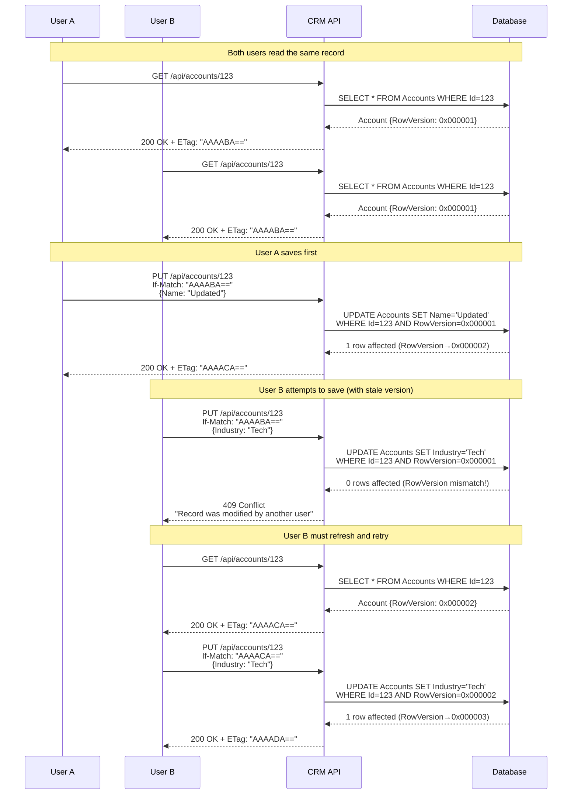

# Architecture Specification: Concurrency Control

> **Spec ID:** SPEC-ARCH-009  
> **Feature:** Optimistic Concurrency Control and Conflict Resolution  
> **Module:** Architecture  
> **Version:** 1.0  
> **Last Updated:** February 23, 2026  
> **Status:** 🚧 Draft  
> **Priority:** P2 (Documentation)  
> **Author:** Architecture Team  
> **Cross-References:** [SPEC-ARCH-001](SPEC-ARCH-001-DTOStandard.md) (DTOs), [SPEC-ARCH-002](SPEC-ARCH-002-ErrorHandlingStrategy.md) (Error Handling), [SPEC-ARCH-007](SPEC-ARCH-007-MiddlewarePipeline.md) (Middleware)

---

## Executive Summary

The CRM solution uses **Optimistic Concurrency Control (OCC)** to handle concurrent updates to database entities in multi-user environments. This approach assumes conflicts are rare and detects them only when updates are saved, rather than locking records during reads.

**Key Mechanism:**
- Every entity inherits `RowVersion` property (timestamp)
- Entity Framework Core automatically increments `RowVersion` on every update
- Updates fail with `DbUpdateConcurrencyException` if `RowVersion` doesn't match
- API exposes `ETag` headers for HTTP-level concurrency control
- Frontend must send `If-Match` header for conditional updates

**Benefits:**
- **Better performance:** No row-level locking reduces contention
- **Scalability:** Multiple users can read simultaneously
- **RESTful compliance:** Follows HTTP `ETag`/`If-Match` pattern
- **Data integrity:** Ensures "last write wins" doesn't overwrite changes
- **User-friendly:** "Record was modified by another user" messages

---

## 1. Business Context

### 1.1 Feature Description

Concurrency control prevents data loss when multiple users edit the same record simultaneously. Without it:

**Scenario without OCC:**
```
Time T1: User A reads Account "Acme Corp" (Revenue: $1M)
Time T2: User B reads Account "Acme Corp" (Revenue: $1M)
Time T3: User A updates Revenue to $2M → Saved
Time T4: User B updates Industry to "Technology" → Saved
Result: Revenue change by User A is LOST (overwritten with stale $1M value from User B's read)
```

**Scenario with OCC:**
```
Time T1: User A reads Account (Revenue: $1M, RowVersion: 0x000001)
Time T2: User B reads Account (Revenue: $1M, RowVersion: 0x000001)
Time T3: User A updates Revenue to $2M → Saved (RowVersion becomes 0x000002)
Time T4: User B updates Industry to "Technology" → REJECTED (RowVersion mismatch)
User B notification: "Record was modified by another user. Please refresh."
User B refreshes, sees Revenue=$2M, updates Industry → Saved successfully
Result: No data loss, both changes preserved
```

### 1.2 Concurrency Strategies

| Strategy | Locking | Conflict Detection | Performance | Use Case |
|----------|---------|-------------------|-------------|----------|
| **Optimistic (OCC)** | None | On write | High | CRM (read-heavy, rare conflicts) |
| **Pessimistic** | Exclusive locks | Before read | Low | Banking (guaranteed consistency) |
| **Last Write Wins** | None | Never | Highest | Distributed caches (acceptable data loss) |
| **Merge** | None | On write | Medium | Collaborative editing (OT/CRDT) |

**CRM Choice:** Optimistic Concurrency Control (OCC) via Entity Framework Core's `RowVersion` property.

### 1.3 Use Cases

| UC-ID | Use Case | Actor | Scenario | Expected Outcome | Status |
|-------|----------|-------|----------|------------------|--------|
| UC-001 | Detect concurrent update | User B | User A saves first, User B attempts save | 409 Conflict, User B must refresh | ✅ |
| UC-002 | Update with ETag | API Client | Send `If-Match: "version"` header | Update succeeds if ETag matches | ✅ |
| UC-003 | Conditional GET | API Client | Send `If-None-Match` header | 304 Not Modified if ETag matches | ✅ |
| UC-004 | Handle merge conflict | Frontend | Receive 409, show merge UI | User resolves conflict manually | ⚠️ Partial |
| UC-005 | Retry with latest version | API Client | Auto-fetch latest, retry update | Update succeeds after refresh | ⚠️ Manual |

---

## 2. Architecture & Design

### 2.1 Concurrency Control Flow



### 2.2 Design Principles

| Principle | Description | Implementation |
|-----------|-------------|----------------|
| **Optimistic by Default** | Assume conflicts are rare | No pessimistic locks in normal operations |
| **Automatic Versioning** | Database handles version increments | EF Core `[Timestamp]` attribute auto-updates `RowVersion` |
| **Fail Fast** | Detect conflicts at save time | `DbUpdateConcurrencyException` thrown immediately |
| **User Notification** | Inform users of conflicts | 409 Conflict response with clear message |
| **ETags for HTTP** | RESTful concurrency control | `ETag` in response, `If-Match` in request |
| **No Silent Overwrites** | Never allow "last write wins" without version check | Controllers validate `If-Match` header |

### 2.3 Component Layers

```
┌─────────────────────────────────────────────────────────────┐
│                      HTTP Layer (ETags)                      │
│  ┌────────────────────────────────────────────────────────┐ │
│  │ GET /api/accounts/123                                   │ │
│  │ Response: ETag: "AAAABA==" (Base64 of RowVersion)      │ │
│  │                                                         │ │
│  │ PUT /api/accounts/123                                   │ │
│  │ Request: If-Match: "AAAABA=="                           │ │
│  └────────────────────────────────────────────────────────┘ │
└─────────────────────────────────────────────────────────────┘
                            ↓
┌─────────────────────────────────────────────────────────────┐
│                    Middleware Layer                          │
│  ┌────────────────────────────────────────────────────────┐ │
│  │ ErrorHandlingMiddleware                                 │ │
│  │ - Catches DbUpdateConcurrencyException                  │ │
│  │ - Returns 409 Conflict with entity info                 │ │
│  └────────────────────────────────────────────────────────┘ │
└─────────────────────────────────────────────────────────────┘
                            ↓
┌─────────────────────────────────────────────────────────────┐
│                    Controller Layer                          │
│  ┌────────────────────────────────────────────────────────┐ │
│  │ AccountsController                                      │ │
│  │ - Validates If-Match header with ETagHelper             │ │
│  │ - Returns 412 Precondition Failed if mismatch           │ │
│  │ - Sets ETag header on successful responses              │ │
│  └────────────────────────────────────────────────────────┘ │
└─────────────────────────────────────────────────────────────┘
                            ↓
┌─────────────────────────────────────────────────────────────┐
│                    Service Layer                             │
│  ┌────────────────────────────────────────────────────────┐ │
│  │ AccountService                                          │ │
│  │ - Calls EF Core SaveChangesAsync()                      │ │
│  │ - Lets DbUpdateConcurrencyException bubble up           │ │
│  └────────────────────────────────────────────────────────┘ │
└─────────────────────────────────────────────────────────────┘
                            ↓
┌─────────────────────────────────────────────────────────────┐
│                   Entity Framework Core                      │
│  ┌────────────────────────────────────────────────────────┐ │
│  │ CrmDbContext                                            │ │
│  │ - Tracks original RowVersion on entity load             │ │
│  │ - Generates UPDATE with RowVersion in WHERE clause      │ │
│  │ - Throws exception if 0 rows affected                   │ │
│  └────────────────────────────────────────────────────────┘ │
└─────────────────────────────────────────────────────────────┘
                            ↓
┌─────────────────────────────────────────────────────────────┐
│                      Database Layer                          │
│  ┌────────────────────────────────────────────────────────┐ │
│  │ MariaDB/SQL Server                                      │ │
│  │ UPDATE Accounts SET Name='New', RowVersion=RowVersion+1│ │
│  │ WHERE Id=123 AND RowVersion=<expected>                  │ │
│  │ → Returns 1 row if match, 0 if conflict                 │ │
│  └────────────────────────────────────────────────────────┘ │
└─────────────────────────────────────────────────────────────┘
```

---

## 3. Implementation Details

### 3.1 Entity-Level: BaseEntity with RowVersion

**All entities inherit from `BaseEntity` which includes the `RowVersion` property.**

```csharp
// CRM.Core/Entities/BaseEntity.cs
using System.ComponentModel.DataAnnotations;

namespace CRM.Core.Entities;

/// <summary>
/// Base entity class for all domain entities.
/// Provides Id, audit fields, soft delete, and concurrency control.
/// </summary>
public abstract class BaseEntity
{
    public int Id { get; set; }
    public DateTime CreatedAt { get; set; } = DateTime.UtcNow;
    public DateTime? UpdatedAt { get; set; }
    public bool IsDeleted { get; set; } = false;

    /// <summary>
    /// Row version for optimistic concurrency control.
    /// Used to detect concurrent updates to the same record.
    /// Automatically updated by the database on every UPDATE.
    /// </summary>
    [Timestamp]
    public byte[]? RowVersion { get; set; }
}
```

**Key Points:**
- `[Timestamp]` attribute tells EF Core this is a concurrency token
- Database automatically updates `RowVersion` on every `UPDATE`
- EF Core tracks original `RowVersion` when entity is loaded
- On save, generates SQL with `WHERE RowVersion = <original_value>`

**Example Entity:**

```csharp
// CRM.Core/Entities/Account.cs
public class Account : BaseEntity
{
    public string AccountName { get; set; } = string.Empty;
    public string? Industry { get; set; }
    public decimal Revenue { get; set; }
    
    // RowVersion inherited from BaseEntity
}
```

### 3.2 Database Schema

**MariaDB/MySQL:**
```sql
CREATE TABLE Accounts (
    Id INT AUTO_INCREMENT PRIMARY KEY,
    AccountName VARCHAR(200) NOT NULL,
    Industry VARCHAR(100),
    Revenue DECIMAL(18,2) NOT NULL DEFAULT 0,
    CreatedAt DATETIME NOT NULL DEFAULT CURRENT_TIMESTAMP,
    UpdatedAt DATETIME NULL,
    IsDeleted BIT NOT NULL DEFAULT 0,
    RowVersion TIMESTAMP NOT NULL DEFAULT CURRENT_TIMESTAMP ON UPDATE CURRENT_TIMESTAMP,
    INDEX IX_Accounts_IsDeleted (IsDeleted)
);
```

**SQL Server:**
```sql
CREATE TABLE Accounts (
    Id INT IDENTITY(1,1) PRIMARY KEY,
    AccountName NVARCHAR(200) NOT NULL,
    Industry NVARCHAR(100),
    Revenue DECIMAL(18,2) NOT NULL DEFAULT 0,
    CreatedAt DATETIME2 NOT NULL DEFAULT GETUTCDATE(),
    UpdatedAt DATETIME2 NULL,
    IsDeleted BIT NOT NULL DEFAULT 0,
    RowVersion ROWVERSION NOT NULL,
    INDEX IX_Accounts_IsDeleted (IsDeleted)
);
```

**EF Core Configuration:**

```csharp
// CRM.Infrastructure/Data/CrmDbContext.cs (OnModelCreating)
protected override void OnModelCreating(ModelBuilder modelBuilder)
{
    // Configure RowVersion for all entities
    foreach (var entityType in modelBuilder.Model.GetEntityTypes())
    {
        var property = entityType.FindProperty("RowVersion");
        if (property != null)
        {
            // MariaDB/MySQL uses TIMESTAMP
            if (Database.IsMariaDb() || Database.IsMySql())
            {
                property.SetColumnType("timestamp");
                property.SetDefaultValueSql("CURRENT_TIMESTAMP ON UPDATE CURRENT_TIMESTAMP");
            }
            // SQL Server uses ROWVERSION
            else if (Database.IsSqlServer())
            {
                property.SetColumnType("rowversion");
                property.ValueGeneratedOnAddOrUpdate();
            }
            // PostgreSQL uses xmin
            else if (Database.IsNpgsql())
            {
                property.SetColumnName("xmin");
                property.SetColumnType("xid");
                property.ValueGeneratedOnAddOrUpdate();
            }
        }
    }

    base.OnModelCreating(modelBuilder);
}
```

### 3.3 Service Layer: Handling Concurrency Exceptions

**Services should let `DbUpdateConcurrencyException` bubble up to middleware.**

```csharp
// CRM.Infrastructure/Services/AccountService.cs
public class AccountService : IAccountService
{
    private readonly ICrmDbContext _context;
    private readonly ILogger<AccountService> _logger;

    public AccountService(ICrmDbContext context, ILogger<AccountService> logger)
    {
        _context = context;
        _logger = logger;
    }

    public async Task<Account> UpdateAsync(int id, Account account, CancellationToken cancellationToken = default)
    {
        var existing = await _context.Accounts
            .FirstOrDefaultAsync(a => a.Id == id && !a.IsDeleted, cancellationToken);

        if (existing == null)
        {
            throw new CrmNotFoundException($"Account with ID {id} not found");
        }

        // Update properties
        existing.AccountName = account.AccountName;
        existing.Industry = account.Industry;
        existing.Revenue = account.Revenue;
        existing.UpdatedAt = DateTime.UtcNow;

        // EF Core will include RowVersion in WHERE clause automatically
        // If another user updated this record, SaveChangesAsync will throw DbUpdateConcurrencyException
        await _context.SaveChangesAsync(cancellationToken);

        _logger.LogInformation("Updated account {Id} to version {RowVersion}",
            existing.Id, Convert.ToBase64String(existing.RowVersion ?? Array.Empty<byte>()));

        return existing;
    }
}
```

**Key Points:**
- DO NOT catch `DbUpdateConcurrencyException` in service layer
- Let exception propagate to `ErrorHandlingMiddleware`
- After successful save, `RowVersion` is automatically refreshed by EF Core

### 3.4 Middleware: Error Handling for Concurrency Conflicts

**ErrorHandlingMiddleware converts `DbUpdateConcurrencyException` to 409 Conflict.**

```csharp
// CRM.Api/Middleware/ErrorHandlingMiddleware.cs
public class ErrorHandlingMiddleware
{
    private readonly RequestDelegate _next;
    private readonly ILogger<ErrorHandlingMiddleware> _logger;

    public ErrorHandlingMiddleware(RequestDelegate next, ILogger<ErrorHandlingMiddleware> logger)
    {
        _next = next;
        _logger = logger;
    }

    public async Task InvokeAsync(HttpContext context)
    {
        try
        {
            await _next(context);
        }
        catch (DbUpdateConcurrencyException ex)
        {
            // Handle optimistic concurrency conflicts
            _logger.LogWarning(ex, "Concurrency conflict detected for request {Method} {Path}",
                context.Request.Method, context.Request.Path);

            context.Response.StatusCode = StatusCodes.Status409Conflict;
            context.Response.ContentType = "application/json";

            var conflictResponse = new ConcurrencyConflictResponse
            {
                Message = "The record was modified by another user. Please refresh and try again.",
                ConflictType = "ConcurrencyConflict",
                Timestamp = DateTime.UtcNow,
                RequestPath = context.Request.Path,
                EntityInfo = ex.Entries.Select(e => new EntityConflictInfo
                {
                    EntityType = e.Entity.GetType().Name,
                    EntityId = GetEntityId(e.Entity),
                    State = e.State.ToString()
                }).ToList()
            };

            await context.Response.WriteAsJsonAsync(conflictResponse);
        }
        catch (Exception ex)
        {
            // Handle other exceptions...
        }
    }

    private static string GetEntityId(object entity)
    {
        var idProperty = entity.GetType().GetProperty("Id");
        return idProperty?.GetValue(entity)?.ToString() ?? "Unknown";
    }
}

public class ConcurrencyConflictResponse
{
    public string Message { get; set; } = string.Empty;
    public string ConflictType { get; set; } = string.Empty;
    public DateTime Timestamp { get; set; }
    public string RequestPath { get; set; } = string.Empty;
    public List<EntityConflictInfo> EntityInfo { get; set; } = new();
}

public class EntityConflictInfo
{
    public string EntityType { get; set; } = string.Empty;
    public string EntityId { get; set; } = string.Empty;
    public string State { get; set; } = string.Empty;
}
```

**Response Example:**

```json
{
  "message": "The record was modified by another user. Please refresh and try again.",
  "conflictType": "ConcurrencyConflict",
  "timestamp": "2026-02-23T14:30:00Z",
  "requestPath": "/api/accounts/123",
  "entityInfo": [
    {
      "entityType": "Account",
      "entityId": "123",
      "state": "Modified"
    }
  ]
}
```

### 3.5 Controller Layer: ETag Validation

**Controllers use `ETagHelper` to work with HTTP ETags.**

```csharp
// CRM.Api/Helpers/ETagHelper.cs
namespace CRM.Api.Helpers;

/// <summary>
/// Helper methods for working with ETags and RowVersion for HTTP-level concurrency control.
/// </summary>
public static class ETagHelper
{
    /// <summary>
    /// Generates an ETag from a RowVersion byte array.
    /// </summary>
    public static string GenerateETag(byte[]? rowVersion)
    {
        if (rowVersion == null || rowVersion.Length == 0)
            return "\"\"";

        return $"\"{Convert.ToBase64String(rowVersion)}\"";
    }

    /// <summary>
    /// Generates an ETag from a BaseEntity's RowVersion.
    /// </summary>
    public static string GenerateETag(BaseEntity entity)
    {
        return GenerateETag(entity.RowVersion);
    }

    /// <summary>
    /// Parses an ETag header value back to a RowVersion byte array.
    /// </summary>
    public static byte[]? ParseETag(string? etag)
    {
        if (string.IsNullOrWhiteSpace(etag))
            return null;

        // Remove quotes if present
        etag = etag.Trim().Trim('"');

        try
        {
            return Convert.FromBase64String(etag);
        }
        catch
        {
            return null;
        }
    }

    /// <summary>
    /// Checks if the If-Match header matches the current RowVersion.
    /// </summary>
    public static bool IsMatch(string? ifMatch, byte[]? currentRowVersion)
    {
        if (string.IsNullOrWhiteSpace(ifMatch))
            return true; // No If-Match header means no validation

        var requestedVersion = ParseETag(ifMatch);
        if (requestedVersion == null || currentRowVersion == null)
            return false;

        return requestedVersion.SequenceEqual(currentRowVersion);
    }

    /// <summary>
    /// Checks if the If-None-Match header matches the current RowVersion (for conditional GET).
    /// </summary>
    public static bool IsNoneMatch(string? ifNoneMatch, byte[]? currentRowVersion)
    {
        if (string.IsNullOrWhiteSpace(ifNoneMatch))
            return false;

        var currentEtag = GenerateETag(currentRowVersion);
        return ifNoneMatch.Contains(currentEtag);
    }
}
```

**Controller Implementation:**

```csharp
// CRM.Api/Controllers/AccountsController.cs
[ApiController]
[Route("api/[controller]")]
public class AccountsController : ControllerBase
{
    private readonly IAccountService _accountService;
    private readonly ILogger<AccountsController> _logger;

    public AccountsController(IAccountService accountService, ILogger<AccountsController> logger)
    {
        _accountService = accountService;
        _logger = logger;
    }

    /// <summary>
    /// Gets an account by ID with ETag support for conditional requests.
    /// </summary>
    [HttpGet("{id}")]
    public async Task<IActionResult> GetById(int id)
    {
        var account = await _accountService.GetByIdAsync(id);

        if (account == null)
        {
            return NotFound(new { message = $"Account with ID {id} not found" });
        }

        // Generate ETag from RowVersion
        var etag = ETagHelper.GenerateETag(account.RowVersion);
        Response.Headers.ETag = etag;

        // Check If-None-Match (conditional GET)
        var ifNoneMatch = Request.Headers["If-None-Match"].ToString();
        if (!string.IsNullOrEmpty(ifNoneMatch) && !ETagHelper.IsNoneMatch(ifNoneMatch, account.RowVersion))
        {
            return StatusCode(StatusCodes.Status304NotModified);
        }

        return Ok(account);
    }

    /// <summary>
    /// Updates an account with ETag-based concurrency control.
    /// Requires If-Match header with current ETag.
    /// </summary>
    [HttpPut("{id}")]
    public async Task<IActionResult> Update(int id, [FromBody] UpdateAccountDto dto)
    {
        // Validate If-Match header
        var ifMatch = Request.Headers["If-Match"].ToString();
        if (string.IsNullOrEmpty(ifMatch))
        {
            return BadRequest(new
            {
                message = "If-Match header is required for updates",
                hint = "Include the ETag received from GET request"
            });
        }

        try
        {
            // Get current entity to check version
            var currentAccount = await _accountService.GetByIdAsync(id);
            if (currentAccount == null)
            {
                return NotFound(new { message = $"Account with ID {id} not found" });
            }

            // Validate ETag matches current RowVersion
            if (!ETagHelper.IsMatch(ifMatch, currentAccount.RowVersion))
            {
                return StatusCode(StatusCodes.Status412PreconditionFailed, new
                {
                    message = "ETag mismatch. The record may have been modified.",
                    currentETag = ETagHelper.GenerateETag(currentAccount.RowVersion),
                    providedETag = ifMatch
                });
            }

            // Perform update (will throw DbUpdateConcurrencyException if another user updated meanwhile)
            var account = await _accountService.UpdateAsync(id, dto);

            // Return updated entity with new ETag
            Response.Headers.ETag = ETagHelper.GenerateETag(account.RowVersion);
            return Ok(account);
        }
        catch (DbUpdateConcurrencyException)
        {
            // This should be caught by ErrorHandlingMiddleware, but include as safety
            return Conflict(new
            {
                message = "The record was modified by another user. Please refresh and try again."
            });
        }
    }
}
```

**HTTP Request/Response Flow:**

```http
# Step 1: GET request
GET /api/accounts/123 HTTP/1.1

HTTP/1.1 200 OK
ETag: "AAAABA=="
Content-Type: application/json

{
  "id": 123,
  "accountName": "Acme Corp",
  "revenue": 1000000
}

# Step 2: PUT request with matching ETag (succeeds)
PUT /api/accounts/123 HTTP/1.1
If-Match: "AAAABA=="
Content-Type: application/json

{
  "accountName": "Acme Corporation",
  "revenue": 2000000
}

HTTP/1.1 200 OK
ETag: "AAAACA=="
Content-Type: application/json

{
  "id": 123,
  "accountName": "Acme Corporation",
  "revenue": 2000000
}

# Step 3: PUT request with stale ETag (fails)
PUT /api/accounts/123 HTTP/1.1
If-Match: "AAAABA=="
Content-Type: application/json

{
  "industry": "Technology"
}

HTTP/1.1 409 Conflict
Content-Type: application/json

{
  "message": "The record was modified by another user. Please refresh and try again.",
  "conflictType": "ConcurrencyConflict",
  "entityInfo": [
    {
      "entityType": "Account",
      "entityId": "123"
    }
  ]
}
```

### 3.6 Frontend Implementation Pattern

**React/TypeScript example for handling concurrency:**

```typescript
// CRM.Frontend/src/services/accountService.ts
import axios from 'axios';

export interface Account {
  id: number;
  accountName: string;
  revenue: number;
  // ... other fields
}

class AccountService {
  private baseUrl = '/api/accounts';

  // GET with ETag tracking
  async getById(id: number): Promise<{ data: Account; etag: string }> {
    const response = await axios.get<Account>(`${this.baseUrl}/${id}`);
    const etag = response.headers['etag'] || '';
    return { data: response.data, etag };
  }

  // PUT with If-Match header
  async update(id: number, account: Account, etag: string): Promise<Account> {
    try {
      const response = await axios.put<Account>(
        `${this.baseUrl}/${id}`,
        account,
        {
          headers: {
            'If-Match': etag
          }
        }
      );
      return response.data;
    } catch (error: any) {
      if (error.response?.status === 409) {
        throw new ConcurrencyError('Record was modified by another user');
      }
      throw error;
    }
  }
}

export class ConcurrencyError extends Error {
  constructor(message: string) {
    super(message);
    this.name = 'ConcurrencyError';
  }
}

export default new AccountService();
```

**Component usage:**

```typescript
// CRM.Frontend/src/components/AccountEditForm.tsx
import React, { useState, useEffect } from 'react';
import accountService, { Account, ConcurrencyError } from '../services/accountService';
import { Alert, Button, TextField } from '@mui/material';

export const AccountEditForm: React.FC<{ accountId: number }> = ({ accountId }) => {
  const [account, setAccount] = useState<Account | null>(null);
  const [etag, setEtag] = useState<string>('');
  const [error, setError] = useState<string>('');
  const [concurrencyError, setConcurrencyError] = useState<boolean>(false);

  useEffect(() => {
    loadAccount();
  }, [accountId]);

  const loadAccount = async () => {
    const { data, etag: newEtag } = await accountService.getById(accountId);
    setAccount(data);
    setEtag(newEtag);
    setConcurrencyError(false);
  };

  const handleSave = async () => {
    if (!account) return;

    try {
      const updated = await accountService.update(accountId, account, etag);
      setAccount(updated);
      setEtag(updated.etag); // Update with new ETag
      setError('');
      setConcurrencyError(false);
    } catch (err) {
      if (err instanceof ConcurrencyError) {
        setConcurrencyError(true);
        setError('This record was modified by another user. Please refresh to see the latest version.');
      } else {
        setError('Failed to save account');
      }
    }
  };

  const handleRefresh = () => {
    loadAccount();
  };

  return (
    <div>
      {concurrencyError && (
        <Alert severity="warning" action={
          <Button color="inherit" size="small" onClick={handleRefresh}>
            REFRESH
          </Button>
        }>
          {error}
        </Alert>
      )}

      {account && (
        <>
          <TextField
            label="Account Name"
            value={account.accountName}
            onChange={(e) => setAccount({ ...account, accountName: e.target.value })}
          />
          <TextField
            label="Revenue"
            type="number"
            value={account.revenue}
            onChange={(e) => setAccount({ ...account, revenue: parseFloat(e.target.value) })}
          />
          <Button onClick={handleSave}>Save</Button>
        </>
      )}
    </div>
  );
};
```

---

## 4. Best Practices

### 4.1 Entity Development Guidelines

| Best Practice | Rationale | Example |
|---------------|-----------|---------|
| **Inherit from BaseEntity** | Ensures RowVersion is present | `public class Account : BaseEntity` |
| **Never modify RowVersion** | Database manages it automatically | Read-only in application code |
| **Include in DTOs** | Frontend needs ETag for updates | `public byte[]? RowVersion { get; set; }` in DTO |
| **Test concurrency scenarios** | Catch issues early | Unit tests with concurrent updates |

### 4.2 Service Layer Best Practices

| Best Practice | Rationale | Example |
|---------------|-----------|---------|
| **Let exceptions bubble up** | Middleware handles concurrency errors | Don't catch `DbUpdateConcurrencyException` |
| **Don't manually check RowVersion** | EF Core does it automatically | Just call `SaveChangesAsync()` |
| **Use transactions for multi-entity updates** | Ensures atomicity | `using var transaction = await _context.Database.BeginTransactionAsync()` |
| **Log version changes** | Helps debugging | `_logger.LogDebug("Updated to version {Version}", entity.RowVersion)` |

### 4.3 Controller Best Practices

| Best Practice | Rationale | Example |
|---------------|-----------|---------|
| **Require If-Match for updates** | Prevents accidental overwrite | Return 400 if header missing |
| **Return ETag on all responses** | Enables client-side concurrency control | `Response.Headers.ETag = ETagHelper.GenerateETag(entity)` |
| **Support If-None-Match** | Reduces bandwidth for unchanged data | Return 304 Not Modified |
| **Provide clear error messages** | Users understand what went wrong | "Record was modified by another user" |

### 4.4 Frontend Best Practices

| Best Practice | Rationale | Example |
|---------------|-----------|---------|
| **Store ETag from GET** | Required for subsequent updates | Save in component state or Redux |
| **Send If-Match on PUT/PATCH** | Enable optimistic concurrency | `headers: { 'If-Match': etag }` |
| **Handle 409 gracefully** | Show user-friendly message | Alert with "Refresh" button |
| **Auto-retry simple updates** | Reduces user friction | Fetch latest, merge changes, retry |
| **Manual merge for complex changes** | User decides conflict resolution | Show both versions, let user choose |

### 4.5 Common Pitfalls to Avoid

| Pitfall | Why It's Bad | Solution |
|---------|--------------|----------|
| **Ignoring RowVersion in DTOs** | Frontend can't send correct ETag | Include in all read/update DTOs |
| **Not sending If-Match** | Server can't validate concurrency | Always send ETag on updates |
| **Silently overwriting on 409** | Lost data, user not informed | Show error, refresh, let user retry |
| **Manually incrementing RowVersion** | Database handles it, manual changes break it | Never touch RowVersion in code |
| **Using old ETag after success** | Next update will fail | Update stored ETag from response |
| **No error handling for 409** | App crashes or shows generic error | Catch and display user-friendly message |

---

## 5. Testing Strategy

### 5.1 Unit Testing Concurrency

**Test Pattern:** Simulate concurrent updates using multiple DbContext instances.

```csharp
// CRM.Backend/tests/Services/AccountServiceConcurrencyTests.cs
public class AccountServiceConcurrencyTests : IDisposable
{
    private readonly CrmDbContext _context1;
    private readonly CrmDbContext _context2;
    private readonly AccountService _service1;
    private readonly AccountService _service2;

    public AccountServiceConcurrencyTests()
    {
        // Setup two separate DbContexts to simulate two users
        var options = new DbContextOptionsBuilder<CrmDbContext>()
            .UseInMemoryDatabase(databaseName: Guid.NewGuid().ToString())
            .Options;

        _context1 = new CrmDbContext(options);
        _context2 = new CrmDbContext(options);

        var logger1 = new Mock<ILogger<AccountService>>();
        var logger2 = new Mock<ILogger<AccountService>>();

        _service1 = new AccountService(_context1, logger1.Object);
        _service2 = new AccountService(_context2, logger2.Object);

        // Seed test data
        var account = new Account { Id = 1, AccountName = "Test", Revenue = 1000 };
        _context1.Accounts.Add(account);
        _context1.SaveChanges();
    }

    [Fact]
    public async Task UpdateAsync_WhenConcurrentUpdate_ThrowsConcurrencyException()
    {
        // Arrange: Both services read the same account
        var account1 = await _context1.Accounts.FindAsync(1);
        var account2 = await _context2.Accounts.FindAsync(1);

        Assert.NotNull(account1);
        Assert.NotNull(account2);

        // Act: User 1 updates first
        account1.AccountName = "Updated by User 1";
        await _context1.SaveChangesAsync();

        // User 2 tries to update with stale version
        account2.AccountName = "Updated by User 2";

        // Assert: User 2's update should fail
        await Assert.ThrowsAsync<DbUpdateConcurrencyException>(
            async () => await _context2.SaveChangesAsync());
    }

    [Fact]
    public async Task UpdateAsync_AfterRefresh_SucceedsWithLatestVersion()
    {
        // Arrange: Both services read the same account
        var account1 = await _context1.Accounts.FindAsync(1);
        var account2 = await _context2.Accounts.FindAsync(1);

        // User 1 updates first
        account1!.AccountName = "Updated by User 1";
        await _context1.SaveChangesAsync();

        // Act: User 2 refreshes (reloads entity)
        await _context2.Entry(account2!).ReloadAsync();
        account2.AccountName = "Updated by User 2";
        await _context2.SaveChangesAsync(); // Should succeed now

        // Assert
        var final = await _context1.Accounts.FindAsync(1);
        Assert.Equal("Updated by User 2", final!.AccountName);
    }

    public void Dispose()
    {
        _context1.Dispose();
        _context2.Dispose();
    }
}
```

### 5.2 Controller Integration Tests

```csharp
// CRM.Backend/tests/Integration/AccountsConcurrencyTests.cs
public class AccountsConcurrencyTests : IClassFixture<WebApplicationFactory<Program>>
{
    private readonly HttpClient _client;

    public AccountsConcurrencyTests(WebApplicationFactory<Program> factory)
    {
        _client = factory.CreateClient();
    }

    [Fact]
    public async Task PutAccount_WithMismatchedETag_Returns412()
    {
        // Arrange: Create account
        var createResponse = await _client.PostAsJsonAsync("/api/accounts", new
        {
            accountName = "Test Account",
            revenue = 1000
        });
        var account = await createResponse.Content.ReadFromJsonAsync<Account>();
        var accountId = account!.Id;

        // Get with ETag
        var getResponse = await _client.GetAsync($"/api/accounts/{accountId}");
        var etag = getResponse.Headers.ETag!.Tag;

        // Another user updates
        await _client.PutAsync($"/api/accounts/{accountId}", JsonContent.Create(new
        {
            accountName = "Updated by Other User",
            revenue = 2000
        }), new Dictionary<string, string> { ["If-Match"] = etag });

        // Act: Try to update with stale ETag
        var updateResponse = await _client.PutAsync($"/api/accounts/{accountId}",
            JsonContent.Create(new { accountName = "My Update", revenue = 3000 }),
            new Dictionary<string, string> { ["If-Match"] = etag });

        // Assert
        Assert.Equal(HttpStatusCode.PreconditionFailed, updateResponse.StatusCode);
    }

    [Fact]
    public async Task GetAccount_WithIfNoneMatch_Returns304()
    {
        // Arrange: Create account and get ETag
        var createResponse = await _client.PostAsJsonAsync("/api/accounts", new
        {
            accountName = "Test Account"
        });
        var account = await createResponse.Content.ReadFromJsonAsync<Account>();
        var accountId = account!.Id;

        var getResponse1 = await _client.GetAsync($"/api/accounts/{accountId}");
        var etag = getResponse1.Headers.ETag!.Tag;

        // Act: GET with If-None-Match
        var request = new HttpRequestMessage(HttpMethod.Get, $"/api/accounts/{accountId}");
        request.Headers.TryAddWithoutValidation("If-None-Match", etag);
        var getResponse2 = await _client.SendAsync(request);

        // Assert
        Assert.Equal(HttpStatusCode.NotModified, getResponse2.StatusCode);
    }
}
```

### 5.3 Test Coverage Requirements

| Component | Target Coverage | Priority |
|-----------|-----------------|----------|
| **BaseEntity RowVersion** | 100% | P0 - Critical |
| **Service layer concurrency handling** | 90%+ | P0 - Critical |
| **Controller ETag validation** | 95%+ | P0 - Critical |
| **ETagHelper methods** | 100% | P0 - Critical |
| **Middleware concurrency error handling** | 90%+ | P1 - High |
| **Frontend concurrency error UI** | 80%+ | P2 - Medium |

---

## 6. References

### 6.1 Internal Documentation

- [SPEC-ARCH-001: DTO Standardization](SPEC-ARCH-001-DTOStandard.md)
- [SPEC-ARCH-002: Error Handling Strategy](SPEC-ARCH-002-ErrorHandlingStrategy.md)
- [SPEC-ARCH-007: Middleware Pipeline](SPEC-ARCH-007-MiddlewarePipeline.md)
- [DATABASE_SCHEMA.md](../../database/DATABASE_SCHEMA.md)

### 6.2 Source Code References

| File/Directory | Purpose |
|----------------|---------|
| `CRM.Core/Entities/BaseEntity.cs` | Base entity with RowVersion |
| `CRM.Api/Helpers/ETagHelper.cs` | ETag generation and validation |
| `CRM.Api/Middleware/ErrorHandlingMiddleware.cs` | Concurrency exception handling |
| `CRM.Api/Controllers/*Controller.cs` | ETag-based concurrency control |
| `CRM.Frontend/src/services/*.ts` | Frontend concurrency handling |

### 6.3 External Resources

- [Optimistic Concurrency - EF Core](https://learn.microsoft.com/en-us/ef/core/saving/concurrency)
- [HTTP ETags](https://developer.mozilla.org/en-US/docs/Web/HTTP/Headers/ETag)
- [HTTP Conditional Requests](https://developer.mozilla.org/en-US/docs/Web/HTTP/Conditional_requests)
- [Timestamp/Rowversion (SQL Server)](https://learn.microsoft.com/en-us/sql/t-sql/data-types/rowversion-transact-sql)

---

## 7. Change Log

| Version | Date | Author | Changes |
|---------|------|--------|---------|
| 1.0 | 2026-02-23 | Architecture Team | Initial specification documenting optimistic concurrency control |

---

## 8. Appendix

### 8.1 Concurrency Strategies Comparison

| Strategy | Pros | Cons | Best For |
|----------|------|------|----------|
| **Optimistic (OCC)** | • High performance<br>• Scalable<br>• No deadlocks | • Requires retry logic<br>• User sees error on conflict | Read-heavy systems like CRM |
| **Pessimistic Locking** | • Guaranteed consistency<br>• No rollback needed | • Poor concurrency<br>• Deadlock risk<br>• Timeout issues | Banking, inventory systems |
| **Version Vectors** | • Handles distributed updates<br>• Eventual consistency | • Complex implementation<br>• Storage overhead | Distributed databases |
| **Last Write Wins** | • Simple<br>• No conflicts | • Data loss<br>• No conflict detection | Caches, non-critical data |

### 8.2 Database-Specific Implementation

**SQL Server (ROWVERSION):**
- Automatically incremented 8-byte value
- Guaranteed unique across database
- Automatically updated on UPDATE
- Cannot be inserted or updated manually

**MariaDB/MySQL (TIMESTAMP):**
- Timestamp precision to microseconds
- Automatically updated via `ON UPDATE CURRENT_TIMESTAMP`
- Must be configured correctly in EF Core

**PostgreSQL (xmin):**
- System column tracking transaction ID
- Automatically maintained
- Use with `xmin` column type in EF Core

### 8.3 Troubleshooting Guide

| Problem | Symptoms | Solution |
|---------|----------|----------|
| **Frequent 409 errors** | Users see many conflicts | • Reduce form submission time<br>• Implement auto-save<br>• Consider pessimistic locking for high-contention records |
| **RowVersion always null** | ETag generation fails | • Check `[Timestamp]` attribute<br>• Verify database schema<br>• Ensure EF Core configuration correct |
| **412 on first update** | Even without concurrent users | • Frontend not sending If-Match<br>• If-Match header malformed<br>• ETag encoding mismatch |
| **Lost updates** | Changes disappear | • If-Match header not required<br>• Concurrency token not configured<br>• RowVersion not in WHERE clause |
| **"Cannot insert explicit value"** | SQL error on insert | • Application trying to set RowVersion<br>• Remove RowVersion from insert DTOs<br>• Verify EF Core doesn't track it on insert |

### 8.4 Performance Considerations

| Aspect | Impact | Mitigation |
|--------|--------|------------|
| **RowVersion column** | Minimal storage (8 bytes) | None needed |
| **ETag generation** | CPU cost of Base64 encoding | Negligible, done once per response |
| **Conflict rate** | Higher conflicts = more retries | Optimize UI for faster updates, batch changes |
| **Database load** | Additional WHERE clause check | Indexed primary key makes this fast |
| **Network overhead** | ETag in every response | Very small (12-20 bytes) |

---

**END OF SPECIFICATION**
