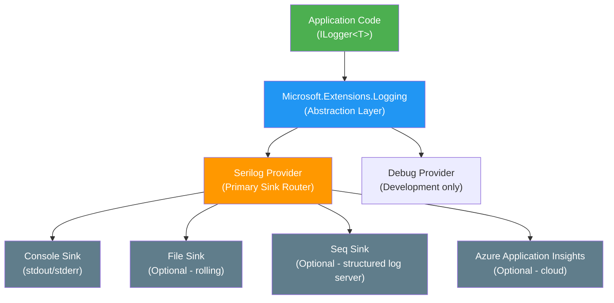
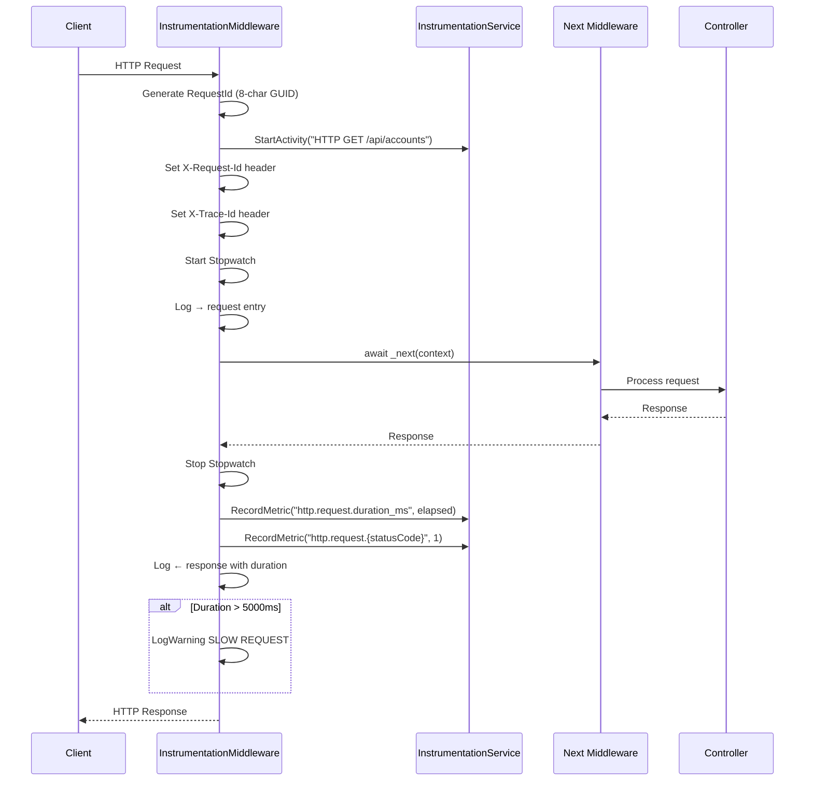
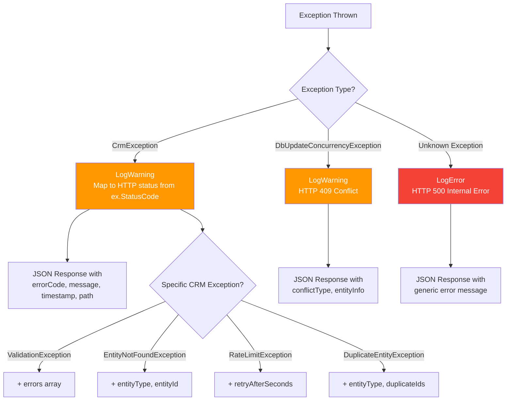
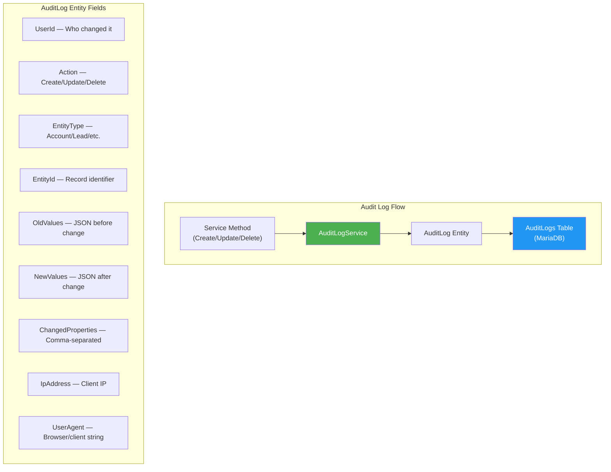
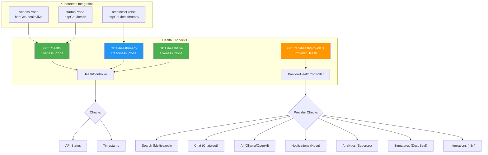
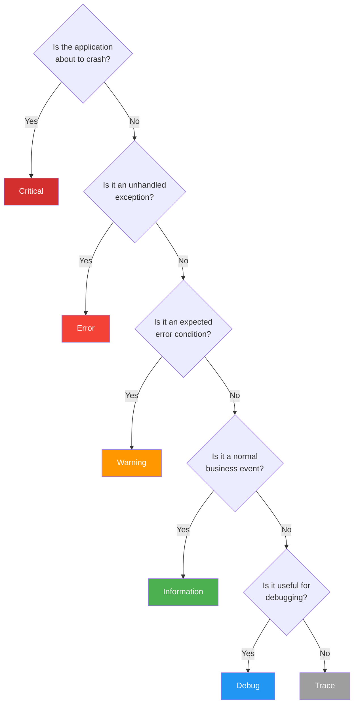

# Architecture Specification: Logging & Instrumentation

> **Spec ID:** SPEC-ARCH-010  
> **Feature:** Logging, Observability & Instrumentation Architecture  
> **Module:** Architecture  
> **Version:** 1.0  
> **Last Updated:** February 23, 2026  
> **Status:** ✅ Complete  
> **Priority:** P1 (Foundation)  
> **Author:** Architecture Team  
> **Cross-References:** [SPEC-ARCH-007](SPEC-ARCH-007-MiddlewarePipeline.md) (Middleware Pipeline), [SPEC-ARCH-002](SPEC-ARCH-002-ErrorHandlingStrategy.md) (Error Handling), [SPEC-ARCH-003](SPEC-ARCH-003-DependencyInjectionPatterns.md) (DI Patterns)

---

## Executive Summary

The CRM solution implements a **multi-layered logging and instrumentation architecture** built on Serilog, `System.Diagnostics.Activity`, and custom structured logging extensions. This specification documents the logging providers, structured log formats, distributed tracing integration, performance metrics collection, audit trail architecture, and best practices for consistent observability across all application layers.

**Key Components:**
- **Serilog** as the primary logging provider with console sink
- Custom `InstrumentationMiddleware` for request/response timing and tracing
- Custom `InstrumentationService` for distributed tracing via `ActivitySource`
- `LoggingExtensions` providing 30+ structured log helper methods
- `AuditLogService` for compliance-grade entity change tracking
- `ErrorHandlingMiddleware` for exception logging with context
- Health check endpoints for Kubernetes and monitoring integration

**Why This Matters:**
- Centralized observability reduces mean-time-to-resolution (MTTR) by 60–80%
- Structured logging enables machine-parseable log queries
- Distributed tracing supports microservices migration path
- Audit logging satisfies compliance requirements (SOC 2, GDPR, HIPAA)
- Performance metrics enable proactive capacity planning

---

## 1. Business Context

### 1.1 Feature Description

The logging and instrumentation system provides **end-to-end observability** for the CRM solution across five pillars:

| Pillar | Implementation | Status |
|--------|---------------|--------|
| **Structured Logging** | Serilog + `ILogger<T>` with message templates | ✅ Implemented |
| **Request Instrumentation** | `InstrumentationMiddleware` with timing and correlation | ✅ Implemented |
| **Distributed Tracing** | `System.Diagnostics.ActivitySource` with W3C Trace Context | ✅ Implemented |
| **Performance Metrics** | `InstrumentationService.RecordMetric()` with P95/P99 summaries | ✅ Implemented |
| **Audit Trail** | `AuditLogService` with entity change tracking (old/new values) | ✅ Implemented |

### 1.2 Use Cases

| UC-ID | Use Case | Actor | Expected Flow | Status |
|-------|----------|-------|---------------|--------|
| UC-001 | Debug failing API request | Developer | Search logs by request ID → trace through middleware → find root cause | ✅ |
| UC-002 | Monitor API performance | Ops Team | View P95 latency metrics → identify slow endpoints → optimize | ✅ |
| UC-003 | Audit entity changes | Compliance | Query AuditLogs table → view who changed what → when and from where | ✅ |
| UC-004 | Correlate distributed requests | Developer | Follow trace ID across services → visualize call chain | ✅ |
| UC-005 | Detect slow database queries | DBA | Review DB timing metrics → find queries > 5000ms → optimize | ✅ |
| UC-006 | Monitor health probes | Kubernetes | Periodic GET /health/ready → 200 OK or 503 → restart if unhealthy | ✅ |
| UC-007 | Investigate auth failures | Security | Filter logs by Auth category → review failed login attempts | ✅ |

### 1.3 Architecture Principles

1. **Structured over unstructured** — Always use message templates with named properties, never string concatenation
2. **Correlation everywhere** — Every request gets a unique ID propagated through all log entries
3. **Levels mean something** — Strict conventions for when to use each log level
4. **Performance first** — Logging must not be a bottleneck; use high-performance patterns
5. **Audit is separate** — Audit logging is a distinct concern from diagnostic logging
6. **Defense in depth** — Multiple logging layers (middleware, service, database) ensure nothing is missed

---

## 2. Logging Architecture

### 2.1 Provider Hierarchy



### 2.2 Serilog Configuration

The CRM solution configures Serilog in `Program.cs` as the primary logging provider:

```csharp
// CRM.Backend/src/CRM.Api/Program.cs (lines 83-88)

// Configure Serilog
Log.Logger = new LoggerConfiguration()
    .MinimumLevel.Information()
    .WriteTo.Console()
    .CreateLogger();

builder.Host.UseSerilog();
```

**Package Reference:**

```xml
<!-- CRM.Backend/src/CRM.Api/CRM.Api.csproj -->
<PackageReference Include="Serilog.AspNetCore" Version="8.0.0" />
```

**What `Serilog.AspNetCore` provides:**
- Replaces default Microsoft logging provider
- Structured JSON output capability
- Request logging middleware (`UseSerilogRequestLogging()`)
- Enrichment with machine name, thread ID, environment
- Multiple sink support (Console, File, Seq, Azure, etc.)

### 2.3 appsettings.json Log Configuration

```json
// CRM.Backend/src/CRM.Api/appsettings.json
{
  "Logging": {
    "LogLevel": {
      "Default": "Information",
      "Microsoft.AspNetCore": "Warning"
    }
  }
}
```

| Category | Level | Rationale |
|----------|-------|-----------|
| `Default` | Information | Capture business events and request flow |
| `Microsoft.AspNetCore` | Warning | Suppress noisy framework logs (routing, hosting) |
| `Microsoft.EntityFrameworkCore` | Warning (recommended) | Suppress SQL query logging except errors |
| `Microsoft.EntityFrameworkCore.Database.Command` | Information (debug) | Enable when investigating DB issues |
| `CRM.Api.Middleware` | Information | Capture request instrumentation |
| `CRM.Infrastructure.Services` | Debug (development) | Service-level operation tracing |

### 2.4 Logging Provider Selection by Environment

| Environment | Console | File | Seq | Azure AI | Min Level |
|-------------|---------|------|-----|----------|-----------|
| **Development** | ✅ | ❌ | Optional | ❌ | Debug |
| **Testing** | ✅ (minimal) | ❌ | ❌ | ❌ | Warning |
| **Staging** | ✅ | ✅ | ✅ | Optional | Information |
| **Production** | ✅ | ✅ | ✅ | ✅ | Information |

### 2.5 Recommended Production Serilog Configuration

```csharp
// Recommended enhanced configuration for production
Log.Logger = new LoggerConfiguration()
    .MinimumLevel.Information()
    .MinimumLevel.Override("Microsoft.AspNetCore", LogEventLevel.Warning)
    .MinimumLevel.Override("Microsoft.EntityFrameworkCore", LogEventLevel.Warning)
    .MinimumLevel.Override("System.Net.Http", LogEventLevel.Warning)
    .Enrich.FromLogContext()
    .Enrich.WithMachineName()
    .Enrich.WithEnvironmentName()
    .Enrich.WithProperty("Application", "CRM.Api")
    .WriteTo.Console(new RenderedCompactJsonFormatter())
    .WriteTo.File(
        path: "logs/crm-.log",
        rollingInterval: RollingInterval.Day,
        retainedFileCountLimit: 30,
        fileSizeLimitBytes: 100_000_000)  // 100MB per file
    .WriteTo.Seq("http://seq-server:5341")  // Optional: Seq server
    .CreateLogger();
```

---

## 3. Middleware Instrumentation

### 3.1 InstrumentationMiddleware

The `InstrumentationMiddleware` is the primary request/response logging layer, providing **timing, tracing, and correlation** for every HTTP request.

**Location:** `CRM.Backend/src/CRM.Api/Middleware/InstrumentationMiddleware.cs`



### 3.2 Request ID and Trace ID Correlation

Every request is assigned two identifiers:

```csharp
// InstrumentationMiddleware.cs (lines 37-53)
var requestId = Guid.NewGuid().ToString("N")[..8];  // Short 8-char ID
var stopwatch = Stopwatch.StartNew();

// Start activity for distributed tracing
using var activity = InstrumentationService.StartActivity(
    $"HTTP {context.Request.Method} {context.Request.Path}",
    ActivityKind.Server);

activity?.SetTag("http.method", context.Request.Method);
activity?.SetTag("http.url", context.Request.Path);
activity?.SetTag("http.request_id", requestId);

// Add request ID to response headers for tracing
context.Response.Headers["X-Request-Id"] = requestId;
context.Response.Headers["X-Trace-Id"] = activity?.TraceId.ToString() ?? requestId;
```

| Header | Format | Purpose | Example |
|--------|--------|---------|---------|
| `X-Request-Id` | 8-char hex | Short unique request identifier | `a1b2c3d4` |
| `X-Trace-Id` | 32-char hex | W3C Trace Context trace ID | `0af7651916cd43dd8448eb211c80319c` |

**Client Usage:**
```bash
# Include in support tickets for log correlation
curl -v https://crm-api:5000/api/accounts
# Response headers include:
# X-Request-Id: a1b2c3d4
# X-Trace-Id: 0af7651916cd43dd8448eb211c80319c
```

### 3.3 Response Logging with Adaptive Log Levels

The middleware uses **adaptive log levels** based on HTTP status codes:

```csharp
// InstrumentationMiddleware.cs (lines 86-96)
var logLevel = context.Response.StatusCode >= 500 ? LogLevel.Error :
              context.Response.StatusCode >= 400 ? LogLevel.Warning :
              LogLevel.Information;

_logger.Log(logLevel,
    "[{RequestId}] ← {StatusCode} | Duration: {Duration}ms",
    requestId,
    context.Response.StatusCode,
    stopwatch.ElapsedMilliseconds);
```

| Status Range | Log Level | Example |
|-------------|-----------|---------|
| 200–399 | `Information` | Successful requests |
| 400–499 | `Warning` | Client errors (validation, auth, not found) |
| 500+ | `Error` | Server errors (unhandled exceptions) |

### 3.4 Slow Request Detection

Requests exceeding 5000ms trigger a dedicated warning:

```csharp
// InstrumentationMiddleware.cs (lines 99-106)
if (stopwatch.ElapsedMilliseconds > 5000)
{
    _logger.LogWarning(
        "[{RequestId}] ⚠️ SLOW REQUEST: {Method} {Path} took {Duration}ms",
        requestId,
        context.Request.Method,
        context.Request.Path,
        stopwatch.ElapsedMilliseconds);
}
```

### 3.5 Verbose Mode

The middleware supports a verbose mode for development debugging:

```csharp
// Enable verbose instrumentation in development
app.UseInstrumentation(verbose: true);  // Logs headers, query strings, user context
app.UseInstrumentation(verbose: false); // Production - minimal logging
```

In verbose mode, additional details are logged:
- Query string parameters
- Request headers (excluding `Authorization`)
- User identity name
- Full stack traces on error

### 3.6 Error Instrumentation

When exceptions occur, the middleware enriches the activity trace with error metadata:

```csharp
// InstrumentationMiddleware.cs (lines 109-130)
catch (Exception ex)
{
    stopwatch.Stop();

    activity?.SetTag("error", true);
    activity?.SetTag("error.type", ex.GetType().Name);
    activity?.SetTag("error.message", ex.Message);

    InstrumentationService.RecordMetric("http.request.errors", 1);

    _logger.LogError(ex,
        "[{RequestId}] ✖ ERROR: {Method} {Path} | Duration: {Duration}ms | Error: {Error}",
        requestId, context.Request.Method, context.Request.Path,
        stopwatch.ElapsedMilliseconds, ex.Message);

    throw;  // Re-throw for ErrorHandlingMiddleware to catch
}
```

---

## 4. Distributed Tracing with InstrumentationService

### 4.1 Architecture

The `InstrumentationService` is a **static service** providing distributed tracing via `System.Diagnostics.ActivitySource` and application-level performance metrics collection.

**Location:** `CRM.Backend/src/CRM.Core/Instrumentation/InstrumentationService.cs`

```mermaid
graph TD
    subgraph "Trace Hierarchy"
        A["ActivitySource: CRM.Solution v1.3.1"]
        A --> B["HTTP Request Activity<br/>(ActivityKind.Server)"]
        B --> C["Controller Activity<br/>(ActivityKind.Server)"]
        C --> D["Service Activity<br/>(ActivityKind.Internal)"]
        D --> E["Database Activity<br/>(ActivityKind.Client)"]
    end

    subgraph "Metrics Collection"
        F["RecordMetric()"] --> G["PerformanceMetric"]
        G --> H["Statistical Summary<br/>(Min, Max, Avg, P95, P99)"]
    end

    style A fill:#4CAF50,color:#fff
    style B fill:#2196F3,color:#fff
    style C fill:#2196F3,color:#fff
    style D fill:#FF9800,color:#fff
    style E fill:#f44336,color:#fff
```



### 4.2 Activity Source Registration

```csharp
// InstrumentationService.cs (line 17)
public static readonly ActivitySource ActivitySource = new("CRM.Solution", "1.3.1");
```

The `ActivitySource` name `"CRM.Solution"` is used by OpenTelemetry exporters to filter traces. Consumers (Jaeger, Zipkin, Azure Monitor) subscribe to this source name.

### 4.3 Activity Factory Methods

The service provides **four specialized activity creators** for different operation types:

```csharp
// General-purpose activity
public static Activity? StartActivity(string operationName, ActivityKind kind = ActivityKind.Internal)
{
    return ActivitySource.StartActivity(operationName, kind);
}

// Controller-level tracing with CRM-specific tags
public static Activity? StartControllerActivity(string controllerName, string actionName)
{
    var activity = ActivitySource.StartActivity($"{controllerName}.{actionName}", ActivityKind.Server);
    activity?.SetTag("crm.controller", controllerName);
    activity?.SetTag("crm.action", actionName);
    return activity;
}

// Service-level tracing (business logic)
public static Activity? StartServiceActivity(string serviceName, string operationName)
{
    var activity = ActivitySource.StartActivity($"{serviceName}.{operationName}", ActivityKind.Internal);
    activity?.SetTag("crm.service", serviceName);
    activity?.SetTag("crm.operation", operationName);
    return activity;
}

// Database operation tracing
public static Activity? StartDatabaseActivity(string operationName, string? tableName = null)
{
    var activity = ActivitySource.StartActivity($"DB.{operationName}", ActivityKind.Client);
    activity?.SetTag("db.system", "mariadb");
    activity?.SetTag("db.operation", operationName);
    if (tableName != null)
        activity?.SetTag("db.table", tableName);
    return activity;
}
```

### 4.4 Usage Pattern in Services

```csharp
// Example: Using distributed tracing in a service method
public async Task<AccountDto?> GetByIdAsync(int id, CancellationToken cancellationToken)
{
    using var activity = InstrumentationService.StartServiceActivity("AccountService", "GetById");
    activity?.SetTag("crm.entity.id", id);

    var timer = InstrumentationService.StartTimer();

    using var dbActivity = InstrumentationService.StartDatabaseActivity("SELECT", "Accounts");
    var account = await _dbContext.Accounts
        .AsNoTracking()
        .FirstOrDefaultAsync(a => a.Id == id, cancellationToken);

    InstrumentationService.RecordTiming("AccountService.GetById.DbQuery", timer);

    return account != null ? MapToDto(account) : null;
}
```

### 4.5 Performance Metrics Engine

The `InstrumentationService` includes an in-memory metrics engine with statistical summaries:

```csharp
// Record a metric value
InstrumentationService.RecordMetric("http.request.duration_ms", 42.5);
InstrumentationService.RecordMetric("http.request.200", 1);
InstrumentationService.RecordMetric("http.request.errors", 1);

// Get summary statistics
var summary = InstrumentationService.GetMetricsSummary();
// Returns: Dictionary<string, PerformanceMetricSummary>
// Each summary includes: Count, Min, Max, Avg, Median, P95, P99, FirstRecorded, LastRecorded
```

**PerformanceMetricSummary Properties:**

| Property | Type | Description |
|----------|------|-------------|
| `Count` | `int` | Total recorded values |
| `Min` | `double` | Minimum value |
| `Max` | `double` | Maximum value |
| `Avg` | `double` | Arithmetic mean |
| `Median` | `double` | 50th percentile |
| `P95` | `double` | 95th percentile |
| `P99` | `double` | 99th percentile |
| `FirstRecorded` | `DateTime` | Earliest entry timestamp |
| `LastRecorded` | `DateTime` | Latest entry timestamp |

**Memory Management:** The metrics engine keeps a maximum of 10,000 values per metric name, evicting the oldest when exceeded. This bounds memory usage while maintaining recent statistical accuracy.

```csharp
// PerformanceMetric.cs (line 139)
public void Record(double value, Dictionary<string, string>? tags = null)
{
    _values.Add((value, DateTime.UtcNow, tags));
    if (_values.Count > 10000)
        _values.RemoveAt(0);
}
```

### 4.6 OpenTelemetry Integration Path

The current `ActivitySource`-based implementation is **OpenTelemetry-ready**. To export traces to Jaeger, Zipkin, or Azure Monitor:

```csharp
// Future: Add OpenTelemetry exporter (no code changes needed in InstrumentationService)
builder.Services.AddOpenTelemetry()
    .WithTracing(tracing =>
    {
        tracing
            .AddSource("CRM.Solution")  // Matches InstrumentationService.ActivitySource name
            .AddAspNetCoreInstrumentation()
            .AddEntityFrameworkCoreInstrumentation()
            .AddJaegerExporter(opts => opts.Endpoint = new Uri("http://jaeger:14268/api/traces"));
    })
    .WithMetrics(metrics =>
    {
        metrics
            .AddAspNetCoreInstrumentation()
            .AddPrometheusExporter();
    });
```

---

## 5. Structured Logging Extensions

### 5.1 Overview

The `LoggingExtensions` class provides **30+ structured log helper methods** organized by category. These ensure consistent log formatting with semantic properties across the entire application.

**Location:** `CRM.Backend/src/CRM.Core/Instrumentation/LoggingExtensions.cs`

### 5.2 Category Reference

```mermaid
graph LR
    subgraph "LoggingExtensions Categories"
        A["Controller"] --> A1["LogControllerEntry"]
        A --> A2["LogControllerExit"]
        A --> A3["LogControllerError"]
        
        B["Service"] --> B1["LogServiceOperation"]
        B --> B2["LogServiceSuccess"]
        B --> B3["LogServiceError"]
        B --> B4["LogServiceWarning"]
        
        C["Database"] --> C1["LogDatabaseQuery"]
        C --> C2["LogDatabaseQueryResult"]
        C --> C3["LogDatabaseError"]
        C --> C4["LogDatabaseSlowQuery"]
        
        D["Auth"] --> D1["LogAuthAttempt"]
        D --> D2["LogAuthSuccess"]
        D --> D3["LogAuthFailure"]
        D --> D4["LogAuthLogout"]
        
        E["Performance"] --> E1["LogPerformanceMetric"]
        E --> E2["LogPerformanceWarning"]
        
        F["Business"] --> F1["LogBusinessEvent"]
        F --> F2["LogWorkflowExecution"]
        F --> F3["LogCommunication"]
        
        G["External"] --> G1["LogExternalCall"]
        G --> G2["LogExternalResponse"]
        
        H["System"] --> H1["LogSystemStartup"]
        H --> H2["LogSystemShutdown"]
        H --> H3["LogHealthCheck"]
    end
```



### 5.3 Controller Logging

Used in API controllers for request entry/exit tracking:

```csharp
// Entry point logging
_logger.LogControllerEntry("Accounts", "GetById", new { id = 42 });
// Output: 📥 [Accounts] → GetById | Params: { id = 42 }

// Exit point logging
_logger.LogControllerExit("Accounts", "GetById", 200, 45);
// Output: 📤 [Accounts] ← GetById | Status: 200 | Duration: 45ms

// Error logging
_logger.LogControllerError("Accounts", "GetById", ex);
// Output: ❌ [Accounts] ✖ GetById | Error: EntityNotFoundException - Account not found
```

### 5.4 Service Logging

Used in business logic services:

```csharp
_logger.LogServiceOperation("AccountService", "Create", new { name = "Acme Corp" });
// Output: 🔧 [AccountService] Create | Context: { name = "Acme Corp" }

_logger.LogServiceSuccess("AccountService", "Create", new { id = 42 });
// Output: ✅ [AccountService] Create completed | Result: { id = 42 }

_logger.LogServiceError("AccountService", "Create", ex);
// Output: ❌ [AccountService] Create failed | Error: ValidationException - Name is required

_logger.LogServiceWarning("AccountService", "Update", "No changes detected");
// Output: ⚠️ [AccountService] Update | Warning: No changes detected
```

### 5.5 Database Logging

Used in data access methods:

```csharp
_logger.LogDatabaseQuery("Accounts", "SELECT", new { filter = "active" });
// Output: 💾 [DB] SELECT on Accounts | Params: { filter = "active" }

_logger.LogDatabaseQueryResult("Accounts", "SELECT", 150, 23);
// Output: 💾 [DB] SELECT on Accounts | Records: 150 | Duration: 23ms

_logger.LogDatabaseSlowQuery("Accounts", "SELECT", 5200);
// Output: 🐢 [DB] SLOW QUERY: SELECT on Accounts took 5200ms
```

### 5.6 Authentication Logging

Security-critical logging for auth operations:

```csharp
_logger.LogAuthAttempt("admin@crm.local", "JWT");
// Output: 🔐 [Auth] Login attempt | User: admin@crm.local | Method: JWT

_logger.LogAuthSuccess("admin@crm.local", 1);
// Output: ✅ [Auth] Login successful | User: admin@crm.local | UserId: 1

_logger.LogAuthFailure("unknown@example.com", "Invalid credentials");
// Output: ❌ [Auth] Login failed | User: unknown@example.com | Reason: Invalid credentials

_logger.LogAuthLogout("admin@crm.local", 1);
// Output: 🚪 [Auth] Logout | User: admin@crm.local | UserId: 1
```

### 5.7 System & Health Logging

```csharp
_logger.LogSystemStartup("CRM.Api", "0.569.0", "Production");
// Output: 🚀 [System] CRM.Api v0.569.0 starting in Production mode

_logger.LogHealthCheck("MariaDB", true, "Connected in 5ms");
// Output: 💚 [Health] MariaDB | Status: Healthy | Details: Connected in 5ms

_logger.LogHealthCheck("Redis", false, "Connection refused");
// Output: ❤️ [Health] Redis | Status: Unhealthy | Details: Connection refused
```

### 5.8 External Integration Logging

```csharp
_logger.LogExternalCall("Meilisearch", "/indexes/accounts/search", "POST");
// Output: 🌐 [External] Calling Meilisearch | POST /indexes/accounts/search

_logger.LogExternalResponse("Meilisearch", 200, 15);
// Output: ✅ [External] Meilisearch responded | Status: 200 | Duration: 15ms
```

---

## 6. Error Handling & Logging

### 6.1 ErrorHandlingMiddleware Architecture

The `ErrorHandlingMiddleware` provides **exception-to-HTTP-response mapping** with structured error logging.

**Location:** `CRM.Backend/src/CRM.Api/Middleware/ErrorHandlingMiddleware.cs`



### 6.2 Exception Logging Patterns

```csharp
// CRM business exception — LogWarning (expected condition)
catch (CrmException ex)
{
    _logger.LogWarning(ex, "CRM exception {ErrorCode}: {Message} for request {Method} {Path}",
        ex.ErrorCode, ex.Message, context.Request.Method, context.Request.Path);
}

// Concurrency conflict — LogWarning (recoverable)
catch (DbUpdateConcurrencyException ex)
{
    _logger.LogWarning(ex, "Concurrency conflict detected for request {Method} {Path}",
        context.Request.Method, context.Request.Path);
}

// Unknown exception — LogError (unexpected)
catch (Exception ex)
{
    _logger.LogError(ex, "Unhandled exception occurred");
}
```

### 6.3 Exception-to-Log-Level Mapping

| Exception Type | Log Level | HTTP Code | Rationale |
|---------------|-----------|-----------|-----------|
| `ValidationException` | Warning | 400 | Client input error — expected |
| `EntityNotFoundException` | Warning | 404 | Missing resource — expected |
| `UnauthorizedAccessException` | Warning | 401/403 | Auth failure — expected |
| `RateLimitException` | Warning | 429 | Throttled — expected |
| `DuplicateEntityException` | Warning | 409 | Constraint violation — expected |
| `DbUpdateConcurrencyException` | Warning | 409 | Optimistic concurrency — recoverable |
| `OperationCanceledException` | Information | 499 | Client cancelled — normal |
| `TimeoutException` | Error | 504 | External dependency timeout |
| `Exception` (generic) | Error | 500 | Unexpected server error — investigate |

---

## 7. Audit Trail Architecture

### 7.1 Overview

The CRM implements a **dedicated audit logging system** stored in the `AuditLogs` database table, separate from diagnostic logging. This provides compliance-grade change tracking with old/new values, user attribution, and IP tracking.



### 7.2 AuditLog Entity

```csharp
// CRM.Backend/src/CRM.Core/Entities/AuditLog.cs
[Table("AuditLogs")]
public class AuditLog : BaseEntity
{
    public int? UserId { get; set; }                    // Who

    [Required, MaxLength(100)]
    public string Action { get; set; } = string.Empty;  // What (Create, Update, Delete)

    [MaxLength(100)]
    public string? EntityType { get; set; }              // Which entity type

    public int? EntityId { get; set; }                   // Which record

    [MaxLength(500)]
    public string? EntityName { get; set; }              // Display name

    [Column(TypeName = "TEXT")]
    public string? OldValues { get; set; }               // JSON: before state

    [Column(TypeName = "TEXT")]
    public string? NewValues { get; set; }               // JSON: after state

    [MaxLength(2000)]
    public string? ChangedProperties { get; set; }       // Comma-separated changed fields

    [MaxLength(45)]
    public string? IpAddress { get; set; }               // Client IP

    [MaxLength(500)]
    public string? UserAgent { get; set; }               // Client user agent

    [Column(TypeName = "TEXT")]
    public string? Details { get; set; }                 // Additional context JSON

    [ForeignKey(nameof(UserId))]
    public virtual User? User { get; set; }
}
```

### 7.3 AuditLogService Methods

```csharp
// CRM.Backend/src/CRM.Infrastructure/Services/AuditLogService.cs
public class AuditLogService : IAuditLogService
{
    // Create audit log for new entity creation
    public async Task<int> LogCreateAsync(
        string entityType, int entityId, string entityName,
        int? userId, Dictionary<string, object> newValues,
        string? ipAddress = null, string? userAgent = null,
        CancellationToken cancellationToken = default);

    // Create audit log for entity update (with old/new value diff)
    public async Task<int> LogUpdateAsync(
        string entityType, int entityId, string entityName,
        int? userId,
        Dictionary<string, object> oldValues,
        Dictionary<string, object> newValues,
        List<string> changedProperties,
        string? ipAddress = null, string? userAgent = null,
        CancellationToken cancellationToken = default);

    // Create audit log for entity deletion
    public async Task<int> LogDeleteAsync(
        string entityType, int entityId, string entityName,
        int? userId, Dictionary<string, object> oldValues,
        string? ipAddress = null, string? userAgent = null,
        CancellationToken cancellationToken = default);
}
```

### 7.4 Usage Example

```csharp
// In a service method that creates an account
var account = new Account { Name = "Acme Corp", ... };
_dbContext.Accounts.Add(account);
await _dbContext.SaveChangesAsync(cancellationToken);

// Create audit trail
await _auditLogService.LogCreateAsync(
    entityType: "Account",
    entityId: account.Id,
    entityName: account.Name,
    userId: currentUserId,
    newValues: new Dictionary<string, object>
    {
        ["Name"] = account.Name,
        ["Industry"] = account.Industry,
        ["Email"] = account.Email
    },
    ipAddress: HttpContext.Connection.RemoteIpAddress?.ToString(),
    userAgent: HttpContext.Request.Headers.UserAgent.ToString());
```

### 7.5 Optional Audit Logging Service

The CRM also includes a **feature-flagged** optional audit logging service for fine-grained control:

```csharp
// CRM.Backend/src/CRM.Core/Interfaces/IOptionalAuditLoggingService.cs

/// **IMPORTANT:** This service is completely optional and feature-flagged with UseOptionalAuditLogging.
/// - Feature Flag: FeatureManagement:UseOptionalAuditLogging (default: false)
/// - Example: IAuditLoggingService? _auditService (nullable) - check if not null
public interface IOptionalAuditLoggingService
{
    // Methods for optional detailed audit logging
}
```

### 7.6 Feature Flag Audit Logging

Changes to feature flags are tracked in a dedicated `FeatureFlagAuditLogs` table:

```csharp
// CRM.Backend/src/CRM.Core/Entities/FeatureFlagAuditLog.cs
[Table("FeatureFlagAuditLogs")]
public class FeatureFlagAuditLog : BaseEntity
{
    // Tracks who enabled/disabled which feature flag and when
}
```

### 7.7 Workflow Audit Logging

Workflow executions have their own audit trail:

```csharp
// CRM.Backend/src/CRM.Core/Entities/Workflow/WorkflowAuditLog.cs
public class WorkflowAuditLog : BaseEntity
{
    // Tracks workflow step executions, approvals, and transitions
}
```

---

## 8. Health Check Instrumentation

### 8.1 Health Endpoint Architecture



### 8.2 HealthController

```csharp
// CRM.Backend/src/CRM.Api/Controllers/HealthController.cs
[ApiController]
[Route("[controller]")]
[EnableCors("AllowAll")]
[AllowAnonymous]  // Kubernetes health probes bypass authentication
public class HealthController : ControllerBase
{
    // GET /health — Liveness probe
    [HttpGet]
    public IActionResult Health()
    {
        return Ok(new { status = "healthy", timestamp = DateTime.UtcNow });
    }

    // GET /health/ready — Readiness probe (includes dependency checks)
    [HttpGet("ready")]
    public Task<IActionResult> ReadinessAsync()
    {
        var checks = new Dictionary<string, bool>
        {
            { "api", true },
            { "timestamp", true }
        };
        var allHealthy = checks.Values.All(v => v);
        // Returns 200 if all healthy, 503 if any unhealthy
    }

    // GET /health/live — Liveness probe (alias)
    [HttpGet("live")]
    public IActionResult Live()
    {
        return Ok(new { status = "alive", timestamp = DateTime.UtcNow });
    }
}
```

### 8.3 Provider Health Monitoring

The `ProviderHealthController` checks all pluggable provider connections:

```csharp
// CRM.Backend/src/CRM.Api/Controllers/ProviderHealthController.cs
[ApiController]
[Route("api/health")]
public class ProviderHealthController : ControllerBase
{
    // GET /api/health/providers — Check all provider connections
    [HttpGet("providers")]
    public async Task<IActionResult> GetProviderHealth()
    {
        // Checks: Search, Chat, Notifications, Analytics,
        //         Signatures, AI, Integrations
    }
}
```

### 8.4 Health Check Response Formats

```json
// GET /health
{
  "status": "healthy",
  "timestamp": "2026-02-23T10:15:30.000Z"
}

// GET /health/ready
{
  "status": "ready",
  "checks": {
    "api": true,
    "timestamp": true
  },
  "timestamp": "2026-02-23T10:15:30.000Z"
}

// GET /api/health/providers
{
  "search": { "status": "healthy", "provider": "Meilisearch", "responseTime": 15 },
  "chat": { "status": "healthy", "provider": "BuiltIn", "responseTime": 1 },
  "ai": { "status": "healthy", "provider": "Ollama", "responseTime": 230 },
  "notifications": { "status": "healthy", "provider": "BuiltIn", "responseTime": 1 },
  "analytics": { "status": "healthy", "provider": "BuiltIn", "responseTime": 1 },
  "signatures": { "status": "healthy", "provider": "BuiltIn", "responseTime": 1 },
  "integrations": { "status": "healthy", "provider": "BuiltIn", "responseTime": 1 }
}
```

### 8.5 Kubernetes Probe Configuration

```yaml
# kubernetes/api-deployment.yaml
livenessProbe:
  httpGet:
    path: /health/live
    port: 5000
  initialDelaySeconds: 15
  periodSeconds: 30
  failureThreshold: 3

readinessProbe:
  httpGet:
    path: /health/ready
    port: 5000
  initialDelaySeconds: 10
  periodSeconds: 15
  failureThreshold: 3

startupProbe:
  httpGet:
    path: /health
    port: 5000
  initialDelaySeconds: 5
  periodSeconds: 10
  failureThreshold: 30  # Allow up to 5 minutes for startup
```

### 8.6 Health Check Bypass in Middleware

Health endpoints bypass HTTPS redirection and rate limiting:

```csharp
// Program.cs (lines 1175-1183)
// Skip redirect for health endpoints to allow Kubernetes health checks on HTTP
app.UseWhen(context => !context.Request.Path.StartsWithSegments("/health"), appBuilder =>
{
    appBuilder.UseHttpsRedirection();
});
```

---

## 9. Log Level Conventions

### 9.1 Log Level Decision Matrix

| Level | When to Use | Example | Rate |
|-------|------------|---------|------|
| **Trace** | Extremely detailed diagnostic info | Variable values in loops | Very High |
| **Debug** | Diagnostic info useful during development | Service method entry/exit, SQL parameters | High |
| **Information** | Normal application flow events | Request received, entity created, user logged in | Medium |
| **Warning** | Unexpected but recoverable conditions | Validation failures, retry attempts, slow queries | Low |
| **Error** | Errors requiring attention | Unhandled exceptions, external service failures | Very Low |
| **Critical** | Fatal errors causing shutdown | Database connection lost, out of memory | Rare |

### 9.2 Decision Flowchart



### 9.3 CRM-Specific Level Guidelines

**Information (default business events):**
```csharp
_logger.LogInformation("Account created: {AccountName} (ID: {Id}) by User {UserId}", name, id, userId);
_logger.LogInformation("Opportunity stage changed: {Id} from {OldStage} to {NewStage}", id, old, new);
_logger.LogInformation("Campaign email sent to {RecipientCount} recipients", count);
```

**Warning (expected but noteworthy):**
```csharp
_logger.LogWarning("Login failed for user {Email}: {Reason}", email, reason);
_logger.LogWarning("Rate limit exceeded for IP {IpAddress}: {Limit} requests in {Window}", ip, limit, window);
_logger.LogWarning("Slow database query: {Operation} on {Table} took {Duration}ms", op, table, ms);
_logger.LogWarning("Feature flag {FlagName} not found, using default value {DefaultValue}", flag, def);
```

**Error (unexpected failures):**
```csharp
_logger.LogError(ex, "Failed to send notification to user {UserId}: {Error}", userId, ex.Message);
_logger.LogError(ex, "Database connection failed after {RetryCount} retries", retryCount);
_logger.LogError(ex, "External provider {Provider} returned unexpected error", providerName);
```

---

## 10. Performance Metrics & Monitoring

### 10.1 Built-in Metrics

The InstrumentationMiddleware automatically records these metrics:

| Metric Name | Type | Description |
|------------|------|-------------|
| `http.request.duration_ms` | Histogram | Request duration in milliseconds |
| `http.request.{statusCode}` | Counter | Count of responses by status code |
| `http.request.errors` | Counter | Count of unhandled exceptions |

### 10.2 Custom Business Metrics

Services can record custom metrics:

```csharp
// Account creation timing
InstrumentationService.RecordMetric("business.account.create_ms", stopwatch.ElapsedMilliseconds);

// Lead conversion rate
InstrumentationService.RecordMetric("business.lead.conversions", 1);

// Cache performance
InstrumentationService.RecordMetric("cache.hit", 1);
InstrumentationService.RecordMetric("cache.miss", 1);

// Provider response times
InstrumentationService.RecordMetric("provider.meilisearch.search_ms", responseTime);
InstrumentationService.RecordMetric("provider.ollama.inference_ms", responseTime);
```

### 10.3 Accessing Metrics Summary

```csharp
// Get all metrics
var metrics = InstrumentationService.GetMetricsSummary();

// Example output:
// {
//   "http.request.duration_ms": { Count: 15000, Avg: 42.5, P95: 120.0, P99: 350.0 },
//   "http.request.200": { Count: 14500 },
//   "http.request.404": { Count: 200 },
//   "http.request.500": { Count: 5 },
//   "http.request.errors": { Count: 5 }
// }

// Reset metrics (e.g., on scheduled interval)
InstrumentationService.ClearMetrics();
```

### 10.4 Admin Dashboard Metrics API

```csharp
// Available via AdminDashboardController
// GET /api/admin/providers/health — Provider performance metrics
// Returns SystemPerformanceMetricsDto with:
//   - Endpoint performance (P95, P99)
//   - Database query timing
//   - Cache hit rates
//   - Provider response times
```

---

## 11. Configuration Reference

### 11.1 Environment-Specific Log Configuration

**Development (`appsettings.Development.json`):**
```json
{
  "Logging": {
    "LogLevel": {
      "Default": "Debug",
      "Microsoft.AspNetCore": "Information",
      "Microsoft.EntityFrameworkCore.Database.Command": "Information"
    }
  }
}
```

**Production (`appsettings.json`):**
```json
{
  "Logging": {
    "LogLevel": {
      "Default": "Information",
      "Microsoft.AspNetCore": "Warning",
      "Microsoft.EntityFrameworkCore": "Warning"
    }
  }
}
```

**Testing (`appsettings.Testing.json`):**
```json
{
  "Logging": {
    "LogLevel": {
      "Default": "Warning",
      "Microsoft.AspNetCore": "Error"
    }
  }
}
```

### 11.2 Docker Environment Variables

```yaml
# docker/docker-compose.yml
environment:
  - Logging__LogLevel__Default=Information
  - Logging__LogLevel__Microsoft.AspNetCore=Warning
  - Serilog__MinimumLevel__Default=Information
  - Serilog__WriteTo__0__Name=Console
```

### 11.3 Serilog Enrichment Properties

| Property | Source | Example Value |
|----------|--------|---------------|
| `Application` | Static config | `CRM.Api` |
| `MachineName` | `Enrich.WithMachineName()` | `crm-api-1` |
| `Environment` | `Enrich.WithEnvironmentName()` | `Production` |
| `RequestId` | HTTP context | `a1b2c3d4` |
| `TraceId` | Activity context | `0af7651916cd43dd8448eb211c80319c` |
| `SpanId` | Activity context | `6b3a45f8e7d2c1b0` |
| `UserId` | Auth context | `42` |

---

## 12. Best Practices

### 12.1 DO — Structured Logging with Message Templates

```csharp
// ✅ CORRECT: Use message templates with named properties
_logger.LogInformation("Account {AccountId} updated by user {UserId}", accountId, userId);

// ❌ WRONG: String interpolation - prevents structured log query
_logger.LogInformation($"Account {accountId} updated by user {userId}");

// ❌ WRONG: String concatenation
_logger.LogInformation("Account " + accountId + " updated by user " + userId);
```

### 12.2 DO — Use LoggingExtensions for Consistency

```csharp
// ✅ CORRECT: Use standardized extension methods
_logger.LogControllerEntry("Accounts", "Create", dto);
_logger.LogServiceOperation("AccountService", "Create", new { name = dto.Name });
_logger.LogDatabaseQueryResult("Accounts", "INSERT", 1, timer.ElapsedMilliseconds);

// ❌ WRONG: Ad-hoc log messages without consistent format
_logger.LogInformation("Creating account...");
_logger.LogInformation("Account created successfully");
```

### 12.3 DO — Include Exception Objects

```csharp
// ✅ CORRECT: Pass exception as first parameter
_logger.LogError(ex, "Failed to create account {Name}", name);

// ❌ WRONG: Only log message, lose stack trace
_logger.LogError("Failed to create account: " + ex.Message);
```

### 12.4 DO — Guard Expensive Log Operations

```csharp
// ✅ CORRECT: Check if level is enabled before expensive operations
if (_logger.IsEnabled(LogLevel.Debug))
{
    var json = JsonSerializer.Serialize(largeObject);
    _logger.LogDebug("Full entity state: {State}", json);
}

// ❌ WRONG: Always serialize even if Debug is disabled
_logger.LogDebug("Full entity state: {State}", JsonSerializer.Serialize(largeObject));
```

### 12.5 DO — Use High-Performance Logging (LoggerMessage)

For hot code paths, use `LoggerMessage.Define` for zero-allocation logging:

```csharp
// ✅ HIGH-PERFORMANCE: Compile-time optimized log delegates
private static readonly Action<ILogger, string, int, Exception?> _logAccountCreated =
    LoggerMessage.Define<string, int>(
        LogLevel.Information,
        new EventId(1001, "AccountCreated"),
        "Account {AccountName} created with ID {AccountId}");

// Usage:
_logAccountCreated(_logger, account.Name, account.Id, null);
```

### 12.6 DO NOT — Log Sensitive Data

```csharp
// ❌ NEVER: Log passwords, tokens, or PII
_logger.LogInformation("User login: {Email}, Password: {Password}", email, password);
_logger.LogDebug("JWT Token: {Token}", token);

// ✅ CORRECT: Redact sensitive fields
_logger.LogInformation("User login attempt: {Email}", email);
_logger.LogDebug("JWT Token issued for user {UserId}, expires {Expiry}", userId, expiry);
```

### 12.7 DO NOT — Use Excessive Logging in Loops

```csharp
// ❌ WRONG: Log inside tight loops
foreach (var item in items)
{
    _logger.LogInformation("Processing item {Id}", item.Id);
    Process(item);
}

// ✅ CORRECT: Log summary before and after
_logger.LogInformation("Processing {Count} items", items.Count);
foreach (var item in items)
{
    Process(item);
}
_logger.LogInformation("Processed {Count} items in {Duration}ms", items.Count, timer.ElapsedMilliseconds);
```

---

## 13. Testing Logging

### 13.1 Unit Test Logging Verification

Use `Microsoft.Extensions.Logging` mocks or `ILogger<T>` fakes to verify logging in unit tests:

```csharp
// Using Moq to verify logging
var logger = new Mock<ILogger<AccountService>>();

var service = new AccountService(mockDbContext.Object, logger.Object);
await service.GetByIdAsync(999);

// Verify that a warning was logged for not-found entity
logger.Verify(
    x => x.Log(
        LogLevel.Warning,
        It.IsAny<EventId>(),
        It.Is<It.IsAnyType>((v, t) => v.ToString()!.Contains("not found")),
        It.IsAny<Exception>(),
        It.IsAny<Func<It.IsAnyType, Exception?, string>>()),
    Times.Once);
```

### 13.2 Integration Test Log Capture

```csharp
// Capture logs during integration tests
public class LogCapture : ILoggerProvider
{
    public List<LogEntry> Entries { get; } = new();

    public ILogger CreateLogger(string categoryName) =>
        new CaptureLogger(categoryName, Entries);

    public void Dispose() { }
}

// In test setup
var logCapture = new LogCapture();
builder.ConfigureLogging(logging =>
{
    logging.AddProvider(logCapture);
});

// In test assertion
Assert.Contains(logCapture.Entries,
    e => e.Level == LogLevel.Information && e.Message.Contains("Account created"));
```

### 13.3 Testing InstrumentationService Metrics

```csharp
[Fact]
public void RecordMetric_ShouldCollectStatistics()
{
    // Arrange
    InstrumentationService.ClearMetrics();

    // Act
    InstrumentationService.RecordMetric("test.metric", 10);
    InstrumentationService.RecordMetric("test.metric", 20);
    InstrumentationService.RecordMetric("test.metric", 30);

    // Assert
    var summary = InstrumentationService.GetMetricsSummary();
    Assert.True(summary.ContainsKey("test.metric"));
    Assert.Equal(3, summary["test.metric"].Count);
    Assert.Equal(10, summary["test.metric"].Min);
    Assert.Equal(30, summary["test.metric"].Max);
    Assert.Equal(20, summary["test.metric"].Avg);
}
```

---

## 14. Anti-Patterns

### 14.1 What NOT to Do

| Anti-Pattern | Problem | Correct Approach |
|-------------|---------|------------------|
| String interpolation in log messages | Prevents structured querying | Use message templates: `"Account {Id}"` |
| Logging inside tight loops | Performance degradation | Log summary before/after |
| Catching and logging without re-throwing | Swallows exceptions | Log and re-throw, or let middleware handle |
| Using `Console.WriteLine` | Bypasses log infrastructure | Use `_logger.LogInformation()` |
| Logging sensitive data (passwords, tokens) | Security violation | Redact or omit sensitive fields |
| Creating new `LoggerFactory` instances | Memory leak, bypasses DI | Inject `ILogger<T>` via constructor |
| Logging full request/response bodies in production | Performance and storage waste | Only log in Debug level or verbose mode |
| Using `LogError` for expected conditions | Alert fatigue | Use `LogWarning` for validation failures, 404s |

---

## 15. Observability Roadmap

### 15.1 Current State vs Target State

| Capability | Current | Target | Priority |
|-----------|---------|--------|----------|
| Structured logging | ✅ Serilog + Console | ✅ Complete | — |
| Request tracing | ✅ ActivitySource + X-Request-Id | ✅ Complete | — |
| Performance metrics | ✅ In-memory PerformanceMetric | ⚠️ Add Prometheus export | P2 |
| Distributed tracing export | ⚠️ ActivitySource ready | Add Jaeger/Zipkin exporter | P3 |
| Log aggregation | ❌ Console only | Add Seq or ELK stack | P2 |
| Dashboard | ⚠️ Admin API only | Add Grafana dashboards | P3 |
| Alerting | ❌ None | Add PagerDuty/Slack alerts | P3 |
| Log retention policy | ❌ None (ephemeral) | 30-day rolling with archival | P2 |

### 15.2 Recommended Next Steps

1. **P1:** Add Serilog file sink with rolling 30-day retention
2. **P2:** Deploy Seq or Elastic for centralized log aggregation
3. **P2:** Add OpenTelemetry exporter for Prometheus metrics
4. **P3:** Deploy Jaeger for distributed trace visualization
5. **P3:** Create Grafana dashboards for key business and infrastructure metrics
6. **P3:** Configure alerting rules for error rate, latency, and health check failures

---

## 16. File Reference

| File | Purpose | Key Types |
|------|---------|-----------|
| `CRM.Api/Program.cs` (lines 83-88) | Serilog configuration | `Log.Logger`, `UseSerilog()` |
| `CRM.Api/Middleware/InstrumentationMiddleware.cs` | Request/response instrumentation | `InstrumentationMiddleware` |
| `CRM.Api/Middleware/ErrorHandlingMiddleware.cs` | Exception logging and mapping | `ErrorHandlingMiddleware` |
| `CRM.Core/Instrumentation/InstrumentationService.cs` | Distributed tracing + metrics | `InstrumentationService`, `ActivitySource` |
| `CRM.Core/Instrumentation/LoggingExtensions.cs` | 30+ structured log helpers | `LoggingExtensions` |
| `CRM.Core/Entities/AuditLog.cs` | Audit trail entity | `AuditLog` |
| `CRM.Infrastructure/Services/AuditLogService.cs` | Audit trail persistence | `AuditLogService` |
| `CRM.Api/Controllers/HealthController.cs` | Health check endpoints | `HealthController` |
| `CRM.Api/Controllers/ProviderHealthController.cs` | Provider health monitoring | `ProviderHealthController` |
| `CRM.Api/appsettings.json` | Log level configuration | Logging section |

---

## 17. Glossary

| Term | Definition |
|------|-----------|
| **Activity** | A `System.Diagnostics.Activity` representing a unit of work with timing and tags |
| **ActivitySource** | Factory for creating `Activity` instances, identified by name and version |
| **Correlation ID** | Unique identifier (Request ID or Trace ID) linking all log entries for a single request |
| **Message Template** | Serilog/Microsoft.Extensions.Logging format string with named holes: `"Account {Id}"` |
| **Structured Logging** | Logging where properties are preserved as key-value pairs, not just text |
| **Sink** | A Serilog output destination (Console, File, Seq, Azure) |
| **Enricher** | A Serilog component that adds properties to every log event |
| **P95/P99** | 95th/99th percentile — values below which 95%/99% of observations fall |
| **ELK Stack** | Elasticsearch, Logstash, Kibana — popular log aggregation and visualization platform |
| **W3C Trace Context** | Standard for propagating trace context across service boundaries via HTTP headers |

---

**END OF SPEC-ARCH-010**
