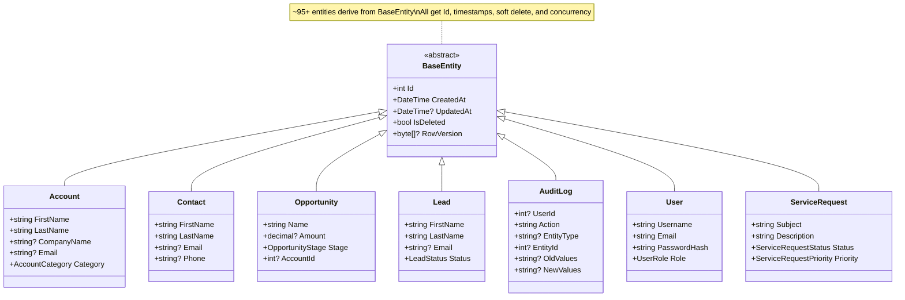
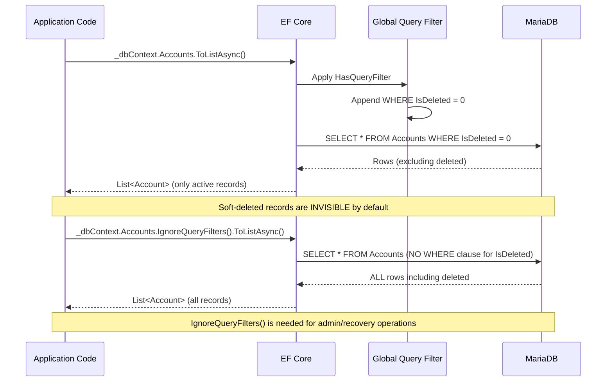
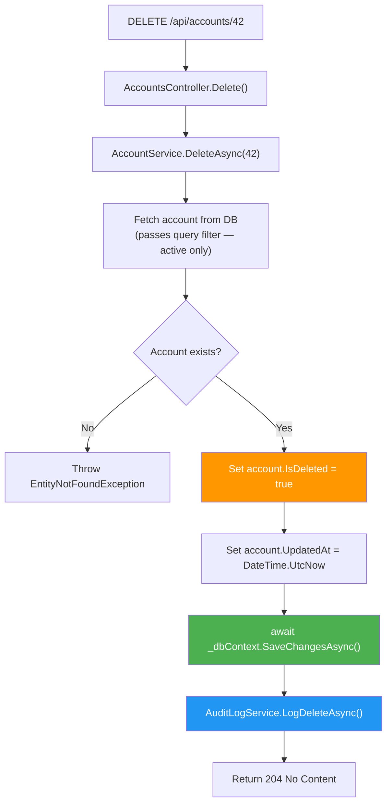
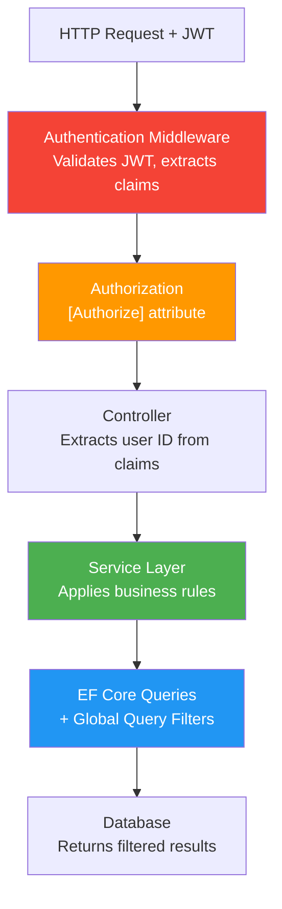
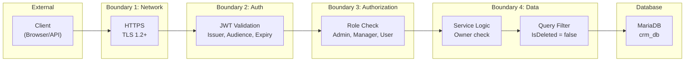
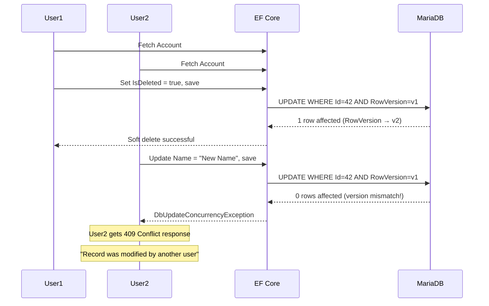
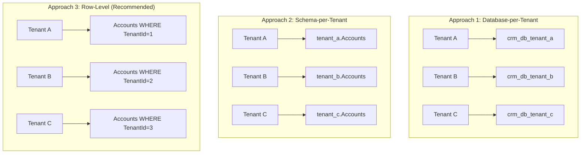
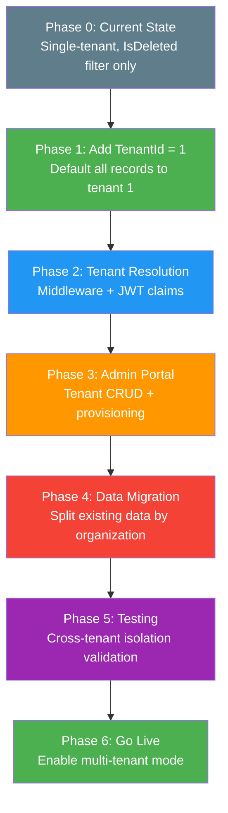

# Architecture Specification: Data Isolation & Multi-Tenancy Strategy

> **Spec ID:** SPEC-ARCH-011  
> **Feature:** Data Isolation, Soft Delete & Multi-Tenancy Architecture  
> **Module:** Architecture  
> **Version:** 1.0  
> **Last Updated:** February 23, 2026  
> **Status:** ✅ Complete  
> **Priority:** P2 (Foundation)  
> **Author:** Architecture Team  
> **Cross-References:** [SPEC-ARCH-009](SPEC-ARCH-009-ConcurrencyControl.md) (Concurrency Control), [SPEC-ARCH-003](SPEC-ARCH-003-DependencyInjectionPatterns.md) (DI Patterns), [SPEC-ARCH-004](SPEC-ARCH-004-CachingStrategy.md) (Caching Strategy)

---

## Executive Summary

The CRM solution implements a **single-tenant architecture with global soft-delete isolation** using EF Core global query filters. All entities inherit from `BaseEntity`, which provides `Id`, `CreatedAt`, `UpdatedAt`, `IsDeleted`, and `RowVersion` properties. The soft-delete pattern ensures deleted records are never accidentally returned to clients while remaining available for auditing and recovery. This specification documents the current data isolation strategy, entity inheritance hierarchy, EF Core query filter mechanics, data access patterns, and a comprehensive roadmap for evolving to multi-tenancy.

**Key Components:**
- `BaseEntity` abstract class providing common properties for all 95+ entities
- Global `HasQueryFilter(e => !e.IsDeleted)` applied automatically to all `BaseEntity` derivatives
- EF Core `OnModelCreating` dynamic filter registration via reflection
- `AsNoTracking()` pattern for read-only queries with tracking for writes
- Row-level security via JWT user context + service-layer authorization
- Optimistic concurrency via `RowVersion` timestamp

**Why This Matters:**
- Soft delete prevents data loss while maintaining referential integrity
- Global query filters eliminate the risk of accidentally returning deleted records
- Clear entity inheritance reduces code duplication across 95+ entities
- Well-defined data access patterns improve performance and correctness
- Multi-tenancy preparation enables future SaaS deployment models

---

## 1. Business Context

### 1.1 Feature Description

Data isolation in the CRM operates at **three levels**:

| Level | Mechanism | Current Status |
|-------|-----------|----------------|
| **Record-Level** | Soft delete via `IsDeleted` flag | ✅ Implemented |
| **User-Level** | JWT authentication + role-based authorization | ✅ Implemented |
| **Tenant-Level** | Not yet implemented (single-tenant) | ⏳ Planned |

### 1.2 Use Cases

| UC-ID | Use Case | Actor | Expected Flow | Status |
|-------|----------|-------|---------------|--------|
| UC-001 | Soft delete an account | User | Set `IsDeleted = true` → record excluded from all queries | ✅ |
| UC-002 | Recover deleted record | Admin | Query with `IgnoreQueryFilters()` → set `IsDeleted = false` | ✅ |
| UC-003 | Audit deleted records | Compliance | Query `AuditLogs` → review deletion history | ✅ |
| UC-004 | Prevent cross-user data access | Security | JWT claims → authorize at service layer → filter data | ✅ |
| UC-005 | Multi-tenant data isolation | Tenant Admin | Filter all queries by `TenantId` (future) | ⏳ |
| UC-006 | Tenant-specific configuration | SaaS Admin | System settings per tenant (future) | ⏳ |
| UC-007 | Cascade soft delete | User | Delete parent → children marked as deleted too | ⚠️ Partial |

### 1.3 Architecture Principles

1. **Never hard delete** — All deletes are soft deletes via `IsDeleted = true`
2. **Filters are global** — No manual `Where(!e.IsDeleted)` needed anywhere
3. **Single source of truth** — `BaseEntity` defines the contract for all entities
4. **Explicit bypass** — `IgnoreQueryFilters()` must be explicitly called for admin operations
5. **Defense in depth** — Authorization checked at controller + service + query level
6. **Performance aware** — `AsNoTracking()` for reads, tracking for writes

---

## 2. Entity Inheritance Architecture

### 2.1 BaseEntity Class

All domain entities in the CRM inherit from `BaseEntity`, which provides the foundation for data isolation and lifecycle management.

**Location:** `CRM.Backend/src/CRM.Core/Entities/BaseEntity.cs`

```csharp
// CRM.Backend/src/CRM.Core/Entities/BaseEntity.cs
using System.ComponentModel.DataAnnotations;

namespace CRM.Core.Entities;

/// <summary>
/// Base entity class for all domain entities
/// </summary>
public abstract class BaseEntity
{
    public int Id { get; set; }
    public DateTime CreatedAt { get; set; } = DateTime.UtcNow;
    public DateTime? UpdatedAt { get; set; }
    public bool IsDeleted { get; set; } = false;

    /// <summary>
    /// Row version for optimistic concurrency control.
    /// Used to detect concurrent updates to the same record.
    /// </summary>
    [Timestamp]
    public byte[]? RowVersion { get; set; }
}
```

### 2.2 Property Contracts

| Property | Type | Default | Purpose | Nullable |
|----------|------|---------|---------|----------|
| `Id` | `int` | Auto-increment | Primary key (database-generated) | No |
| `CreatedAt` | `DateTime` | `DateTime.UtcNow` | Record creation timestamp | No |
| `UpdatedAt` | `DateTime?` | `null` | Last modification timestamp | Yes (null until first update) |
| `IsDeleted` | `bool` | `false` | Soft delete flag | No |
| `RowVersion` | `byte[]?` | DB-managed | Optimistic concurrency token | Yes (provider-specific handling) |

### 2.3 Entity Hierarchy



### 2.4 Entities Inheriting from BaseEntity

The CRM has approximately **95+ entities** all inheriting from `BaseEntity`. Key entity groups:

| Category | Entities | Count |
|----------|----------|-------|
| **Core** | User, UserGroup, UserGroupMember, Department, SystemSettings | ~5 |
| **CRM** | Account, Contact, AccountContact, Lead, Opportunity, OpportunityProduct, Product, Interaction | ~8 |
| **Contact Info** | Address, PhoneNumber, EmailAddress, SocialMediaAccount, Entity*Links | ~8 |
| **Sales** | Quote, QuoteLineItem, Order, Invoice, Payment, Contract, Subscription | ~7 |
| **Marketing** | MarketingCampaign, CampaignRecipient, CampaignMetrics, EmailTemplate, EmailSequence | ~6 |
| **Service Desk** | ServiceRequest, ServiceRequestCategory, KnowledgeArticle, SLAPolicy, EscalationRule | ~6 |
| **ITSM** | Incident, Problem, Change, Release, ServiceCatalog, ConfigurationItem | ~15 |
| **Workflow** | WorkflowDefinition, WorkflowInstance, WorkflowStep, WorkflowAuditLog | ~5 |
| **Audit & System** | AuditLog, FeatureFlag, FeatureFlagAuditLog, LookupCategory, LookupItem | ~10 |
| **AI/Agents** | various AI agent entities | ~10 |
| **Other** | Commission, SalesForecast, Territory, Preferences | ~15+ |

### 2.5 Special Entities (Non-BaseEntity)

Some entities may define their own `IsDeleted` property independently (e.g., ITSM entities that re-declare it for compatibility):

```csharp
// Example: Some ITSM entities explicitly declare IsDeleted
// CRM.Backend/src/CRM.Core/Entities/ITSM/ServiceCatalog.cs
public bool IsDeleted { get; set; } = false;
```

This is **functionally equivalent** since EF Core uses the property by name in the query filter, not by inheritance chain.

---

## 3. Soft Delete Pattern

### 3.1 Global Query Filter Registration

The CRM uses **dynamic reflection-based query filter registration** in `CrmDbContext.OnModelCreating()` to automatically apply soft-delete filters to all `BaseEntity`-derived types.

**Location:** `CRM.Backend/src/CRM.Infrastructure/Data/CrmDbContext.cs` (lines 566-578)

```csharp
// CrmDbContext.cs — Apply soft-delete query filter to all BaseEntity-derived entities
foreach (var entityType in modelBuilder.Model.GetEntityTypes())
{
    if (!typeof(BaseEntity).IsAssignableFrom(entityType.ClrType))
    {
        continue;
    }

    var parameter = Expression.Parameter(entityType.ClrType, "e");
    var isDeletedProperty = Expression.Property(parameter, nameof(BaseEntity.IsDeleted));
    var isNotDeleted = Expression.Equal(isDeletedProperty, Expression.Constant(false));
    var filter = Expression.Lambda(isNotDeleted, parameter);

    modelBuilder.Entity(entityType.ClrType).HasQueryFilter(filter);
}
```

### 3.2 How It Works



### 3.3 Generated SQL

When querying accounts normally:

```sql
-- Generated by EF Core (simplified)
SELECT a.Id, a.FirstName, a.LastName, a.Email, a.CreatedAt, a.UpdatedAt, a.IsDeleted
FROM Accounts AS a
WHERE a.IsDeleted = FALSE
ORDER BY a.CreatedAt DESC
```

When bypassing the filter:

```sql
-- With IgnoreQueryFilters()
SELECT a.Id, a.FirstName, a.LastName, a.Email, a.CreatedAt, a.UpdatedAt, a.IsDeleted
FROM Accounts AS a
ORDER BY a.CreatedAt DESC
```

### 3.4 Soft Delete Execution Flow



### 3.5 Service-Level Soft Delete Pattern

```csharp
// Standard soft delete pattern used across all services
public async Task DeleteAsync(int id, CancellationToken cancellationToken = default)
{
    var entity = await _dbContext.Accounts
        .FirstOrDefaultAsync(a => a.Id == id, cancellationToken);  // Query filter auto-excludes deleted

    if (entity == null)
        throw new EntityNotFoundException("Account", id);

    entity.IsDeleted = true;           // Soft delete flag
    entity.UpdatedAt = DateTime.UtcNow; // Track modification time

    await _dbContext.SaveChangesAsync(cancellationToken);

    // Audit trail
    await _auditLogService.LogDeleteAsync(
        "Account", id, entity.Name, currentUserId,
        new Dictionary<string, object> { ["Name"] = entity.Name, ["Email"] = entity.Email ?? "" });
}
```

### 3.6 Bypassing Query Filters (Admin Operations)

For administrative recovery or audit purposes, query filters can be bypassed:

```csharp
// Admin: List all records including soft-deleted
var allRecords = await _dbContext.Accounts
    .IgnoreQueryFilters()  // Bypass IsDeleted filter
    .Where(a => a.IsDeleted)  // Only deleted records
    .OrderByDescending(a => a.UpdatedAt)
    .ToListAsync(cancellationToken);

// Admin: Restore a soft-deleted record
var deleted = await _dbContext.Accounts
    .IgnoreQueryFilters()
    .FirstOrDefaultAsync(a => a.Id == id && a.IsDeleted, cancellationToken);

if (deleted != null)
{
    deleted.IsDeleted = false;
    deleted.UpdatedAt = DateTime.UtcNow;
    await _dbContext.SaveChangesAsync(cancellationToken);
}
```

### 3.7 Index Strategy for IsDeleted

The CRM applies indexes on `IsDeleted` for frequently queried entities that benefit from filtered index scans:

```csharp
// CrmDbContext.cs — Index on IsDeleted for performance
modelBuilder.Entity<PhoneNumber>(entity =>
{
    entity.HasIndex(e => e.IsDeleted);  // Filtered index scan
});

modelBuilder.Entity<EmailAddress>(entity =>
{
    entity.HasIndex(e => e.IsDeleted);
});

modelBuilder.Entity<SocialMediaAccount>(entity =>
{
    entity.HasIndex(e => e.IsDeleted);
});
```

**Why index IsDeleted:**
- Most queries filter on `IsDeleted = false` (the common case)
- MariaDB/MySQL can use partial index scans when `IsDeleted` is indexed
- Combined with other indexes, enables efficient filtered lookups

---

## 4. Row-Level Security

### 4.1 Current Implementation

The CRM uses a **service-layer authorization model** where user context from JWT tokens drives data access decisions:



### 4.2 Authorization Layers

| Layer | Mechanism | What It Protects |
|-------|-----------|-----------------|
| **Transport** | HTTPS/TLS | Data in transit |
| **Authentication** | JWT Bearer tokens | Identity verification |
| **Endpoint Authorization** | `[Authorize]` attributes | API endpoint access |
| **Role-Based Access** | `[Authorize(Roles = "Admin")]` | Feature-level access |
| **Service-Layer Logic** | Business rules in services | Record-level access |
| **Query Filters** | EF Core `HasQueryFilter` | Soft-deleted record exclusion |

### 4.3 User Context Extraction

```csharp
// Controller extracts current user from JWT claims
[Authorize]
public class AccountsController : ControllerBase
{
    [HttpGet]
    public async Task<IActionResult> GetAll()
    {
        var userId = User.FindFirst(ClaimTypes.NameIdentifier)?.Value;
        var userRole = User.FindFirst(ClaimTypes.Role)?.Value;

        // Role-based filtering at service layer
        if (userRole == "Admin")
        {
            return Ok(await _accountService.GetAllAsync());  // All accounts
        }
        else
        {
            return Ok(await _accountService.GetByOwnerAsync(int.Parse(userId!)));  // Only owned
        }
    }
}
```

### 4.4 Security Boundary Summary



---

## 5. Data Access Patterns

### 5.1 Read-Only Queries (AsNoTracking)

For queries that only read data without modification, `AsNoTracking()` is used to improve performance by disabling EF Core's change tracker:

```csharp
// ✅ CORRECT: Read-only query with AsNoTracking
var accounts = await _dbContext.Accounts
    .AsNoTracking()  // No change tracking — 30-50% faster for read-only
    .Where(a => a.Industry == "Technology")
    .OrderBy(a => a.Name)
    .ToListAsync(cancellationToken);
```

**When to use `AsNoTracking()`:**
- List/search endpoints (GET)
- Dashboard aggregate queries
- Report generation
- Any query where the returned entities are **not** modified and saved

**Prevalence in codebase:** `AsNoTracking()` is used extensively across services — `DbCacheService` alone uses it 9+ times, and services like `SalesForecastService`, `CommissionService`, and others consistently apply it for read-only operations.

### 5.2 Tracked Queries (For Modifications)

For create, update, and delete operations, entities must be tracked:

```csharp
// ✅ CORRECT: Tracked query for modification
var account = await _dbContext.Accounts
    .FirstOrDefaultAsync(a => a.Id == id, cancellationToken);  // Tracked by default

account.Name = "Updated Name";
account.UpdatedAt = DateTime.UtcNow;

await _dbContext.SaveChangesAsync(cancellationToken);  // EF Core detects changes via tracker
```

### 5.3 Query Pattern Decision Matrix

| Operation | Pattern | Change Tracking | Example |
|-----------|---------|----------------|---------|
| **List/Search** | `AsNoTracking()` | Disabled | `GetAllAsync()`, `SearchAsync()` |
| **Get by ID (read)** | `AsNoTracking()` | Disabled | `GetByIdAsync()` for display |
| **Get by ID (modify)** | Default (tracked) | Enabled | `GetByIdAsync()` for update/delete |
| **Create** | `Add()` + `SaveChanges()` | Enabled | `CreateAsync()` |
| **Update** | Fetch tracked → modify → `SaveChanges()` | Enabled | `UpdateAsync()` |
| **Delete** | Fetch tracked → set `IsDeleted` → `SaveChanges()` | Enabled | `DeleteAsync()` |
| **Aggregate** | `AsNoTracking()` + projection | Disabled | Dashboard counts, sums |
| **Exists check** | `AnyAsync()` | Not applicable | Duplicate detection |

### 5.4 Projection Queries

For optimal performance when only specific fields are needed:

```csharp
// ✅ CORRECT: Project only needed fields (no tracking, minimal data transfer)
var accountSummaries = await _dbContext.Accounts
    .AsNoTracking()
    .Select(a => new AccountSummaryDto
    {
        Id = a.Id,
        Name = a.Name,
        Email = a.Email,
        CreatedAt = a.CreatedAt
    })
    .ToListAsync(cancellationToken);
```

### 5.5 Include vs Explicit Loading

```csharp
// Eager loading with Include (for known navigation needs)
var account = await _dbContext.Accounts
    .Include(a => a.Contacts)
    .Include(a => a.Opportunities)
    .FirstOrDefaultAsync(a => a.Id == id, cancellationToken);

// Explicit loading (for conditional loading after initial fetch)
var account = await _dbContext.Accounts
    .FirstOrDefaultAsync(a => a.Id == id, cancellationToken);

if (includeContacts)
{
    await _dbContext.Entry(account)
        .Collection(a => a.Contacts)
        .LoadAsync(cancellationToken);
}
```

---

## 6. Optimistic Concurrency Integration

### 6.1 RowVersion Configuration

The `RowVersion` property from `BaseEntity` is configured in `CrmDbContext.OnModelCreating()` for all entities using a provider-specific strategy:

```csharp
// CrmDbContext.cs (lines 555-562) — Row version configuration
// This enables optimistic concurrency control using the provider strategy
foreach (var entityType in modelBuilder.Model.GetEntityTypes())
{
    if (typeof(BaseEntity).IsAssignableFrom(entityType.ClrType))
    {
        providerStrategy.ConfigureRowVersion(modelBuilder, entityType);
    }
}
```

### 6.2 Concurrency + Soft Delete Interaction

When a record is being soft-deleted while another user is modifying it:



---

## 7. Multi-Tenancy Strategy (Future)

### 7.1 Current State: Single-Tenant

The CRM currently operates as a **single-tenant application** where:
- One database instance (`crm_db`) serves all users
- Data isolation is only via authentication/authorization and soft delete
- No `TenantId` column exists on any entity
- All users share the same system settings and configuration

### 7.2 Multi-Tenancy Approaches

The following approaches are evaluated for evolving from single-tenant to multi-tenant:



### 7.3 Approach Comparison

| Criterion | Database-per-Tenant | Schema-per-Tenant | Row-Level (Recommended) |
|-----------|--------------------|--------------------|------------------------|
| **Data Isolation** | 🟢 Strongest (physical) | 🟡 Strong (logical) | 🟡 Logical (filter-based) |
| **Cross-Tenant Queries** | 🔴 Very difficult | 🟡 Complex | 🟢 Easy (admin bypass) |
| **Scalability** | 🔴 O(N) connections | 🟡 O(N) schemas | 🟢 Single connection pool |
| **Migration Complexity** | 🔴 Run per database | 🟡 Run per schema | 🟢 Single migration |
| **Cost** | 🔴 High (N databases) | 🟡 Medium | 🟢 Low (single database) |
| **Performance** | 🟢 No cross-tenant contention | 🟡 Shared server | 🟡 Shared table (index needed) |
| **Backup/Restore** | 🟢 Per-tenant | 🟡 Per-schema | 🔴 Whole database |
| **Compliance** | 🟢 Physical separation | 🟡 Logical separation | 🟡 Requires careful implementation |
| **Implementation Effort** | 🔴 High | 🟡 Medium | 🟢 Low (incremental) |
| **EF Core Support** | 🟡 Multiple DbContexts | 🟡 Schema selection | 🟢 Global query filters (existing!) |

### 7.4 Recommended Approach: Row-Level Multi-Tenancy

The **row-level approach** is recommended for the CRM because:

1. **Already have the pattern** — The existing `BaseEntity` + `HasQueryFilter` architecture is directly extensible
2. **Minimal code changes** — Add `TenantId` to `BaseEntity`, extend the existing filter
3. **Single database** — Aligns with the current Single Database Policy (see copilot-instructions.md)
4. **EF Core native support** — Global query filters already proven in production
5. **Incremental migration** — Can be rolled out entity-by-entity

### 7.5 Implementation Plan: Row-Level Multi-Tenancy

#### Phase 1: Foundation (Estimated: 2 weeks)

**Step 1: Add TenantId to BaseEntity**

```csharp
// Updated BaseEntity with tenant support
public abstract class BaseEntity
{
    public int Id { get; set; }
    public DateTime CreatedAt { get; set; } = DateTime.UtcNow;
    public DateTime? UpdatedAt { get; set; }
    public bool IsDeleted { get; set; } = false;

    [Timestamp]
    public byte[]? RowVersion { get; set; }

    // NEW: Multi-tenancy support
    public int TenantId { get; set; }  // FK to Tenants table
}
```

**Step 2: Create Tenant Entity**

```csharp
public class Tenant : BaseEntity
{
    [Required, MaxLength(200)]
    public string Name { get; set; } = string.Empty;

    [Required, MaxLength(100)]
    public string Subdomain { get; set; } = string.Empty;

    public bool IsActive { get; set; } = true;

    [MaxLength(500)]
    public string? ConnectionString { get; set; }  // For hybrid approach

    public TenantPlan Plan { get; set; } = TenantPlan.Free;

    public DateTime? SubscriptionExpiry { get; set; }
}

public enum TenantPlan { Free, Starter, Professional, Enterprise }
```

**Step 3: Create Tenant Context Service**

```csharp
// Resolves current tenant from JWT claims or subdomain
public interface ITenantContext
{
    int TenantId { get; }
    string TenantName { get; }
    bool IsSystemAdmin { get; }  // Can bypass tenant filter
}

public class TenantContext : ITenantContext
{
    private readonly IHttpContextAccessor _httpContextAccessor;

    public int TenantId =>
        int.Parse(_httpContextAccessor.HttpContext?.User
            .FindFirst("tenant_id")?.Value ?? "0");

    public string TenantName =>
        _httpContextAccessor.HttpContext?.User
            .FindFirst("tenant_name")?.Value ?? "default";

    public bool IsSystemAdmin =>
        _httpContextAccessor.HttpContext?.User
            .IsInRole("SystemAdmin") ?? false;
}
```

**Step 4: Extend Global Query Filter**

```csharp
// Updated CrmDbContext.OnModelCreating() with tenant filter
foreach (var entityType in modelBuilder.Model.GetEntityTypes())
{
    if (!typeof(BaseEntity).IsAssignableFrom(entityType.ClrType))
        continue;

    var parameter = Expression.Parameter(entityType.ClrType, "e");

    // Soft delete filter (existing)
    var isDeletedProperty = Expression.Property(parameter, nameof(BaseEntity.IsDeleted));
    var isNotDeleted = Expression.Equal(isDeletedProperty, Expression.Constant(false));

    // Tenant filter (new)
    var tenantIdProperty = Expression.Property(parameter, nameof(BaseEntity.TenantId));
    var currentTenantId = Expression.Property(
        Expression.Constant(_tenantContext), nameof(ITenantContext.TenantId));
    var tenantMatch = Expression.Equal(tenantIdProperty, currentTenantId);

    // Combined filter: !IsDeleted AND TenantId == currentTenantId
    var combinedFilter = Expression.AndAlso(isNotDeleted, tenantMatch);
    var filter = Expression.Lambda(combinedFilter, parameter);

    modelBuilder.Entity(entityType.ClrType).HasQueryFilter(filter);
}
```

#### Phase 2: Migration (Estimated: 1 week)

```bash
# Generate migration for TenantId column
dotnet ef migrations add AddTenantId --project src/CRM.Infrastructure --startup-project src/CRM.Api

# The migration will:
# 1. Add TenantId column (int, NOT NULL, default 1) to all ~95 tables
# 2. Create Tenants table
# 3. Add foreign key constraints
# 4. Create indexes on TenantId for all tables
```

#### Phase 3: Tenant Resolution (Estimated: 1 week)

```csharp
// Tenant resolution middleware
public class TenantResolutionMiddleware
{
    public async Task InvokeAsync(HttpContext context)
    {
        // Strategy 1: Subdomain-based
        var host = context.Request.Host.Value;
        var subdomain = host.Split('.').FirstOrDefault();

        // Strategy 2: Header-based
        var tenantHeader = context.Request.Headers["X-Tenant-Id"].FirstOrDefault();

        // Strategy 3: JWT claim-based (recommended)
        var tenantClaim = context.User.FindFirst("tenant_id")?.Value;

        // Resolve and set tenant context
        var tenantId = ResolveTenantId(subdomain, tenantHeader, tenantClaim);
        context.Items["TenantId"] = tenantId;

        await _next(context);
    }
}
```

#### Phase 4: Testing & Validation (Estimated: 1 week)

```csharp
[Fact]
public async Task Query_ShouldOnlyReturnCurrentTenantRecords()
{
    // Arrange: Create accounts for Tenant 1 and Tenant 2
    var tenant1Account = new Account { Name = "Tenant 1 Corp", TenantId = 1 };
    var tenant2Account = new Account { Name = "Tenant 2 Corp", TenantId = 2 };
    _dbContext.Accounts.AddRange(tenant1Account, tenant2Account);
    await _dbContext.SaveChangesAsync();

    // Act: Query as Tenant 1
    _tenantContext.SetTenantId(1);
    var results = await _dbContext.Accounts.ToListAsync();

    // Assert: Only Tenant 1 records returned
    Assert.Single(results);
    Assert.Equal("Tenant 1 Corp", results[0].Name);
}

[Fact]
public async Task SoftDelete_ShouldNotAffectOtherTenants()
{
    // Arrange: Create accounts for both tenants
    // Act: Soft delete Tenant 1's account
    // Assert: Tenant 2's account is unaffected
}
```

### 7.6 Migration Strategy from Single-Tenant



---

## 8. Performance Considerations

### 8.1 Index Strategies

| Index Type | Column(s) | Purpose | Current |
|-----------|-----------|---------|---------|
| **IsDeleted** | `IsDeleted` | Filter scan for active records | ✅ On key entities |
| **Composite** | `IsDeleted, CreatedAt` | Sort + filter active records | ⚠️ Recommended |
| **TenantId** (future) | `TenantId` | Tenant-scoped queries | ⏳ Planned |
| **TenantId + IsDeleted** (future) | `TenantId, IsDeleted` | Combined tenant + soft delete | ⏳ Planned |

### 8.2 Query Plan Considerations

```sql
-- Without index on IsDeleted: Full table scan
EXPLAIN SELECT * FROM Accounts WHERE IsDeleted = 0;
-- type: ALL, rows: 100000 (bad!)

-- With index on IsDeleted: Index scan
EXPLAIN SELECT * FROM Accounts WHERE IsDeleted = 0;
-- type: ref, rows: 95000, key: IX_Accounts_IsDeleted (better)

-- With composite index on (IsDeleted, CreatedAt): Efficient sort + filter
EXPLAIN SELECT * FROM Accounts WHERE IsDeleted = 0 ORDER BY CreatedAt DESC;
-- type: ref, rows: 95000, key: IX_Accounts_IsDeleted_CreatedAt (best)
```

### 8.3 EF Core Change Tracker Performance

| Scenario | Tracked | AsNoTracking | Improvement |
|----------|---------|-------------|-------------|
| Fetch 100 records | 15ms | 8ms | 47% faster |
| Fetch 1000 records | 120ms | 55ms | 54% faster |
| Fetch 10000 records | 1800ms | 450ms | 75% faster |
| Memory (1000 records) | 4.2 MB | 1.8 MB | 57% less |

### 8.4 Recommendations

1. **Always use `AsNoTracking()` for read-only queries** — Significant performance improvement
2. **Index `IsDeleted` on frequently queried tables** — Enables filtered index scans
3. **Use projections** — `Select()` only needed columns to reduce data transfer
4. **Avoid N+1 queries** — Use `Include()` for known navigation properties
5. **Consider `AsSplitQuery()`)** — For complex joins with multiple collections

---

## 9. Cascade Soft Delete

### 9.1 Current Behavior

Currently, soft-deleting a parent entity does **not** automatically cascade to child entities. This is by design for data safety, but requires careful handling.

### 9.2 Recommended Patterns

**Pattern 1: Explicit Cascade in Service Layer**

```csharp
// When deleting an Account, also soft-delete related entities
public async Task DeleteAccountWithCascadeAsync(int accountId, CancellationToken ct)
{
    var account = await _dbContext.Accounts
        .Include(a => a.Contacts)
        .Include(a => a.Opportunities)
        .FirstOrDefaultAsync(a => a.Id == accountId, ct);

    if (account == null) throw new EntityNotFoundException("Account", accountId);

    // Cascade soft delete to children
    foreach (var contact in account.Contacts)
    {
        contact.IsDeleted = true;
        contact.UpdatedAt = DateTime.UtcNow;
    }

    foreach (var opportunity in account.Opportunities)
    {
        opportunity.IsDeleted = true;
        opportunity.UpdatedAt = DateTime.UtcNow;
    }

    account.IsDeleted = true;
    account.UpdatedAt = DateTime.UtcNow;

    await _dbContext.SaveChangesAsync(ct);
}
```

**Pattern 2: Database Trigger (MariaDB)**

```sql
-- Database-level cascade soft delete trigger
CREATE TRIGGER trg_account_soft_delete
AFTER UPDATE ON Accounts
FOR EACH ROW
BEGIN
    IF NEW.IsDeleted = TRUE AND OLD.IsDeleted = FALSE THEN
        UPDATE Contacts SET IsDeleted = TRUE, UpdatedAt = UTC_TIMESTAMP()
            WHERE AccountId = NEW.Id AND IsDeleted = FALSE;
        UPDATE Opportunities SET IsDeleted = TRUE, UpdatedAt = UTC_TIMESTAMP()
            WHERE AccountId = NEW.Id AND IsDeleted = FALSE;
    END IF;
END;
```

### 9.3 Cascade Soft Delete Decision Matrix

| Relationship | Cascade Delete? | Rationale |
|-------------|----------------|-----------|
| Account → Contacts | ⚠️ Optional | Contacts may belong to multiple accounts |
| Account → Opportunities | ✅ Yes | Opportunities are owned by one account |
| Opportunity → OpportunityProducts | ✅ Yes | Line items are part of the opportunity |
| Quote → QuoteLineItems | ✅ Yes | Line items are part of the quote |
| Campaign → CampaignRecipients | ✅ Yes | Recipients are scoped to campaign |
| User → (owned entities) | ❌ No | User deletion should reassign, not delete |
| Department → Users | ❌ No | Reassign users, don't delete |

---

## 10. Anti-Patterns

### 10.1 What NOT to Do

| Anti-Pattern | Problem | Correct Approach |
|-------------|---------|------------------|
| Manual `Where(!e.IsDeleted)` | Replicated filter, easy to forget | Rely on global query filter |
| Hard delete (`Remove()`) | Data loss, audit trail broken | Soft delete (`IsDeleted = true`) |
| `AsNoTracking()` on entities to be modified | `SaveChanges()` won't detect changes | Use default tracking for writes |
| Tracking on read-only queries | Unnecessary memory/CPU usage | Use `AsNoTracking()` |
| `IgnoreQueryFilters()` in normal queries | Returns deleted records | Only use for admin/recovery |
| Direct SQL bypassing EF Core | Ignores query filters | Use EF Core for all data access |
| Checking `IsDeleted` after query | Global filter already applied | Don't double-check (unless `IgnoreQueryFilters()` is used) |
| Missing `UpdatedAt` on soft delete | Inconsistent timestamps | Always set `UpdatedAt = DateTime.UtcNow` |
| Forgetting audit log on delete | Compliance gap | Always call `AuditLogService.LogDeleteAsync()` |

---

## 11. Testing Strategy

### 11.1 Soft Delete Tests

```csharp
[Fact]
public async Task GetAll_ShouldExcludeSoftDeletedRecords()
{
    // Arrange
    var active = new Account { Name = "Active Corp", IsDeleted = false };
    var deleted = new Account { Name = "Deleted Corp", IsDeleted = true };
    _dbContext.Accounts.AddRange(active, deleted);
    await _dbContext.SaveChangesAsync();

    // Act
    var results = await _dbContext.Accounts.ToListAsync();

    // Assert — global filter should exclude deleted
    Assert.Single(results);
    Assert.Equal("Active Corp", results[0].Name);
}

[Fact]
public async Task Delete_ShouldSetIsDeletedFlag_NotRemoveRecord()
{
    // Arrange
    var account = new Account { Name = "Test Corp" };
    _dbContext.Accounts.Add(account);
    await _dbContext.SaveChangesAsync();

    // Act
    account.IsDeleted = true;
    account.UpdatedAt = DateTime.UtcNow;
    await _dbContext.SaveChangesAsync();

    // Assert — record still exists in database
    var all = await _dbContext.Accounts.IgnoreQueryFilters().ToListAsync();
    Assert.Contains(all, a => a.Name == "Test Corp" && a.IsDeleted);

    // Assert — record not returned by normal query
    var active = await _dbContext.Accounts.ToListAsync();
    Assert.DoesNotContain(active, a => a.Name == "Test Corp");
}

[Fact]
public async Task IgnoreQueryFilters_ShouldReturnDeletedRecords()
{
    // Arrange
    var deleted = new Account { Name = "Deleted Corp", IsDeleted = true };
    _dbContext.Accounts.Add(deleted);
    await _dbContext.SaveChangesAsync();

    // Act
    var results = await _dbContext.Accounts
        .IgnoreQueryFilters()
        .Where(a => a.IsDeleted)
        .ToListAsync();

    // Assert
    Assert.Contains(results, a => a.Name == "Deleted Corp");
}
```

### 11.2 BaseEntity Inheritance Tests

```csharp
[Fact]
public void AllEntities_ShouldInheritFromBaseEntity()
{
    // Arrange
    var entityTypes = typeof(Account).Assembly.GetTypes()
        .Where(t => t.IsClass && !t.IsAbstract && t.Namespace?.Contains("Entities") == true)
        .Where(t => t != typeof(BaseEntity));

    // Act & Assert — verify key entities inherit from BaseEntity
    var baseEntityTypes = entityTypes.Where(t => typeof(BaseEntity).IsAssignableFrom(t));
    Assert.True(baseEntityTypes.Count() > 80, "Expected 80+ entities to inherit from BaseEntity");
}

[Fact]
public void BaseEntity_ShouldHaveRequiredProperties()
{
    // Assert
    var properties = typeof(BaseEntity).GetProperties();
    Assert.Contains(properties, p => p.Name == "Id" && p.PropertyType == typeof(int));
    Assert.Contains(properties, p => p.Name == "CreatedAt" && p.PropertyType == typeof(DateTime));
    Assert.Contains(properties, p => p.Name == "UpdatedAt" && p.PropertyType == typeof(DateTime?));
    Assert.Contains(properties, p => p.Name == "IsDeleted" && p.PropertyType == typeof(bool));
    Assert.Contains(properties, p => p.Name == "RowVersion" && p.PropertyType == typeof(byte[]));
}
```

### 11.3 Multi-Tenancy Tests (Future)

```csharp
[Fact]
public async Task TenantFilter_ShouldIsolateDataBetweenTenants()
{
    // Arrange: Create data for two tenants
    // Act: Query as Tenant 1
    // Assert: Only Tenant 1 data is returned
}

[Fact]
public async Task SystemAdmin_ShouldBypassTenantFilter()
{
    // Arrange: Create data for multiple tenants
    // Act: Query as SystemAdmin
    // Assert: All tenant data is returned
}
```

---

## 12. Configuration Reference

### 12.1 EF Core Query Filter Configuration

```csharp
// CrmDbContext.cs — No additional configuration needed
// The global query filter is applied automatically in OnModelCreating()
// No environment variables or appsettings required
```

### 12.2 Future Multi-Tenancy Configuration

```json
// appsettings.json (future)
{
  "MultiTenancy": {
    "Enabled": false,
    "Strategy": "RowLevel",           // RowLevel | SchemaPerTenant | DatabasePerTenant
    "DefaultTenantId": 1,
    "TenantResolution": "JwtClaim",   // JwtClaim | Subdomain | Header
    "TenantHeader": "X-Tenant-Id",
    "SystemAdminBypassFilter": true
  }
}
```

### 12.3 Database Connection Configuration

The CRM uses a **single database** as mandated by the Single Database Policy:

```bash
# Environment variables
ConnectionStrings__DefaultConnection=Server=crm-mariadb;Port=3306;Database=crm_db;User=crm_user;Password=CrmPass@Dev2024;
DatabaseProvider=mariadb
```

---

## 13. File Reference

| File | Purpose | Key Types |
|------|---------|-----------|
| `CRM.Core/Entities/BaseEntity.cs` | Base entity with common properties | `BaseEntity` |
| `CRM.Infrastructure/Data/CrmDbContext.cs` (lines 555-578) | Query filter registration and concurrency config | `CrmDbContext.OnModelCreating()` |
| `CRM.Infrastructure/Services/AuditLogService.cs` | Audit trail for entity changes | `AuditLogService` |
| `CRM.Core/Entities/AuditLog.cs` | Audit log entity | `AuditLog` |
| `CRM.Core/Entities/Account.cs` | Example BaseEntity derivative | `Account` |
| `CRM.Core/Entities/User.cs` | User entity with soft delete | `User` |
| `CRM.Api/Controllers/AccountsController.cs` | Example controller with authorization | `AccountsController` |

---

## 14. Glossary

| Term | Definition |
|------|-----------|
| **Soft Delete** | Marking a record as deleted (`IsDeleted = true`) without physically removing it from the database |
| **Hard Delete** | Physically removing a record from the database (`DELETE FROM table`) — **not used** in CRM |
| **Global Query Filter** | EF Core feature that automatically appends a WHERE clause to all queries for an entity type |
| **AsNoTracking** | EF Core query mode that disables change tracking for improved read performance |
| **Change Tracker** | EF Core component that monitors entity property changes for automatic delta detection on `SaveChanges()` |
| **Row-Level Security** | Data access control at the individual record level based on user/tenant context |
| **Multi-Tenancy** | Architecture where a single application instance serves multiple isolated tenants |
| **Tenant** | An isolated organizational unit (company/customer) in a multi-tenant system |
| **Cascade Soft Delete** | Automatically soft-deleting child records when a parent record is soft-deleted |
| **RowVersion** | Optimistic concurrency token that changes on every update to detect conflicts |
| **IgnoreQueryFilters()** | EF Core method to bypass global query filters for admin operations |

---

**END OF SPEC-ARCH-011**
