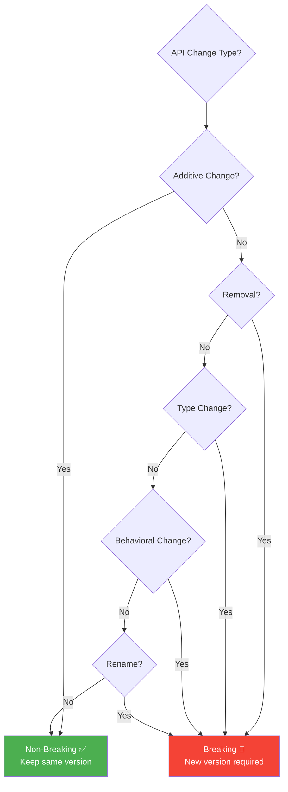
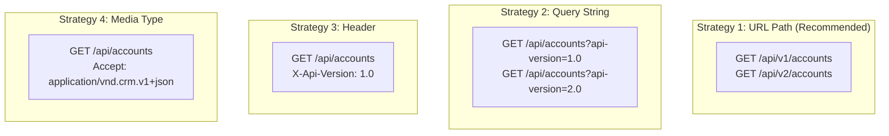
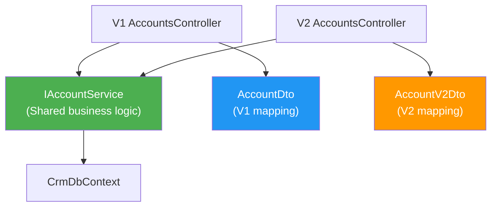
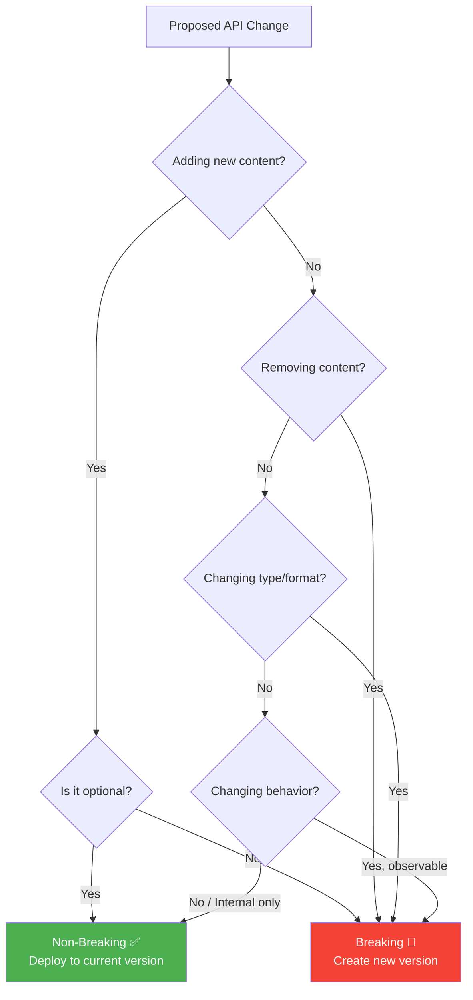
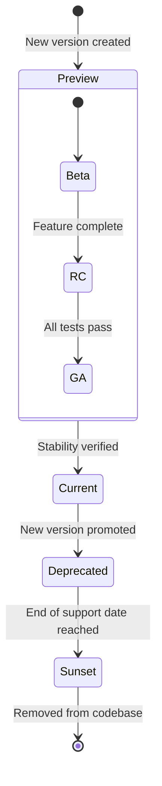
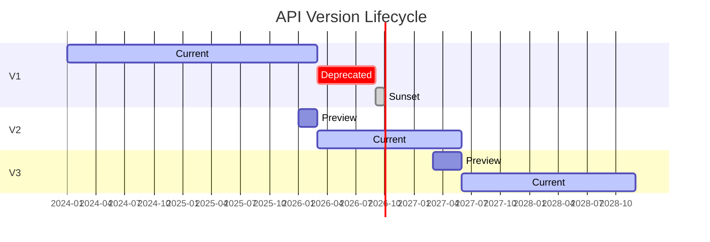
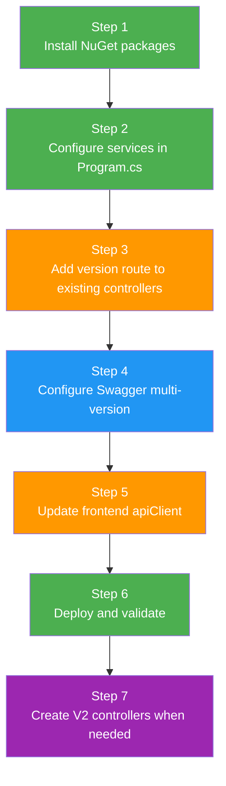
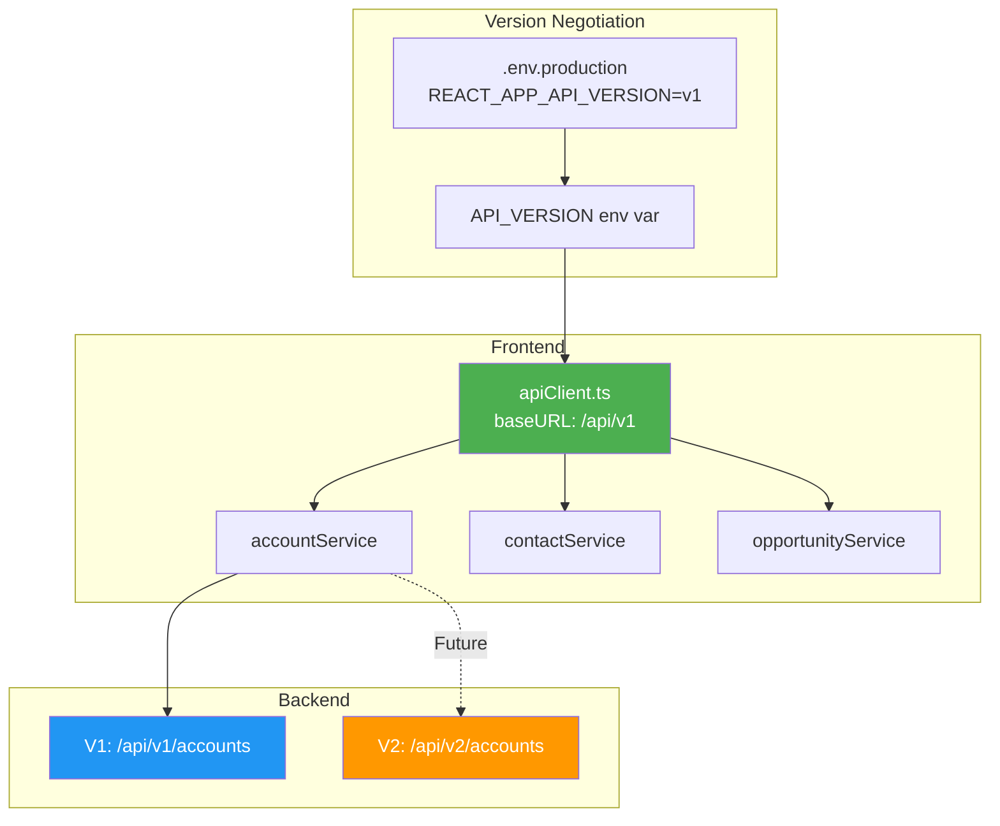

# Architecture Specification: API Versioning Strategy

> **Spec ID:** SPEC-ARCH-012  
> **Feature:** API Versioning Strategy & Implementation Plan  
> **Module:** Architecture  
> **Version:** 1.0  
> **Last Updated:** February 23, 2026  
> **Status:** ✅ Complete  
> **Priority:** P2 (Foundation)  
> **Author:** Architecture Team  
> **Cross-References:** [SPEC-ARCH-007](SPEC-ARCH-007-MiddlewarePipeline.md) (Middleware Pipeline), [SPEC-ARCH-001](SPEC-ARCH-001-DTOStandard.md) (DTO Standard), [SPEC-ARCH-002](SPEC-ARCH-002-ErrorHandlingStrategy.md) (Error Handling)

---

## Executive Summary

The CRM solution currently operates with **unversioned API endpoints** using a consistent `api/[controller]` routing pattern. All 40+ controllers follow the `[Route("api/[controller]")]` convention without version segments. This specification documents the current state, evaluates versioning strategies, provides a comprehensive implementation plan using `Asp.Versioning.Mvc`, defines a version lifecycle and deprecation policy, and includes concrete migration examples using real CRM controllers.

**Key Findings:**
- **40+ controllers** use `[Route("api/[controller]")]` with no API versioning
- **No version library** is currently installed (`Asp.Versioning.Mvc` not referenced)
- **All endpoints** resolve to `/api/{resource}` (e.g., `/api/accounts`, `/api/contacts`)
- **Breaking changes** to the API require coordinated frontend deployments

**Recommendation:** Implement **URL path-based versioning** (`/api/v1/accounts`) using `Asp.Versioning.Mvc` with backward-compatible defaults, supporting N-1 version deprecation lifecycle.

**Why This Matters:**
- Enables independent frontend/backend deployment cadences
- Protects external integrations from breaking changes
- Supports gradual API evolution without client disruption
- Mandatory for public API or third-party integrations
- Required for microservices migration (API gateway routing by version)

---

## 1. Business Context

### 1.1 Feature Description

API versioning provides a mechanism to **evolve the API contract without breaking existing clients**. When a breaking change is required (field removal, type change, behavioral change), a new API version is created while the old version continues to function.

### 1.2 Use Cases

| UC-ID | Use Case | Actor | Expected Flow | Status |
|-------|----------|-------|---------------|--------|
| UC-001 | Add breaking field change | Developer | Create v2 endpoint with new contract, keep v1 active | ⏳ Planned |
| UC-002 | Deprecate old API version | API Team | Mark v1 as deprecated with sunset header, notify clients | ⏳ Planned |
| UC-003 | External integration compatibility | 3rd Party | Pin to specific API version, unaffected by CRM updates | ⏳ Planned |
| UC-004 | Independent frontend deployment | Frontend Dev | Frontend uses v1 while backend rolls out v2 | ⏳ Planned |
| UC-005 | Swagger multi-version docs | Developer | View all API versions side-by-side in Swagger UI | ⏳ Planned |
| UC-006 | Version-specific rate limiting | Ops | Apply different rate limits to deprecated versions | ⏳ Planned |
| UC-007 | Microservice routing by version | Gateway | Route /api/v1/accounts → monolith, /api/v2/accounts → microservice | ⏳ Planned |

### 1.3 Architecture Principles

1. **Default version is always the latest** — Unversioned requests route to the current version
2. **Backward compatibility is the goal** — Avoid breaking changes when possible
3. **Explicit version is preferred** — Clients should specify API version explicitly
4. **Deprecation before removal** — Deprecated versions remain supported for a fixed period
5. **One version increment at a time** — Jump from v1 → v2, never v1 → v3
6. **Frontend follows backend** — Frontend must adapt to new versions within the deprecation window

---

## 2. Current State Analysis

### 2.1 Routing Pattern

All controllers in the CRM use the `[Route("api/[controller]")]` convention:

```csharp
// CRM.Backend/src/CRM.Api/Controllers/AccountsController.cs (lines 50-51)
[ApiController]
[Route("api/[controller]")]
[Authorize]
public class AccountsController : ControllerBase
```

### 2.2 Controller Inventory

The following controllers are currently deployed with unversioned routes:

| Controller | Route | HTTP Methods | Entity |
|-----------|-------|-------------|--------|
| `AccountsController` | `api/accounts` | GET, POST, PUT, DELETE | Account |
| `ContactsController` | `api/contacts` | GET, POST, PUT, DELETE | Contact |
| `OpportunitiesController` | `api/opportunities` | GET, POST, PUT, DELETE | Opportunity |
| `LeadsController` | `api/leads` | GET, POST, PUT, DELETE | Lead |
| `ProductsController` | `api/products` | GET, POST, PUT, DELETE | Product |
| `ActivitiesController` | `api/activities` | GET, POST, PUT, DELETE | Activity |
| `QuotesController` | `api/quotes` | GET, POST, PUT, DELETE | Quote |
| `OrdersController` | `api/orders` | GET, POST, PUT, DELETE | Order |
| `InvoicesController` | `api/invoices` | GET, POST, PUT, DELETE | Invoice |
| `CampaignsController` | `api/campaigns` | GET, POST, PUT, DELETE | Campaign |
| `ServiceRequestsController` | `api/servicerequests` | GET, POST, PUT, DELETE | ServiceRequest |
| `UsersController` | `api/users` | GET, POST, PUT, DELETE | User |
| `AuthController` | `api/auth` | POST | Auth tokens |
| `HealthController` | `health` | GET | Health checks |
| `AdminDashboardController` | `api/admin` | GET | Admin metrics |
| `AdminConfigurationController` | `api/adminconfiguration` | GET, POST, PUT | Config |
| `AdminSettingsController` | `api/adminsettings` | GET, PUT | Settings |
| `AgentController` | `api/agents` | GET, POST | AI Agents |
| `AgentAdminController` | `api/agents/admin` | GET, POST, PUT | Agent admin |
| `AgentAnalyticsController` | `api/agents/analytics` | GET | Agent analytics |
| `AIAgentUsageController` | `api/ai-agent-usage` | GET | AI usage |
| `AIAnalyticsController` | `api/ai` | GET | AI analytics |
| `AIChatbotController` | `api/ai/chatbot` | POST | AI chat |
| `FeaturesController` | `api/features` | GET, POST | Feature flags |
| `ProviderHealthController` | `api/health` | GET | Provider health |
| `AddressesController` | `api/addresses` | GET, POST, PUT, DELETE | Address |
| `DashboardController` | `api/dashboard` | GET | Dashboard |

### 2.3 Current Problems

| Problem | Impact | Severity |
|---------|--------|----------|
| No version in URL | Breaking changes break all clients simultaneously | 🔴 High |
| Tight frontend/backend coupling | Must deploy both together | 🟡 Medium |
| No deprecation mechanism | Can't evolve API safely | 🟡 Medium |
| No multi-version Swagger | Only current API documented | 🟢 Low |
| Microservice migration blocked | Can't route by version to different backends | 🟡 Medium |

### 2.4 What Triggers a Version Bump

Understanding what constitutes a breaking change:



---

## 3. Versioning Strategy Evaluation

### 3.1 Strategy Comparison



### 3.2 Detailed Comparison

| Criterion | URL Path | Query String | Header | Media Type |
|-----------|---------|-------------|--------|-----------|
| **Discoverability** | 🟢 Obvious in URL | 🟡 Must know parameter | 🔴 Hidden | 🔴 Hidden |
| **Cacheability** | 🟢 Different URLs → different caches | 🟡 Varies by CDN config | 🔴 Same URL | 🔴 Same URL |
| **Browser Testing** | 🟢 Easy (just change URL) | 🟡 Add query param | 🔴 Requires tool | 🔴 Requires tool |
| **Swagger Support** | 🟢 Native multi-doc | 🟡 Supported | 🟡 Supported | 🔴 Complex |
| **API Gateway Routing** | 🟢 Simple path-based rules | 🟡 Query parameter routing | 🔴 Header inspection | 🔴 Content negotiation |
| **RESTful Purity** | 🟡 Pollutes URI | 🟡 Pollutes URI | 🟢 RESTful | 🟢 Most RESTful |
| **Client Simplicity** | 🟢 Simple base URL change | 🟡 Parameter addition | 🟡 Header setup | 🔴 Media type handling |
| **Industry Adoption** | 🟢 Most common (Google, GitHub, Stripe) | 🟡 Common (Azure) | 🟡 Less common | 🔴 Rare |
| **Microservice Routing** | 🟢 Path-based splitting | 🟡 Possible | 🔴 Complex | 🔴 Complex |

### 3.3 Recommendation: URL Path Versioning

**URL path versioning** (`/api/v1/accounts`) is recommended for the CRM because:

1. **Most discoverable** — Version is visible in every URL, immediately clear to developers
2. **CDN-friendly** — Different URLs are cached independently without custom configuration
3. **Gateway-friendly** — YARP (our API gateway) can route by URL path natively
4. **Industry standard** — Google APIs, GitHub API, Stripe API all use URL path versioning
5. **Swagger support** — SwaggerGen natively supports separate documents per URL version
6. **Browser testable** — QA can test different versions by simply changing the URL
7. **Frontend simplicity** — Change the `apiClient` base URL to switch versions

---

## 4. Implementation Plan

### 4.1 Package Installation

```bash
# Add the Asp.Versioning packages
cd CRM.Backend
dotnet add src/CRM.Api/CRM.Api.csproj package Asp.Versioning.Mvc
dotnet add src/CRM.Api/CRM.Api.csproj package Asp.Versioning.Mvc.ApiExplorer
```

### 4.2 Service Registration (Program.cs)

```csharp
// CRM.Backend/src/CRM.Api/Program.cs — Add after builder.Services.AddControllers()

builder.Services.AddApiVersioning(options =>
{
    // Use v1 as the default version when not specified
    options.DefaultApiVersion = new ApiVersion(1, 0);

    // Allow requests without an explicit version (map to default)
    options.AssumeDefaultVersionWhenUnspecified = true;

    // Report available versions in response headers
    options.ReportApiVersions = true;

    // Read version from URL path segment
    options.ApiVersionReader = new UrlSegmentApiVersionReader();
})
.AddMvc()  // Enable [ApiVersion] attributes on controllers
.AddApiExplorer(options =>
{
    // Format version as 'v'major[.minor][-status]
    options.GroupNameFormat = "'v'VVV";

    // Substitute API version in URL templates
    options.SubstituteApiVersionInUrl = true;
});
```

### 4.3 Swagger Multi-Version Configuration

```csharp
// Program.cs — Configure Swagger for multiple API versions

builder.Services.AddSwaggerGen(options =>
{
    options.SwaggerDoc("v1", new OpenApiInfo
    {
        Version = "v1",
        Title = "CRM API",
        Description = "CRM Solution REST API - Version 1",
        Contact = new OpenApiContact { Name = "CRM Team", Email = "api@crm.local" }
    });

    options.SwaggerDoc("v2", new OpenApiInfo
    {
        Version = "v2",
        Title = "CRM API",
        Description = "CRM Solution REST API - Version 2 (Preview)",
        Contact = new OpenApiContact { Name = "CRM Team", Email = "api@crm.local" }
    });
});

// Swagger UI with version selector
app.UseSwaggerUI(c =>
{
    c.SwaggerEndpoint("/swagger/v1/swagger.json", "CRM API v1");
    c.SwaggerEndpoint("/swagger/v2/swagger.json", "CRM API v2");
});
```

### 4.4 Controller Migration

#### Phase 1: Add Version Attributes (Non-Breaking)

The first step is adding version attributes to existing controllers **without changing routes**. This is backward compatible because `AssumeDefaultVersionWhenUnspecified = true`.

**Before (Current):**

```csharp
// Current: No versioning
[ApiController]
[Route("api/[controller]")]
[Authorize]
public class AccountsController : ControllerBase
{
}
```

**After (Step 1 — Non-Breaking):**

```csharp
// Step 1: Add version attributes, change route template
[ApiController]
[Route("api/v{version:apiVersion}/[controller]")]  // Supports /api/v1/accounts
[Route("api/[controller]")]                         // Backward compat: /api/accounts still works
[ApiVersion("1.0")]
[Authorize]
public class AccountsController : ControllerBase
{
}
```

#### Phase 2: Create V2 Controllers (When Needed)

When a breaking change is required, create a versioned controller:

```csharp
// V1 controller remains unchanged
namespace CRM.Api.Controllers.V1;

[ApiController]
[Route("api/v{version:apiVersion}/accounts")]
[ApiVersion("1.0")]
[Authorize]
public class AccountsController : ControllerBase
{
    private readonly IAccountService _accountService;
    private readonly ILogger<AccountsController> _logger;

    public AccountsController(
        IAccountService accountService,
        ILogger<AccountsController> logger)
    {
        _accountService = accountService;
        _logger = logger;
    }

    /// <summary>
    /// Get all accounts — V1 contract
    /// Returns: AccountDto (original structure)
    /// </summary>
    [HttpGet]
    [ProducesResponseType(typeof(PagedResult<AccountDto>), StatusCodes.Status200OK)]
    public async Task<IActionResult> GetAll(
        [FromQuery] int page = 1,
        [FromQuery] int pageSize = 20,
        [FromQuery] string? sortBy = null,
        [FromQuery] string? sortOrder = "asc")
    {
        var accounts = await _accountService.GetAllAsync(page, pageSize, sortBy, sortOrder);
        return Ok(accounts);
    }

    /// <summary>
    /// Get account by ID — V1 contract
    /// </summary>
    [HttpGet("{id}")]
    [ProducesResponseType(typeof(AccountDto), StatusCodes.Status200OK)]
    [ProducesResponseType(StatusCodes.Status404NotFound)]
    public async Task<IActionResult> GetById(int id)
    {
        var account = await _accountService.GetByIdAsync(id);
        if (account == null) return NotFound();
        return Ok(account);
    }
}
```

```csharp
// V2 controller with breaking changes
namespace CRM.Api.Controllers.V2;

[ApiController]
[Route("api/v{version:apiVersion}/accounts")]
[ApiVersion("2.0")]
[Authorize]
public class AccountsController : ControllerBase
{
    private readonly IAccountService _accountService;
    private readonly ILogger<AccountsController> _logger;

    public AccountsController(
        IAccountService accountService,
        ILogger<AccountsController> logger)
    {
        _accountService = accountService;
        _logger = logger;
    }

    /// <summary>
    /// Get all accounts — V2 contract
    /// Breaking changes:
    /// - Returns AccountV2Dto (new structure with nested address object)
    /// - Pagination uses cursor-based instead of offset-based
    /// - sortBy renamed to orderBy
    /// </summary>
    [HttpGet]
    [ProducesResponseType(typeof(CursorPagedResult<AccountV2Dto>), StatusCodes.Status200OK)]
    public async Task<IActionResult> GetAll(
        [FromQuery] string? cursor = null,     // Changed: cursor-based pagination
        [FromQuery] int limit = 20,             // Changed: 'limit' instead of 'pageSize'
        [FromQuery] string? orderBy = null,     // Changed: 'orderBy' instead of 'sortBy'
        [FromQuery] string? direction = "asc")
    {
        var accounts = await _accountService.GetAllCursorAsync(cursor, limit, orderBy, direction);
        return Ok(accounts);
    }

    /// <summary>
    /// Get account by ID — V2 contract
    /// Breaking change: Returns AccountV2Dto with nested objects
    /// </summary>
    [HttpGet("{id}")]
    [ProducesResponseType(typeof(AccountV2Dto), StatusCodes.Status200OK)]
    [ProducesResponseType(StatusCodes.Status404NotFound)]
    public async Task<IActionResult> GetById(int id)
    {
        var account = await _accountService.GetAccountV2ByIdAsync(id);
        if (account == null) return NotFound();
        return Ok(account);
    }
}
```

### 4.5 Versioned DTO Example

```csharp
// V1 DTO (existing — unchanged)
public class AccountDto
{
    public int Id { get; set; }
    public string FirstName { get; set; } = string.Empty;
    public string LastName { get; set; } = string.Empty;
    public string? CompanyName { get; set; }
    public string? Email { get; set; }
    public string? Phone { get; set; }
    public string? Street { get; set; }      // Flat address fields
    public string? City { get; set; }
    public string? State { get; set; }
    public string? PostalCode { get; set; }
    public string? Country { get; set; }
    public DateTime CreatedAt { get; set; }
}

// V2 DTO (new — breaking change: nested address)
public class AccountV2Dto
{
    public int Id { get; set; }
    public string FirstName { get; set; } = string.Empty;
    public string LastName { get; set; } = string.Empty;
    public string? CompanyName { get; set; }
    public string? Email { get; set; }
    public string? Phone { get; set; }
    public AddressDto? PrimaryAddress { get; set; }  // Changed: nested object
    public List<AddressDto> Addresses { get; set; }  // New: all addresses
    public DateTime CreatedAt { get; set; }
    public DateTime? UpdatedAt { get; set; }          // New field
    public string? AvatarUrl { get; set; }            // New field
}
```

### 4.6 Shared Services Pattern

Both V1 and V2 controllers should share the same service layer, with mapping at the controller level:



---

## 5. Breaking vs Non-Breaking Changes

### 5.1 Non-Breaking Changes (Same Version)

These changes can be made **without creating a new API version**:

| Change Type | Example | Why Non-Breaking |
|------------|---------|------------------|
| **Add optional field** | Add `AvatarUrl` to `AccountDto` | Existing clients ignore it |
| **Add new endpoint** | Add `GET /api/v1/accounts/{id}/contacts` | Existing endpoints unaffected |
| **Add optional query parameter** | Add `?includeContacts=true` | Parameter is optional |
| **Add new enum value** | Add `Stage.Closed_Won` to `OpportunityStage` | Existing values unchanged |
| **Increase string limit** | `MaxLength(100)` → `MaxLength(200)` | Existing data still valid |
| **Add new HTTP method** | Add `PATCH` to existing resource | Other methods unchanged |
| **Performance improvement** | Optimize query behind same endpoint | Same contract |
| **Bug fix** | Fix incorrect calculation | Same contract, corrected behavior |

### 5.2 Breaking Changes (New Version Required)

| Change Type | Example | Why Breaking |
|------------|---------|-------------|
| **Remove field** | Remove `Phone` from `AccountDto` | Clients expecting field will break |
| **Rename field** | `FirstName` → `GivenName` | Clients using old name will break |
| **Change field type** | `string Phone` → `PhoneDto Phone` | Deserialization fails |
| **Remove endpoint** | Remove `DELETE /api/accounts/{id}` | Clients calling it get 404 |
| **Change required fields** | Optional `Email` → Required | Existing requests missing Email fail |
| **Change pagination** | Offset → cursor-based | Different request/response format |
| **Change error format** | Different error response structure | Client error handling breaks |
| **Change authentication** | Header name or token format | Auth fails for existing clients |
| **Remove enum value** | Remove `Stage.Prospecting` | Requests with that value fail |
| **Change default behavior** | `GET /accounts` now returns paginated instead of all | Different response structure |

### 5.3 Decision Flowchart



---

## 6. Version Lifecycle & Deprecation Policy

### 6.1 Version States



### 6.2 Version Lifecycle Policy

| State | Duration | Description | HTTP Headers |
|-------|----------|-------------|--------------|
| **Preview** | Variable | New version under development and testing | `API-Version: 2.0-preview` |
| **Current** | Indefinite (until superseded) | Active version receiving features and fixes | `API-Version: 1.0` |
| **Deprecated** | 6 months minimum | Previous version with security fixes only | `Sunset: Sat, 23 Aug 2026 00:00:00 GMT` |
| **Sunset** | 30 days grace period | Final warning before removal | `Sunset: <past date>`, HTTP 410 on all endpoints |
| **Removed** | — | No longer available | HTTP 404 / 410 |

### 6.3 Deprecation Headers

When a version is deprecated, the API should include deprecation headers:

```http
HTTP/1.1 200 OK
Content-Type: application/json
API-Version: 1.0
API-Deprecated: true
Sunset: Sat, 23 Aug 2026 00:00:00 GMT
Link: <https://crm-api.example.com/docs/migration/v1-to-v2>; rel="deprecation"
API-Supported-Versions: 1.0, 2.0
API-Current-Version: 2.0
```

### 6.4 Implementation: Version Reporting Middleware

```csharp
// Custom middleware to add deprecation headers
public class ApiVersionDeprecationMiddleware
{
    private readonly RequestDelegate _next;
    private readonly IConfiguration _configuration;

    public async Task InvokeAsync(HttpContext context)
    {
        await _next(context);

        // Report supported versions
        context.Response.Headers.Append("API-Supported-Versions", "1.0, 2.0");
        context.Response.Headers.Append("API-Current-Version", "2.0");

        // Check if the requested version is deprecated
        var requestedVersion = context.GetRequestedApiVersion();
        if (requestedVersion?.MajorVersion == 1)
        {
            context.Response.Headers.Append("API-Deprecated", "true");
            context.Response.Headers.Append("Sunset", "Sat, 23 Aug 2026 00:00:00 GMT");
            context.Response.Headers.Append("Link",
                "<https://crm-api.example.com/docs/migration/v1-to-v2>; rel=\"deprecation\"");
        }
    }
}
```

### 6.5 Version Support Timeline Example



---

## 7. Migration Guide

### 7.1 Step-by-Step Implementation



### 7.2 Step 1: Install Packages

```bash
cd CRM.Backend
dotnet add src/CRM.Api/CRM.Api.csproj package Asp.Versioning.Mvc --version 8.1.0
dotnet add src/CRM.Api/CRM.Api.csproj package Asp.Versioning.Mvc.ApiExplorer --version 8.1.0
```

### 7.3 Step 2: Configure Services

Add to `Program.cs` after `builder.Services.AddControllers()`:

```csharp
// API Versioning
builder.Services.AddApiVersioning(options =>
{
    options.DefaultApiVersion = new ApiVersion(1, 0);
    options.AssumeDefaultVersionWhenUnspecified = true;
    options.ReportApiVersions = true;
    options.ApiVersionReader = ApiVersionReader.Combine(
        new UrlSegmentApiVersionReader(),
        new HeaderApiVersionReader("X-Api-Version")  // Fallback: header
    );
})
.AddMvc()
.AddApiExplorer(options =>
{
    options.GroupNameFormat = "'v'VVV";
    options.SubstituteApiVersionInUrl = true;
});
```

### 7.4 Step 3: Migrate Controllers (Batch)

Apply to all controllers using a systematic approach:

**Pattern: Dual-route for backward compatibility**

```csharp
// BEFORE
[ApiController]
[Route("api/[controller]")]
[Authorize]
public class AccountsController : ControllerBase { }

// AFTER
[ApiController]
[Route("api/v{version:apiVersion}/[controller]")]  // New: versioned
[Route("api/[controller]")]                         // Keep: backward compat
[ApiVersion("1.0")]
[Authorize]
public class AccountsController : ControllerBase { }
```

**Controllers to migrate (priority order):**

| Priority | Controller | Route | Rationale |
|----------|-----------|-------|-----------|
| P1 | `AccountsController` | `/api/v1/accounts` | Core entity, most used |
| P1 | `ContactsController` | `/api/v1/contacts` | Core entity |
| P1 | `OpportunitiesController` | `/api/v1/opportunities` | Core entity |
| P1 | `LeadsController` | `/api/v1/leads` | Core entity |
| P1 | `AuthController` | `/api/v1/auth` | Authentication |
| P2 | `ProductsController` | `/api/v1/products` | Sales module |
| P2 | `QuotesController` | `/api/v1/quotes` | Sales module |
| P2 | `OrdersController` | `/api/v1/orders` | Sales module |
| P2 | `CampaignsController` | `/api/v1/campaigns` | Marketing module |
| P2 | `ServiceRequestsController` | `/api/v1/servicerequests` | Service desk |
| P3 | `AgentController` | `/api/v1/agents` | AI features |
| P3 | `DashboardController` | `/api/v1/dashboard` | Analytics |
| P3 | `AdminSettingsController` | `/api/v1/adminsettings` | Admin |
| — | `HealthController` | `/health` (no version) | Infrastructure — never versioned |

### 7.5 Step 4: Configure Swagger

```csharp
// Program.cs — Update Swagger configuration
builder.Services.AddSwaggerGen(options =>
{
    var provider = builder.Services.BuildServiceProvider()
        .GetRequiredService<IApiVersionDescriptionProvider>();

    foreach (var description in provider.ApiVersionDescriptions)
    {
        options.SwaggerDoc(description.GroupName, new OpenApiInfo
        {
            Version = description.ApiVersion.ToString(),
            Title = "CRM API",
            Description = description.IsDeprecated
                ? "CRM Solution REST API - DEPRECATED"
                : "CRM Solution REST API"
        });
    }
});

app.UseSwaggerUI(options =>
{
    var provider = app.Services.GetRequiredService<IApiVersionDescriptionProvider>();
    foreach (var description in provider.ApiVersionDescriptions.Reverse())
    {
        options.SwaggerEndpoint(
            $"/swagger/{description.GroupName}/swagger.json",
            $"CRM API {description.GroupName}");
    }
});
```

### 7.6 Step 5: Update Frontend API Client

```typescript
// CRM.Frontend/src/services/apiClient.ts

// BEFORE: Unversioned
const apiClient = axios.create({
  baseURL: '/api',
  headers: { 'Content-Type': 'application/json' }
});

// AFTER: Versioned with configuration
const API_VERSION = process.env.REACT_APP_API_VERSION || 'v1';

const apiClient = axios.create({
  baseURL: `/api/${API_VERSION}`,
  headers: {
    'Content-Type': 'application/json',
    'X-Api-Version': API_VERSION.replace('v', '')  // Fallback header
  }
});

// Service calls remain the same:
export const accountService = {
  getAll: () => apiClient.get('/accounts'),        // → GET /api/v1/accounts
  getById: (id: number) => apiClient.get(`/accounts/${id}`),
  create: (data: CreateAccountDto) => apiClient.post('/accounts', data),
  update: (id: number, data: UpdateAccountDto) => apiClient.put(`/accounts/${id}`, data),
  delete: (id: number) => apiClient.delete(`/accounts/${id}`),
};
```

### 7.7 Step 6: Validation Checklist

After deployment, verify:

```bash
# V1 versioned endpoints work
curl https://crm-api:5000/api/v1/accounts
# Expected: 200 OK

# Unversioned endpoints still work (backward compat)
curl https://crm-api:5000/api/accounts
# Expected: 200 OK (routes to v1)

# Version reported in headers
curl -v https://crm-api:5000/api/v1/accounts 2>&1 | grep -i "api-version"
# Expected: api-supported-versions: 1.0

# Swagger docs for v1
curl https://crm-api:5000/swagger/v1/swagger.json
# Expected: OpenAPI document for v1

# Health endpoints unaffected (no version)
curl https://crm-api:5000/health
# Expected: 200 OK (no version prefix)
```

---

## 8. Client Contract & Frontend Adaptation

### 8.1 Frontend Version Management



### 8.2 Environment Configuration

```bash
# .env.development
REACT_APP_API_VERSION=v1

# .env.staging
REACT_APP_API_VERSION=v1

# .env.production
REACT_APP_API_VERSION=v1

# When migrating to v2:
# REACT_APP_API_VERSION=v2
```

### 8.3 Gradual Frontend Migration

When the backend introduces V2, the frontend can migrate incrementally:

```typescript
// Mixed version approach during migration
const v1Client = axios.create({ baseURL: '/api/v1' });
const v2Client = axios.create({ baseURL: '/api/v2' });

export const accountService = {
  // Migrated to V2
  getAll: () => v2Client.get('/accounts'),        // V2: cursor-based pagination
  getById: (id: number) => v2Client.get(`/accounts/${id}`),

  // Still on V1 (migrating later)
  create: (data: CreateAccountDto) => v1Client.post('/accounts', data),
  update: (id: number, data: UpdateAccountDto) => v1Client.put(`/accounts/${id}`, data),
};
```

### 8.4 Deprecation Warning in Frontend

```typescript
// apiClient.ts — Check for deprecation headers
apiClient.interceptors.response.use(
  (response) => {
    if (response.headers['api-deprecated'] === 'true') {
      const sunset = response.headers['sunset'];
      console.warn(
        `⚠️ API version deprecated. Sunset date: ${sunset}. ` +
        `Please upgrade to the latest API version.`
      );

      // Optional: Show user notification
      if (typeof window !== 'undefined') {
        // Dispatch deprecation event for UI notification
        window.dispatchEvent(new CustomEvent('api-deprecated', {
          detail: { sunsetDate: sunset }
        }));
      }
    }
    return response;
  }
);
```

---

## 9. Documentation Strategy

### 9.1 Swagger/OpenAPI Multi-Version

With `Asp.Versioning.Mvc.ApiExplorer`, Swagger automatically generates separate documents:

| URL | Content |
|-----|---------|
| `/swagger/v1/swagger.json` | OpenAPI 3.0 document for V1 endpoints |
| `/swagger/v2/swagger.json` | OpenAPI 3.0 document for V2 endpoints |
| `/swagger/index.html` | Swagger UI with version selector dropdown |

### 9.2 Version Changelog Documentation

Create a changelog for each version transition:

```markdown
# API Changelog

## v2.0 (2026-XX-XX)

### Breaking Changes
- **Account endpoint:** Pagination changed from offset-based to cursor-based
  - `page` parameter removed, use `cursor` instead
  - `pageSize` renamed to `limit`
  - `sortBy` renamed to `orderBy`
- **Account DTO:** Address fields restructured
  - Flat fields (`street`, `city`, `state`, `postalCode`, `country`) removed
  - Replaced with `primaryAddress` object and `addresses` array

### Migration Guide
1. Update pagination calls to use cursor-based API
2. Update DTO types for nested address structure
3. See /docs/api/migration-v1-to-v2.md for detailed guide

## v1.0 (2024-01-01) — Current

### Endpoints
- All CRUD operations for core CRM entities
- Authentication and authorization
- Dashboard and reporting
- AI agent integration
```

---

## 10. Testing Strategy

### 10.1 Version-Specific Integration Tests

```csharp
// Test that V1 endpoints still work after V2 deployment
public class AccountsV1IntegrationTests : IClassFixture<WebApplicationFactory<Program>>
{
    private readonly HttpClient _client;

    public AccountsV1IntegrationTests(WebApplicationFactory<Program> factory)
    {
        _client = factory.CreateClient();
    }

    [Fact]
    public async Task GetAccounts_V1_ShouldReturnOffsetPagination()
    {
        // Act
        var response = await _client.GetAsync("/api/v1/accounts?page=1&pageSize=10");

        // Assert
        response.EnsureSuccessStatusCode();
        var content = await response.Content.ReadFromJsonAsync<PagedResult<AccountDto>>();
        Assert.NotNull(content);
        Assert.True(content.TotalCount >= 0);
        Assert.True(content.Page == 1);
    }

    [Fact]
    public async Task GetAccounts_Unversioned_ShouldDefaultToV1()
    {
        // Act — no version in URL
        var response = await _client.GetAsync("/api/accounts?page=1&pageSize=10");

        // Assert — should still work (backward compat)
        response.EnsureSuccessStatusCode();
    }

    [Fact]
    public async Task GetAccounts_V1_ShouldReportSupportedVersions()
    {
        // Act
        var response = await _client.GetAsync("/api/v1/accounts");

        // Assert
        Assert.True(response.Headers.Contains("api-supported-versions"));
    }
}

// Test that V2 endpoints work with new contract
public class AccountsV2IntegrationTests : IClassFixture<WebApplicationFactory<Program>>
{
    private readonly HttpClient _client;

    [Fact]
    public async Task GetAccounts_V2_ShouldReturnCursorPagination()
    {
        // Act
        var response = await _client.GetAsync("/api/v2/accounts?limit=10");

        // Assert
        response.EnsureSuccessStatusCode();
        var content = await response.Content.ReadFromJsonAsync<CursorPagedResult<AccountV2Dto>>();
        Assert.NotNull(content);
        Assert.NotNull(content.NextCursor);
    }

    [Fact]
    public async Task GetAccount_V2_ShouldReturnNestedAddress()
    {
        // Arrange
        var accountId = 1;

        // Act
        var response = await _client.GetAsync($"/api/v2/accounts/{accountId}");

        // Assert
        response.EnsureSuccessStatusCode();
        var account = await response.Content.ReadFromJsonAsync<AccountV2Dto>();
        Assert.NotNull(account);
        // V2-specific assertion: address is nested object, not flat fields
        // Assert.NotNull(account.PrimaryAddress);
    }
}
```

### 10.2 Contract Tests

```csharp
// Ensure V1 contract doesn't change (backward compatibility)
[Fact]
public void AccountDto_V1_ShouldHaveExpectedProperties()
{
    var properties = typeof(AccountDto).GetProperties();
    var propertyNames = properties.Select(p => p.Name).ToList();

    // These properties MUST exist in V1 DTO (contract guarantee)
    Assert.Contains("Id", propertyNames);
    Assert.Contains("FirstName", propertyNames);
    Assert.Contains("LastName", propertyNames);
    Assert.Contains("Email", propertyNames);
    Assert.Contains("CreatedAt", propertyNames);
}

// Ensure V2 contract has the expected new structure
[Fact]
public void AccountV2Dto_ShouldHaveNestedAddress()
{
    var properties = typeof(AccountV2Dto).GetProperties();
    var propertyNames = properties.Select(p => p.Name).ToList();

    Assert.Contains("PrimaryAddress", propertyNames);
    Assert.Contains("Addresses", propertyNames);
    Assert.DoesNotContain("Street", propertyNames);  // Flat field removed in V2
}
```

### 10.3 E2E Tests with Versioned Endpoints

```typescript
// e2e-tests/tests/versioning/api-versioning.spec.ts

import { test, expect } from '@playwright/test';

test.describe('API Versioning', () => {
  const baseUrl = process.env.API_BASE_URL || 'http://localhost:5000';

  test('V1 endpoint returns expected format', async ({ request }) => {
    const response = await request.get(`${baseUrl}/api/v1/accounts`);
    expect(response.status()).toBe(200);

    const data = await response.json();
    expect(data).toHaveProperty('items');
    expect(data).toHaveProperty('totalCount');
    expect(data).toHaveProperty('page');
  });

  test('Unversioned endpoint maps to V1', async ({ request }) => {
    const v1Response = await request.get(`${baseUrl}/api/v1/accounts`);
    const unversionedResponse = await request.get(`${baseUrl}/api/accounts`);

    expect(v1Response.status()).toBe(unversionedResponse.status());
  });

  test('Version is reported in response headers', async ({ request }) => {
    const response = await request.get(`${baseUrl}/api/v1/accounts`);
    const versions = response.headers()['api-supported-versions'];
    expect(versions).toContain('1.0');
  });

  test('Health endpoints are not versioned', async ({ request }) => {
    const response = await request.get(`${baseUrl}/health`);
    expect(response.status()).toBe(200);
  });
});
```

---

## 11. Special Considerations

### 11.1 Endpoints That Should NEVER Be Versioned

| Endpoint | Reason |
|----------|--------|
| `/health` | Kubernetes probes — must be stable |
| `/health/ready` | Readiness probes — infrastructure concern |
| `/health/live` | Liveness probes — infrastructure concern |
| `/swagger/*` | Documentation — meta endpoint |
| `/hubs/*` | SignalR hubs — separate protocol |

### 11.2 Authentication Endpoints

Auth endpoints require special care because a version mismatch breaks all other calls:

```csharp
// Auth controller should support all versions
[ApiController]
[Route("api/v{version:apiVersion}/auth")]
[Route("api/auth")]  // Always keep unversioned route
[ApiVersion("1.0")]
[ApiVersion("2.0")]  // Support all versions
public class AuthController : ControllerBase
{
    // Token format should remain consistent across versions
}
```

### 11.3 Microservice Version Routing

When the CRM migrates to microservices, the API gateway (YARP) can route by version:

```json
// YARP configuration for version-based routing
{
  "ReverseProxy": {
    "Routes": {
      "accounts-v1": {
        "ClusterId": "monolith",
        "Match": { "Path": "/api/v1/accounts/{**catch-all}" }
      },
      "accounts-v2": {
        "ClusterId": "customer-microservice",
        "Match": { "Path": "/api/v2/accounts/{**catch-all}" }
      }
    }
  }
}
```

### 11.4 Rate Limiting by Version

Deprecated versions can have stricter rate limits to encourage migration:

```json
{
  "RateLimiting": {
    "EndpointRules": {
      "/api/v1/*": { "Period": "1m", "Limit": 500 },
      "/api/v2/*": { "Period": "1m", "Limit": 1000 }
    }
  }
}
```

---

## 12. Anti-Patterns

### 12.1 What NOT to Do

| Anti-Pattern | Problem | Correct Approach |
|-------------|---------|------------------|
| Version in query string for public APIs | Hard to cache, easy to forget | Use URL path versioning |
| Creating a new version for every change | Version explosion | Only version on breaking changes |
| Removing old version without deprecation | Breaks existing clients | Deprecate with 6-month window |
| Different auth for different versions | Client confusion | Auth is cross-version |
| Versioning health endpoints | Breaks Kubernetes probes | Health is infrastructure — never version |
| Copy-paste entire controller for V2 | Massive duplication | Share service layer, map at controller |
| Running 5+ versions simultaneously | Maintenance burden | Max 2-3 active versions (current + deprecated) |
| No backward compatibility route | Forces immediate client migration | Keep `api/[controller]` as fallback |

---

## 13. Implementation Timeline

### 13.1 Phased Rollout

| Phase | Duration | Activities | Risk |
|-------|----------|-----------|------|
| **Phase 1: Foundation** | 1 week | Install packages, configure services, add version route to all controllers | 🟢 Low — backward compatible |
| **Phase 2: Swagger** | 2 days | Configure multi-version Swagger docs | 🟢 Low — documentation only |
| **Phase 3: Frontend** | 3 days | Update `apiClient.ts` to use versioned URLs | 🟡 Medium — requires frontend deploy |
| **Phase 4: Validation** | 1 week | Integration tests, E2E tests, load tests | 🟢 Low — testing only |
| **Phase 5: V2 (when needed)** | Variable | Create V2 controllers for breaking changes | 🟡 Medium — new API contract |

### 13.2 Estimated Effort

| Task | Story Points | Developer Hours |
|------|-------------|----------------|
| NuGet package installation | 1 | 0.5h |
| Program.cs configuration | 2 | 1h |
| Controller migration (40+ controllers) | 5 | 4h |
| Swagger multi-version setup | 3 | 2h |
| Frontend apiClient update | 3 | 2h |
| Integration tests | 5 | 4h |
| Documentation | 3 | 2h |
| **Total** | **22** | **~16h** |

---

## 14. File Reference

| File | Purpose | Changes Needed |
|------|---------|---------------|
| `CRM.Api/CRM.Api.csproj` | Package references | Add `Asp.Versioning.Mvc` packages |
| `CRM.Api/Program.cs` | Service registration | Add `AddApiVersioning()`, update Swagger |
| `CRM.Api/Controllers/*.cs` (40+ files) | Route templates | Add `[ApiVersion("1.0")]` and versioned route |
| `CRM.Api/Controllers/HealthController.cs` | Health checks | **No change** — never versioned |
| `CRM.Frontend/src/services/apiClient.ts` | Base URL | Add version segment to `baseURL` |
| `CRM.Frontend/.env.*` | Environment config | Add `REACT_APP_API_VERSION` |

---

## 15. Glossary

| Term | Definition |
|------|-----------|
| **API Version** | A numbered release of the API contract (e.g., v1, v2) |
| **Breaking Change** | A modification to an API that could cause existing clients to fail |
| **Non-Breaking Change** | An additive or optional modification that maintains backward compatibility |
| **Deprecation** | Marking an API version as outdated while still supporting it for a transition period |
| **Sunset** | The final removal date for a deprecated API version |
| **Sunset Header** | HTTP header (`Sunset`) indicating when a deprecated API will be removed (RFC 8594) |
| **URL Path Versioning** | Including the version in the URL path (e.g., `/api/v1/accounts`) |
| **Query String Versioning** | Including the version as a query parameter (e.g., `?api-version=1.0`) |
| **Header Versioning** | Including the version in an HTTP header (e.g., `X-Api-Version: 1.0`) |
| **Content Negotiation** | Including the version in the Accept/Content-Type header |
| **Asp.Versioning.Mvc** | Microsoft's official NuGet package for ASP.NET Core API versioning |
| **YARP** | Yet Another Reverse Proxy — Microsoft's .NET API gateway used in the CRM microservices architecture |
| **Backward Compatible** | A change that allows old clients to continue working without modification |

---

**END OF SPEC-ARCH-012**
